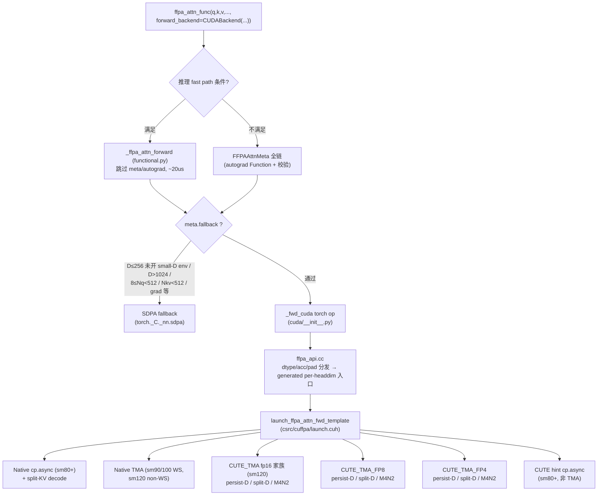

## 使用说明（先读本节）

- **本文件主体**是《ffpa-attn CUDA Backend 特性支持现状技术报告》（下称"报告"）：
  §1-§8 特性现状、§9 优化方向概览、§10 附录（环境变量 / bench / 构建 / 辅助
  skill）、§11 核心技术点数学原理（推导级）。
- **references/**：
  - `rfc-future-optimizations.md`——工程级未来优化 RFC（功能完备性 > 性能优化
    双轨，含**完成状态清单**、实施路线图、已证伪附录）。做优化前先读其附录 A；
    做完一项勾选清单 + 更新总览表状态列。
  - `ffpa_split_d_m4n2_design.md` / `ffpa_split_d_m4n4_analysis.md`——大 D 两大
    核心技术之一 M4N2 TiledMMA<4,2,1> 的设计推导（配合报告 §11.4）。
  - `sage-attention-principles.md`——SageAttention 1/2/2++/3 核心技术原理
    （ffpa 量化数学的上游出处）。
  - `flash-attention-principles.md`——FlashAttention 1-4 核心技术原理
    （online softmax / tiling / WS / lazy rescale 的上游出处）。
- **论文原文**：`references/papers/`（SA1/SA2/SA2++/SA3 + FA-1/FA-2/FA-3/FA-4
  文本版：`SageAttention{1,2,2++,3}.txt`、`FlashAttention-{1,2,3,4}.txt`）。
- **辅助 skill**（kernel 级优化/调试时搭配）：`cuda-auto-tune`（NCU 驱动迭代
  优化）、`cuda-cpp-kernel`（CUDA/PTX 编写与 profiling）、`cutlass-cpp-kernel`
  （CUTLASS/CuTe C++ 模板）。
- **代码路径约定**：报告与 RFC 中所有代码路径均相对于 **ffpa-attn 仓库根目录**。

## RFC实现规范（⚠️ 强制约束）

- 1. 每项动手前：先在 plan 模式（Copilot下要切换到plan agent）完成实施规划（改动面 / 注入点 / 验证矩阵），规划好再动手 (自动模式下可以按照规划继续实施操作)。
- 2. 每做完一项：勾选对应条目（`- [ ]` → `- [x]`），并同步更新上方总览表状态列。注意，要同时更新 SKILL.md 中的技术报告和RFC 文档的总览表状态列，确保两处状态一致。

---

# ffpa-attn CUDA Backend 特性支持现状技术报告

> 基准代码：ffpa-attn `dev` 分支（strided-NHD 零拷贝已合入，对应 commit `02d49ab` 附近）。
> 本报告梳理 CUDA backend 的全部 kernel 路径、特性矩阵、限制、核心技术与未来优化方向。
> 所有行号/行为以当前工作树为准。

---

## 目录

1. [总体架构与分发链路](#1-总体架构与分发链路)
2. [后端实现枚举与 Python 入口门禁](#2-后端实现枚举与-python-入口门禁)
3. [Native 路径（NATIVE / TMA hint）](#3-native-路径)
4. [CUTE fp16/bf16 路径](#4-cute-fp16bf16-路径)
5. [CUTE FP8 路径](#5-cute-fp8-路径)
6. [CUTE FP4 (NVFP4) 路径](#6-cute-fp4-nvfp4-路径)
7. [横向特性矩阵](#7-横向特性矩阵)
8. [split-D / M4N2 相对 persist-D 的功能缺口](#8-split-d--m4n2-相对-persist-d-的功能缺口)
9. [未来优化方向](#9-未来优化方向)
10. [附录：环境变量 / CLI / 构建备忘](#10-附录)
11. [核心技术点数学原理](#11-核心技术点数学原理)

---

## 1. 总体架构与分发链路

### 1.1 调用链



### 1.2 关键文件

| 文件 | 职责 |
|---|---|
| `src/ffpa_attn/functional.py` | `CUDABackend` dataclass（全部量化 knob）、fast path decline 判定、NHD gate |
| `src/ffpa_attn/ffpa_attn_interface.py` | SDPA 对齐签名入口、meta 校验、SDPA fallback 路由 |
| `src/ffpa_attn/cuda/__init__.py` | `_fwd_cuda` torch op 注册、O/lse 分配、NHD permute 归一化 |
| `csrc/cuffpa/ffpa_api.cc` | dtype×acc 分发、head_dim pad（O-only）、generated dispatcher |
| `csrc/cuffpa/launch.cuh` | **顶层 dispatcher**：impl hint → 路径；hybrid stage-1 编排；NHD/strided 物化决策 |
| `csrc/cuffpa/cute/launch.cuh` | CUTE 家族 launcher：TMA descriptor 构建、布局 gate（`ffpa_is_nhd_view` / `ffpa_is_strided_nhd` / `ffpa_layout_of`）、fp8/fp4 前处理链编排 |
| `csrc/cuffpa/native/launch.cuh` | Native kernel 编译期 config（MMA atom、stage、smem 复用、decode split 数选择） |
| `csrc/cuffpa/cute/{fp8,fp4}/` | 量化前处理 kernel（quantize / kv_mean / delta_s / smooth）与主 kernel |

---

## 2. 后端实现枚举与 Python 入口门禁

### 2.1 `CudaBackendImpl` 与 `CUDABackend` flag 映射

`CudaBackendImpl`（`backend.h`）：`AUTO(0) / NATIVE(1) / TMA(2) / CUTE(3) / CUTE_TMA(4) / CUTE_TMA_FP8(5) / CUTE_TMA_FP4(6)`。

`_apply_cuda_backend_hint`（functional.py）优先级：

| CUDABackend 字段 | hint |
|---|---|
| `enable_fp4=True` | `CUTE_TMA_FP4` |
| `enable_fp8=True` | `CUTE_TMA_FP8` |
| `enable_tma and enable_cute` | `CUTE_TMA` |
| `enable_tma` | `TMA` |
| `enable_cute` | `CUTE` |
| 都不开 | `NATIVE`（`AUTO` 视同 `NATIVE`） |

注意 hint 是**进程级全局原子**（`set_cuda_backend_impl`），每次调用前由 Python 侧刷新；直调 `_ffpa_attn_forward_cuda` 绕过 Python 时必须手动 set，否则静默走错路径（见 memory `tool-use-pitfalls`）。

### 2.2 推理 fast path 的 decline 条件（返回 `None` → 全链/SDPA）

`_ffpa_attn_forward` 逐条检查（全部命中才走 CUDA fast path）：

1. `_ffpa_attn_forward_cuda` 已编译（`ENABLE_FFPA_CUDA_IMPL=1`）
2. `torch.is_grad_enabled()` 为 False
3. 非 `bf16 + acc='f16'`（无 bf16-acc MMA PTX，meta 层也强制拒绝）
4. small-D 路由：`D ≤ 256` 且未设 `FFPA_CUDA_ALLOW_SMALL_D=1` → decline（SDPA）
5. `D > 1024` → decline
6. `8 ≤ Nq < 512` 或 `Nkv < 512` → decline（短序列不划算；`Nq ∈ [1,8)` 不 decline，可走 native decode）
7. `tensor_layout='NHD'` 时须 `is_nhd_supported(D)`：fp4 `D≤256`；fp8 `D≤224`；fp16 `D≤128 and enable_tma and enable_cute`（persist-D 专属能力）

`NHD + decline` 组合直接 `TypeError`（全链是 BHND-only，静默 fall-through 会误读布局）。

### 2.3 全链（非 fast path）的 SDPA fallback 条件（`meta.fallback`）

`sdpa` backend 恒 fallback；`cutedsl` 的硬件/形状不支持 fallback；其余统一判定：
`D≤256 small-D`（同上 env 门控）、`D > 1024`、`8 ≤ Nq < 512`、`Nkv < 512`。

### 2.4 Backward

- CUDA backend **无 backward**：`CUDA_BWD_AVAILABLE=False`，`_ffpa_attn_backward_cuda` 直接 raise（历史实现已删除）。
- 训练场景路由 `backward_backend='triton'` 或 `'sdpa'`；活跃 backward 开发在 Triton backend。

---

## 3. Native 路径

Native 是 `AUTO`/`NATIVE` hint 的默认路径，也是 TMA super-path 中 sm90/100 与 bias/dropout 场景的回退。**仅支持 fp16/bf16**（无量化）。

### 3.1 三个子路径

| 子路径 | 硬件 | kernel 文件 | 触发条件 |
|---|---|---|---|
| general split-D FA-2 (cp.async) | sm80+ | `native/sm_80/split_d.cuh` | `NATIVE`/`AUTO` hint 的兜底 |
| split-KV decode 两阶段 | sm80+ | `native/sm_80/split_kv.cuh` | `Nq==1 && num_splits>1 && 无 bias/dropout` |
| TMA split-D | sm90/100/120 | `native/sm_120/split_d.cuh` | `TMA` hint；或 sm120 上 fp16 家族带 bias/dropout 的回退；或 `D%32!=0` 的非 cute 回退 |

Dispatch 细节（`launch.cuh`）：

- **sm90/100（228KB smem）**：WS（warp-specialized）路径，`setmaxnreg` 生效。clean path（无 bias/dropout 且 `D≤512`）用 `kPersistQg2s=1`（Q 常驻 smem），否则 `kPersistQg2s=0`。
- **sm120（99KB smem）**：non-WS（`kNonWS=1`），全部 256 线程做 MMA、thread 0 inline 发 TMA。注释明确：**sm_120a 上没有 WGMMA**，且 `setmaxnreg` 在 sm_120a 上会触发 ptxas C7506 被静默忽略（所以构建用 `sm_120f`）。non-WS 相对 cp.async legacy +2~7%。
- **sm120 的 CuTe vs Native TMA 选择**：`force_cute_tma || (无 bias && 无 dropout)` 时走 CUTE 家族（见 §4）；**CUTE kernel 的 bias/dropout 路径功能可用但因寄存器压力慢 ~2x**，所以带 bias/dropout 且未显式 force_cute_tma 时回退 native TMA。

### 3.2 Native 支持的特性

| 特性 | 支持情况 |
|---|---|
| dtype | fp16 / bf16（bf16 强制 f32 acc） |
| head_dim | 编译集内（`--headdim all` 时 %64 ∈ [64,1024]）；**FC-8 起支持运行时 pad**：`D_og%8==0` → 64 对齐 ∈[64,1024]，AUTO/NATIVE/TMA 三 hint 均可，Q/K/V **零物化**（sm80 cp.async 16B chunk 列守卫 src-size=0 / sm90+ TMA `minor_dim=d_og` OOB 零填充），仅 O 由 api 层 pad+切回；未编译档仍报 "headdim not support" |
| acc | f16 / f32（`kMmaAccFloat32QK/PV` 模板参数） |
| causal | ✓（tail-aligned，要求 `Nkv ≥ Nq`） |
| GQA/MQA | ✓（`Nh_q % Nh_kv == 0`，kernel 原生分组） |
| attn_mask（additive bias） | ✓ 4D 广播 `[B\|1, H\|1, Nq\|1, Nkv\|1]`，fp16/bf16/fp32，最内维连续，广播维 stride 压 0 |
| dropout | ✓（philox seed/offset） |
| Nq==1 decode | ✓ split-KV 两阶段 + 波效率贪心 split 数选择（`select_decode_num_splits`） |
| 布局 | **仅 BHND-packed**（NHD/strided 在 dispatch 层被物化成 BHND 副本；O 恒 BHND） |
| softmax_lse | ✓ fp32 `[B,H,N]` |

### 3.3 核心技术

- FA-2 式 split-D：D 维按 `kQKDChunk/kVDChunk` 分 chunk，QK 与 PV 分别 GEMM 累加，O 累加器在线 rescale。
- MMA atom `m16n8k16`，`Br=Bc=128`，编译期 config 函数族（`getConfig*`）按 headdim/stage/宏推导 smem 复用（`kShareSmemQKV`：QK 阶段与 PV 阶段 smem 复用）、Q 常驻（`kPersistQg2s`/`kPersistQs2r`）、寄存器流水 KV（`kRegPipeKV`）、pad vs swizzle 等开关。
- O 存储 dtype：`D≤1024` 用 fp32 累加存储，更大用 fp16 省寄存器。
- sm120 TMA：host 侧 2D `CUtensorMap`（SW64/SW128 swizzle 按 chunk 宽），每调用 `cudaMalloc`+`cudaMemcpy` 3 个 descriptor（已知 CPU 开销点，见 §9）。

### 3.4 限制

- 无任何低精度路径；fp16 大 D 受寄存器压力（O acc = D/2 regs/thread）。
- NHD 零拷贝不支持（静态 BHND gO + flat TMA descriptor）。
- descriptor 每调用重建/释放，CUDA graph 捕获不友好。
- sm90/100 WS 路径注释标 "Unverified on real hardware"。

### 3.5 优化方向

- descriptor 池化 / 常驻（已试过 descriptor-only cache 在 5090 上无效——encode 仅 0.42µs/次，PRO 5000 ~4µs，价值低；见 memory `ffpa-e2e-dispatch-opt`）。
- decode split-KV 仅覆盖 native；量化路径小 Nq 依赖固定前处理链（fp4 ~1.1ms），结构性不划算（见 §6.4）。

---

## 4. CUTE fp16/bf16 路径

`CUTE_TMA` hint（`enable_tma + enable_cute`），sm120 专属（dispatch 内 `prop->major >= 12` 分支），是 fp16 家族的**生产主力**。另有一个 `CUTE` hint 的 sm80 cp.async CuTe kernel（无 TMA，见 §4.5）。

### 4.1 kernel 家族与 D 覆盖（sm120）

| kernel | D 范围 | tile/线程结构 | 出处 |
|---|---|---|---|
| **persist-D WS** | `D ≤ 128` 且 %32（32/64/96/128） | 128 producer(TMA) + 256 consumer(MMA) = 384T；`kBr=128`，`kBc` 随 D 缩放（D≤64→128, D≤128→64）以适应 99KB smem | `cute/sm_120/persist_d.cuh` |
| **split-D M8N1** | %64 且 320≤D<768；%32（非 %64）走 (32,32) chunk | non-WS，256T 全 MMA，tid0 inline TMA；`kQKDChunk=32, kVDChunk=64` | `cute/sm_120/split_d.cuh` |
| **split-D M4N2** | %64 且 768≤D≤1024 | atom_layout=(4,2,1)：4 M-warp × 2 N-warp；O regs = D/4/thread（D=1024→256 regs 不 spill） | `cute/sm_120/split_d_m4n2.cuh` |

M8N1 vs M4N2 交叉点（RTX 5090 A/B 实测，注释内表格）：D<768 M8N1 胜（320: +16%），D≥768 M4N2 胜（768: +7%，1024: +55%——M8N1 在 D=1024 的 o_acc=D/2=512 regs 溢出到 local mem 崩到 ~100T）。**dispatch 交叉点定在 768**。

WS split-D 变体（`launch_cute_fwd_split_d_ws_sm120`）已被禁用：`setmaxnreg` consumer 上限 232 装不下 D=512 的 256-reg o_acc（per-thread 硬上限 255），且 D=256/320/512 无收益。kernel 保留供参考；FA-1 式 M4N2 是大 D 降寄存器压力的正路。

### 4.2 特性支持

| 特性 | persist-D | split-D M8N1 | split-D M4N2 | CUTE(sm80 cp.async) |
|---|---|---|---|---|
| causal（tail-aligned） | ✓ | ✓ | ✓ | ✓ |
| GQA | ✓ | ✓ | ✓ | ✓ |
| attn_bias | ✓（编译期 4 变体 `kHasAttnBias×kHasDropout`） | ✓ | ✓ | ✓ |
| dropout（philox） | ✓ | ✓ | ✓ | ✓ |
| NHD 读（packed view） | ✓（Q/K/V 独立判定，`kNhdQ`/`kNhdKV`） | ✓ | ✓ | ✗（BHND-only，物化） |
| **strided-NHD 读**（fused-QKV chunk） | ✓（仅 `D≤128` 本路径） | ✗ | ✗ | ✗ |
| NHD O 写（`nhd_out` 运行时分支） | ✓（本路径专属） | ✗（静态 BHND gO） | ✗ | ✗ |
| head_dim pad（D_og%8==0 → %32） | ✓（CUTE_TMA 参与 api 层 O-only pad；launcher 侧 constant_pad_nd QKV） | ✓ 同左 | ✓ 同左 | ✓ |
| lse | ✓ | ✓ | ✓ | ✓ |

注意：**带 bias/dropout 时 dispatch 自动回退 native TMA**（除非显式 `force_cute_tma`），因为 CUTE bias 路径因 128×128 rowcol 抽象的寄存器压力慢 ~2x。所以 CUTE 家族实际生产形态是 clean path。

### 4.3 核心技术

- **TMA 全链**：Q/K/V load 与 O store 全部走 `make_tma_copy`（SM90_TMA_LOAD/STORE），smem swizzle 由 Traits 按 D 宽自动选择（SW128 for 64-mult、SW64 for 32/96）。
- **NHD 零拷贝**：NHD permute view 读作 flat `(B*N, H*D)` 2D 行（head 作为列 tile，`domain_offset` 定位 batch），K/V 用 batched 4D TMA descriptor；O 的 NHD 写镜像 Q 的 NHD 读。strided-NHD（row stride > H·D，如 FLUX.2 fused-QKV chunk view 的 V，stride=36864）在 persist-D 通过 `X.stride(2)` 参数化 TMA box 行 stride 支持，配 `ffpa_check_strided_nhd_aligned` 16B 对齐检查。
- **K/V 同族约束**：`k_nhd == v_nhd`（kernel 的 NHD domain-offset 逻辑共享），但允许 row stride 不同（strided V + packed K 的混合）。
- **WS epilogue 协议**：R→S→TMA store（对齐）或 R→G（tail）；producer warpgroup 已提前退出，用 named barrier（仅 consumer）代替 `__syncthreads` 防死锁。
- **M4N2 的跨 N-warp softmax**：SMEM exchange 两阶段归约（max 一个 barrier、sum 由 P roundtrip 的 `__syncthreads` 顺带发布）；P 经 stmatrix→LDSM_N SMEM 往返；仅 n_warp==0 写 lse。
- **smem stage clamp**：`kStagesQK` clamp 到 [2,3]（单缓冲会让 TMA async proxy 写与 ldmatrix generic proxy 读冲突）；99KB 预算内按 D 推导 `kMaxStages`。

### 4.4 限制

- 仅 sm120（sm90/100 的 TMA super-path 走 native WS）。
- persist-D 只到 D=128（smem 公式：`kQPersistBytes = 128·D·2B`，D≥320 时 stages≤0 编译期炸，dispatch 显式守卫）。
- split-D/M4N2 无 NHD O 写、无 strided 输入（严格 gate）。
- 非 %32 的 D 只能走 native 回退。
- bias/dropout 走 CUTE 时性能差（生产回退 native）。

### 4.5 CUTE hint（sm80 cp.async）

`CUTE` hint（`enable_cute` 单开、无 TMA）：`launch_cute_fwd_split_d_sm80`，sm80+ 通用。sm_arch≥120 时 stages 上限压到 2（(32,32)）/ 3（(32,64)）——快速 MMA 下同步开销主导；sm<120 用深流水。`D≥320` 固定 (32,32)。支持 bias/dropout。属兼容/实验路径。

---

## 5. CUTE FP8 路径

`enable_fp8=True`（hint `CUTE_TMA_FP8`）。**fp16/bf16 输入 → 前处理链量化 → 低精度 attention**。仅 sm120（`prop->major >= 9` gate 内的 fp4/fp8 分支实际要求 sm120 traits；fp4 显式 check major==12，fp8 的 traits 是 sm120 家族）。

### 5.1 kernel 家族与 D 覆盖

| kernel | D 范围（kHeadDim） | 结构 |
|---|---|---|
| **persist-D WS** | `D ≤ 224`（%32：32..224；kBc=128 for D≤128，64 for D>128） | 128 producer + 256 consumer，384T；`kPersistQs2rDefault`（Q s2r 常驻寄存器，K stage0 复用 Q smem） |
| **split-D M8N1** | `224 < D < 768` | non-WS，M8N1 设计（同 fp16 split-D） |
| **split-D M4N2** | `D ≥ 768` | atom (4,2,1)，O regs=D/4 |

D 交叉点与 fp16 家族一致（<768 M8N1 / ≥768 M4N2）。`FFPA_FP8_FORCE_KERNEL=split_d|m4n2` env 可强制 A/B（仅 224<D≤1024）。

### 5.2 前处理链（每调用）

1. `launch_kv_mean_sm120`（smooth_k，默认开）：K 的 per-(b,h) 序列均值，两阶段自定义 kernel（~50µs @ B1H32N8192D128，替代 `at::mean`+cast 的 ~85µs）；输出 in-dtype 均值 + fp32 副本。
2. Q/K 量化（二选一）：
   - `launch_quantize_fp8_sm120`（per_block，q/k 各 1 scale/row-block）
   - `launch_quantize_fp8_perthread_qk_sm120`（per_thread：Q 64 scale/128-row block、K 4/kBc-col block，fragment 对齐；2 线程/行优化后 ~49µs @N=4608）
   - 输出 e4m3（`fp8_qk_mm_type='fp8'`）或对称 int8（`'int8'`，s8xs8→s32 QK MMA）
3. V 量化转置：
   - per_block：`vt8 [B,H,D,Nkv_pad]`（TMA 16B 对齐 pad）
   - per_channel（sage 风格，沿 D 每通道 amax over N）：`launch_quantize_fp8_vt_perchannel_sm120`，支持 smooth_v（先减 V 的 dim 均值）
4. hadamard（可选 `fp8_hadamard`）：Q/K Walsh-Hadamard 旋转（正交，QK^T 内消去，O 不变），把量化噪声摊平；要求 BHND，NHD/strided 物化副本；V 若未 pad 同步 pad。

**关键工程点**：前处理 kernel 全部通过 `Fp8InputLayout{nhd, nh, s_batch, s_row}` stride-generic 寻址 → NHD/strided-NHD 输入零拷贝读。**V 有独立描述符 `Lv`**（persist-D 专属，2026-08 修复的静默读错 bug：interleaved chunk 下 V 与 K 头布局同但行距不同，复用 Lkv 会按错误 stride 逐行读，输出噪声图不报错）。split-D/M4N2 仍共享 Lkv（严格 gate 保证布局一致）。

### 5.3 量化 knob 矩阵（`CUDABackend` 字段）

| knob | 取值 | 支持范围 |
|---|---|---|
| `fp8_q/k_quant_method` | `per_block` / `per_thread`（Q/K 必须同配置） | 全部三族 ✓ |
| `fp8_v_quant_method` | `per_block` / `per_channel` | 全部三族 ✓（per-channel stats/quantize 均 D_og 感知） |
| `fp8_pv_acc_type` | `f32` / `f16` | 全部三族 ✓ |
| `fp8_qk_mm_type` | `fp8`(e4m3) / `int8` | 全部三族 ✓ |
| `fp8_smooth_k` | bool（默认 True） | K 减 per-(b,h) 序列均值，对 O 数学无损（softmax 平移不变），仅 lse 需 kernel 内修正 |
| `fp8_smooth_v` | bool（需 per_channel V） | V 减 dim 均值，epilogue 加回 |
| `fp8_hadamard` | bool | WHT Q/K 预旋转 |
| `fp8_hybrid` / `fp8_hybrid_n_early`(默认256) | None(auto: causal+fp8)/bool/int | 见 §5.5 |
| per-row P 量化 | env `FFPA_FP8_PQUANT_PER_ROW=1` | P scale = row_max/448 满量程（balanced narrowing；与 lazy rescale 互斥） |
| reorg-free PV pack | 编译期常量 `reorg_free=true`（persist-D 全配置默认） | P 进 PV A 操作数免 cross-lane shuffle，V^T 列按 `VTPermInv32` 置置写 |

配置性能经验：**fp8 bench 默认配置已统一为 QK int8（int8 MMA + int32 acc）+ PV f16 acc（fp8 MMA + f16 acc）**（5090 与 PRO 5000 同配置；历史上"PRO 5000 纯 fp8(f32acc) / 5090 int8+f16acc"的分卡默认已废弃）。历史测量：FLUX 分辨率（N≤4608）fp8+f16acc 曾更快，qk_mm_type crossover N∈(4608,8192)。**优化/对照实验仍必须显式声明所用配置**，避免与默认配置错位比较。

### 5.4 精度特性（重要）

- **causal early rows 的 ESS 效应**（kernel 头注释的量化分析）：causal 前几行 effective sample size≈1，输出幅度 ~3.1σ，fp8 每 stage ~5% 相对误差 → 绝对误差是 dense 的 15x（0.22 vs 0.015）。**相对误差两者相同**，是幅度放大不是误差放大。V 量化是最大单项误差源（0.19 > QK 0.13 > P 0.11）。缓解：全链 fp16（hybrid）或 per-channel V scale。
- **P 量化精度丢失是量化注意力精度损失的最主要根源之一**：Q/K/V/P 四个量化对象中，Q/K/V 都能离线校准（smooth、per-channel/per-block scale，§11.8），唯独 $P$ 是 kernel 内 **online 量化**产物——softmax 现场算出，值域 [0,1]、逐行分布剧烈变化（causal 早行近 one-hot、dense 行近均匀且数值极小），只能用固定/保守 scale（fp8 固定 $1/448$、fp4 两级 2688 域，§11.6/§11.10），无法像 Q/K/V 那样离线校准；其相对误差经 $O=PV$ 直接传入输出。实测分解中 P 0.11 与 QK 0.13 同量级（V 0.19 最大单项）；fp4 下 P/V 同为 e2m1、问题整体严重一个量级，SA3 的核心贡献（两级 P 量化，§11.10）正是针对 P 的 scale 动态范围问题。**后续方向：针对 P online 量化的精度优化**（更好的满量程利用率、行感知 scale、causal 早行 P 高精度补偿等）值得探索——但须避开已证伪形态（per-row P quant + 重开 lazy rescale，§5.8 #12），在不破坏固定域 FFMA 吸收的前提下另寻方案。
- 已知未解精度限制：causal 早行 lse 误差可达 ~6e-2（e4m3 P 对近 1 概率的舍入），dense ~4e-3。
- 与 SageAttention 的精度 gap 根因分析见 memory `ffpa-fp8-sage-gap-rootcause` / `ffpa-fp8-precision-gap-vs-sage`。

### 5.5 hybrid（两阶段混合精度）

- 结构：stage-1 用 **fp16 kernel**（按 D 选 persist-D/split-D/M4N2）算 `[0:n_early)` 行；stage-2 fp8 kernel 以 `q_start_row=n_early` 偏移算其余行。stage-1 输出经 stride-generic `O.slice(...).copy_` 回写（NHD O 兼容）。
- 动机：保护 causal early rows 精度（§5.4）。
- 约束：`n_early %128`（fp8 M4N2 段 %64）。hybrid 与 NHD/strided 输入**全 D 兼容**（FC-3，9b9dcae）：stage-1 fp16 kernel（persist-D/split-D/M4N2）均原生消费 strided/NHD——dense 分支 K/V 直传零拷贝，causal/pad 分支在 `prepare_hybrid_stage1` 内物化 BHND 前缀（Q_e 恒物化）；stage-2 量化链 layout-generic 且恒做 full-Q 量化，`q_start_row` 只偏移 attn kernel grid；K/V 布局族不匹配（如 BHND K + strided V）时 prep 自动物化兜底。
- `prepare_hybrid_stage1`：d_padded 时 pad 早行切片到 D_pad；causal 时 K/V 切 `[0, kv_offset+n_early)`。

### 5.6 特性支持矩阵（fp8 三族对比）

| 特性 | persist-D (D≤224) | split-D M8N1 (224<D<768) | split-D M4N2 (D≥768) |
|---|---|---|---|
| causal | ✓ | ✓ | ✓ |
| GQA | ✓ | ✓ | ✓ |
| **attn_bias** | ✓（FC-4：raw-S 域注入 + `kHasAttnBias` 双实例） | ✓（FC-4） | ✓（FC-4） |
| **dropout** | **✗** | ✗ | ✗ |
| NHD 读（packed view） | ✓ | ✓（quantize NHD-native） | ✓ |
| **strided-NHD 读** | ✓（relaxed gate + Lv） | ✗（严格 gate） | ✗ |
| NHD O 写 | ✓（D≤224） | ✗ | ✗ |
| hybrid | ✓ | ✓ | ✓（n_early%64） |
| smooth_v (per-channel V) | ✓ | ✓（v_per_channel 可用但 smooth_v？—— split-D 头注释明确 *只支持 per-block V / f32 PV acc* 的旧说明已被覆盖：dispatch 传参支持，但注意头注释 "split_d only supports per-block V / f32 PV acc" 的历史限制） | ✓（kVPerChannel/kPVAccF16 模板参数） |
| per_thread Q/K | ✓（kQKPerThread） | ✓ | ✓（quant_offset 处理 kBr=64 与 128-row quant block 映射） |
| head_dim pad | ✓（quantize 读 D_og stride + 零填 pad 列，**Q/K/V 不物化 pad**，仅 O pad） | ✓ 同左 | ✓ 同左 |

> 注：split-D 头注释中的 "only per-block V / f32 acc" 是移植期历史说明；当前 launcher 对三族统一传 `fp8_v_quant_method/fp8_pv_acc_type`，m4n2 有 `kVPerChannel/kPVAccF16` 模板参数。使用 split-D 的 per-channel V 前建议跑 bench 验证（该组合的实际验证记录集中在 persist-D）。

### 5.7 核心技术

- **log2 域 softmax 折叠反量化**：`s_dequant = qs*ks` 折进 exp2 shift；P 固定 scale 1/448（`exp_offset = log2(vs*448)`）使 PV MMA 域消去 vs：`(P*vs*448)@(V/vs) = 448*(P@V)`，epilogue 用 `(1/448)/row_sum` 反量化（`fp8_pscale.cuh`）。
- **V 预转置**（D×N）供 PV MMA 直接消费；TMA 行 16B 对齐 pad。
- **reorg-free PV pack**：MMA 归约轴置换不变性（Σ_k P[m,k]V[k,n] 对任意双射 π 不变）→ P 打包零 SHFL（4 条 lane 无关 PRMT），quantize 按 π⁻¹ 置换写 V^T 列（同 32B sector 内），配对由单一 `reorg_free` 常量保证不发散。
- **优化已落地**（D=128 int8+f16acc，见 memory `ffpa-fp8-d128-ws-opt`）：rescale+absorb FFMA 融合（fmaf 折进 inst_buf）、max-pass 延迟 scale（tile-max 用未 scale scores 归约后乘 scale）、per-row rescale gating、Q quant 2 线程/行。
- **WS 结构**：1 producer WG(128T, TMA) + 1 consumer(256T, 全计算)；`setmaxnreg` 32/232（producer dealloc/consumer alloc，224-232 区间平坦）；`__launch_bounds__(384,1)`。
- **smem/L1 权衡**：GB202 smem 与 L1 共池，每 +16KB smem ≈ +4-5µs kernel；方向是少占 smem 多留 L1。Q s2r 常驻 + K stage0 复用 Q 区 + 槽轮转（复用区给最晚首次使用的 stage，消除 q_consumed 串行链）。

### 5.8 已证伪的优化（勿重复）

sm120 fp8 persist-D 的结构优化路线**已全部实测证伪**（memory 记录）：

| 实验 | 结果 |
|---|---|
| WS 双 consumer（FA3 式 2×128T consumer） | 负优化，sm_120 不可行 |
| persistent work loop（fp4 方案移植） | 正确但零收益（tensor-bound 77%，fill/drain 摊薄无杠杆） |
| stages 加深（K3V2/K2V3） | 负（TMA 预取 K2V2 已领先；冷热数据双验证） |
| K2+V1 | +12% 严重负（V 预取提前量归零） |
| v2 128P+128C（Br=64） | +31.6%（4-warp consumer MMA 指令级并行减半） |
| v3 无WS / v4 hoist / v5 V 驻留寄存器 | v4 追平 WS（WS 净收益仅 ~1.4%）；v5 +48%（寄存器爆） |
| cluster 化（无 DSMEM 需求） | 2-CTA 持平 4-CTA 慢 5.7% |
| CUDA-core row_sum 替代 tensor rowsum MMA | -4%（rowsum MMA 在 tensor 气泡里免费） |
| O2 预计算 log2/RCP、O3 bank conflict | 否决（MUFU 被 MMA 等待掩盖；ld conflict 0.39%） |
| aux vstats 扩容 | 带宽受限，零收益 |

**结论：attn kernel 本身已稳定略优于 SageAttention（kernel 级 +1.1~2.3%），kernel 微优化到顶。**

### 5.9 E2E 差距根因与方向

E2E（含前处理）GQA 小 N 场景仍落后：根因是辅助链 kernel 数量（quantize×2 + vt + kv_mean 链 ≈13 kernel/call vs sage 7）+ CPU dispatch（wall-GPU 129µs vs sage 50µs）。方向是**aux 链融合成单个大 kernel（Mega Quantize Kernel）削减 kernel 数量**，而非 kernel 微调；multi-stream 并行 aux 链不可行（见 §9）。

---

## 6. CUTE FP4 (NVFP4) 路径

`enable_fp4=True`（hint `CUTE_TMA_FP4`），**显式 `TORCH_CHECK(prop->major == 12)`**：sm120 专属。数据路径移植自 SageAttention3 Blackwell NVFP4 kernel（fragment adapter 逐字拷贝），跑在 ffpa fp8 persist-D 的 producer/consumer 骨架上。

### 6.1 kernel 家族与 D 覆盖

| kernel | D 范围 | 结构 |
|---|---|---|
| **persist-D** | `{64,128,192,256}`（%64） | 128T producer + 256T consumer；kStages 由 traits 定（D≤192: 3；D=256: 2）；persistent grid：dense 用 `min(total_work, SMs)`，causal 每 work 一个 CTA（短 work 由 HW 调度均衡） |
| **split-D** | `(256, 768)` %64 | persist-D 的流水 + K/V^T 按 64 元素 D chunk 流 smem；**非 WS**（256T，tid0 inline TMA）：O acc = D/2 f32 regs 已过 255 墙（D=512），WS 的 setmaxnreg 232 只会更糟 |
| **split-D M4N2** | `[768, 1024]` %64 | atom (4,2,1)，O regs = D/4；P 走 f32 SMEM staging tile roundtrip（每 N-warp 持半行，无全行 max，单级 per-16-k SF） |

任意 `D%8==0` 经 64 对齐 pad 支持（`D_pad = (D+63)&~63` ∈ [64,1024]）：quantize/delta_s kernel 读原始宽度 + 零填 pad 列（**Q/K/V 不物化 pad，仅 O pad 后切回**）；`FFPA_FP4_PAD_TORCH=1` 强制 torch pad 路径做 A/B。pad 列语义：data=0 + SF=0（ue4m3 bits0 合法）→ MMA 贡献 0。

### 6.2 前处理链

`km → q_block_mean → quantize(Q/K/V^T + SF) → delta_s`：

1. **smooth Q / smooth K 强制开启**（不是选项）：e2m1 ±6 动态范围使均值平滑是精度必需。`qm = mean(q, 128-row group)`、`km = mean(k)`。
2. `delta_s`（rank-1 修正预计算）：`delta_s[b,h,mb,n] = qm @ (k-km)^T`，恒等式 `qm@K^T - 2·qm·km` 免物化 K-km；单 wmma kernel（128×128 tile，dynamic smem 64KB），大 N 从 torch 链 1.4ms 降到 ~0.3ms。
3. `D≤128` 时 Q/K/V 单 launch fused 量化（同时产 qm）；更大 D 保持分离链。
4. smooth V（可选 `fp4_smooth_v`，三族全支持）：V 列均值减除 + epilogue 加回（softmax 行和为 1 ⇒ O 不变；split-D/m4n2 的 add-back 按 v_chunk 走 per-chunk identity partition）。
5. hadamard（`fp4_hadamard`）：pow2 D（≤512）**fused 进 quantize kernel**（行内旋转，mean/delta_s 走未旋转域——WHT 线性，`H H^T=I`；lse 修正用旋转副本 qm_rot/km_rot）；非 pow2 D 回退独立 WHT kernel（需 BHND，NHD 物化）。

lse 公式（NVFP4 PV）：`lse = (m*L + log2(row_sum) + log2(1/2688))*ln2 + scale*qkm`（P2=2688=448×6 两级量化域）。MXFP8 PV 的 row_sum 处于 P·448 域（`SoftmaxFusedMxfp8`），域常量换为 `log2(1/448)`——两 kernel 按 `kPvMxfp8` 选择（曾是无条件 2688 的 latent bug，差 ln 6）。

### 6.3 数学链与列对齐

- `S = Qhat@Khat^T + delta_s`（等效 `q(k-km)^T`，K 平滑对 O 无损、lse 加回 `scale·dot(q_row, km)`）。
- P 两级量化：全局常数 1/(448·6) 折进 exp2 shift + per-16 列组 ue4m3 SF 由 blockscaled PV MMA 消费；全 masked 组退化 P=0/SF=0（absmax clamp 防 0/0 NaN）。
- **kv_perm32 列置换**：K/V^T workspace 按 32 行交错置换存储，QK C-fragment 逻辑列 j 对应原 token `kv_perm32(j)`；SA3 的 fragment adapter 全链一致补偿，**masking 必须 perm-aware**（上游 SA3 对原始列 index 做 mask，causal 直接坏——max_abs 3.3；ffpa 修复为按置换后位置判定）。
- **subbyte pitfall**：e2m1 smem tensor 必须 `make_smem_ptr<Element>(void*)`（subbyte_iterator 按 bit 推进）；`reinterpret_cast<Element*>` 按 1B 缩放会 2x 越界（stage≥1 TMA IMA）。
- O epilogue：`SM90_U32x2_STSM_N` 进 SW128 smem（复用释放的 Q/K 区）→ 单 TMA store；tail 行 R→G 带 row guard。

### 6.4 特性支持矩阵

| 特性 | persist-D (64-256) | split-D (256-768) | M4N2 (768-1024) |
|---|---|---|---|
| causal | ✓（perm-aware mask） | ✓ | ✓ |
| GQA | ✓ | ✓ | ✓ |
| **attn_bias** | ✓（FC-4：dequant 域注入，列 kv_perm32） | ✓（FC-4） | ✓（FC-4） |
| **dropout** | **✗** | ✗ | ✗ |
| NHD 读 | ✓（Lkv/Lv relaxed gate） | ✓（FC-1 起独立 Lv relaxed gate） | ✓（FC-1 起独立 Lv relaxed gate） |
| **strided-NHD 读** | ✓ | ✓（FC-1） | ✓（FC-1） |
| NHD O 写 | ✓（D≤256） | ✓（FC-2，nhd_out 分支） | ✓（FC-2） |
| hybrid | ✓ | ✓ | ✓ |
| `fp4_pv_mm_type='fp8'`（MXFP8 PV） | ✓ 仅 `D≤192`（smem 预算） | ✓（FC-6；PV Tile-K=kBc=128=MXFP8 atom K） | **✗ 架构排除**（atom K=128 > kBc=64） |
| `fp4_smooth_v` | ✓ | ✓（FC-6） | ✓（FC-6） |
| hadamard | ✓（pow2 fused / 非 pow2 物化） | ✓（非 pow2 物化） | ✓（同左） |
| head_dim pad | ✓（fused，任意 %8） | ✓ | ✓ |

### 6.5 精度

- 误差结构与 fp8 同源但大一个量级（P/V 均 e2m1，12.5% 步长）：randn σ=1 下 causal 尖峰行 max_abs 0.5-0.75（probe sim 对照证明是量化方案固有）。SA3 论文自身用 cosine 而非 max_abs 评估。bench tol：dense 0.15 / causal 0.70；`mean_abs 0.014-0.03` 是质量指标。
- hybrid（fp16 前 256 行）把 b0/b1 误差 2.6/0.99 → 0.000/0.001；剩余长尾 0.62 由 V 量化主导（与行号无关，加大 n_early 无效）。

### 6.6 性能与优化记录

- 相对 fp8（D=192）：self 1.47x / causal 1.29x / gqa 1.50x / cross-dense 1.57x。fp4 attn kernel 本身比 fp8 快 ~23%；blockscale mxf4nvf4 MMA 吞吐 ≈ fp8 dense（收益主要来自带宽）。
- 已落地：条件 rescale（warp-vote 跳过，dense 96.5% 命中，-4.9%）、`ex2.approx.ftz.f32`（消 ptxas range 胶水，-5.9%）、regalloc 按 D 门控（D≤128 用 alloc<224>，D≥192 必须 232）。
- 证伪：Q smem 复用（fp4 L1TEX hit 已 96.75% 饱和，fp8 的前提不成立，+1.8% 回退，默认 OFF 代码保留）、rescale merge in-place（+1.7%，把 FMUL 拉进 MMA 依赖链）、q_full wait 延迟（中性偏负）、exp2 多项式替换、三段化 causal middle 段（投入产出低留后续）。
- **小 Nq（cross/decode）结构性不划算**：固定前处理链 ~1.1ms 占比过大。
- fp4 相关 falsified 记录另见 memory：`ffpa-fp4-125x-sprint` / `ffpa-fp4-64x64` / `ffpa-fp4-pingpong`。

---

## 7. 横向特性矩阵

### 7.1 attn_mask（additive bias）支持全景

| 路径 | 支持 | 说明 |
|---|---|---|
| Python 层归一化（`normalize_attn_mask`） | — | bool mask → additive（True 参与注意 / False→-inf，SDPA 语义）；2D→`[1,1,Nq,Nkv]`、3D→`[B,1,Nq,Nkv]` view；要求最内维连续（否则 contiguous）；dtype ∈ {bool, fp32, Q.dtype} |
| 全局互斥 | — | `attn_mask` + `is_causal` 任何 backend 均拒绝 |
| Native sm80 / sm120 TMA | ✓ | 4D 广播 `[B\|1, H\|1, Nq\|1, Nkv\|1]`；fp16/bf16/fp32；广播维 stride 置 0；dtype code 1/2/3 |
| CUTE fp16（persist/split/M4N2/sm80） | ✓（编译期 4 变体） | bias IO 已 smem tile 化（PC-0-0：TMA 预取 + mode 2 rowvec 双缓冲 / mode 3 全驻留；D=128 gap 1.12、D=768 1.07 达标，D=320 结构极限 1.44 → PC-0-3）；dispatch 默认仍回退 native TMA（除非 force_cute_tma） |
| **CUTE FP8（全部三族）** | ✓（FC-4 + PC-0-1 tile） | raw-S 域注入 `bias/(qs*ks*scale_orig)`；`kHasAttnBias` 双实例 tag dispatch；仅拒 dropout；bias IO 已 smem tile 化（PC-0-1：persist_d mode 3 **1.84x**、split_d D=320 mode 2 1.20x / D≥512 demote mode 0（PC-0-4）、m4n2 occupancy 守卫 mode 2 1.03x） |
| **CUTE FP4（全部三族）** | ✓（FC-4 + PC-0-1 tile） | dequant 域注入 `bias/scale_orig`，列 `kv_perm32(j)`；仅拒 dropout；bias IO 已 smem tile 化（PC-0-1：split_d mode 3 **1.67x**、m4n2 mode 3 1.04x）；⚠️ **m4n2 带 bias 存在先在时序竞争**（触发面 = bias 数据经 smem：mode 0 gmem 直读完全免疫，mode 2/3 smem 写均触发；跨模板切换非必要——同模板不同 bias 值也触发，PC-0-5 定性收尾 db76a1f + 2026-09-02 mode 矩阵收窄——协议补全 + xfail 用例 + `FFPA_BIAS_TILE_DISABLE` escape hatch；纯 bias 序列稳定，风险受控；fp8 全族、fp16 全族、fp4 split_d 实证干净） |
| cutedsl backend | ✗ | `NotImplementedError`（无静默 fallback） |
| Triton backend | ✓ | （非本报告范围，支持 additive mask 梯度） |

**结论：attn_mask 的低精度路径已由 FC-4 解锁**（fp8/fp4 六族均支持，2026-08-28）；bias 注入 IO 已全家族 smem tile 化（PC-0-0 fp16 2026-08-31 / PC-0-1 fp8+fp4 2026-09-01，主力 mode 3 全驻留 + occupancy 守卫）；**正确性现状（PC-0-5 收敛）**：native / fp16 全族 / fp8 六族 / fp4 split_d / **fp4 persist_d（D=256/D=128 各 0/30 实测）** bias 路径全部干净，**唯一 PC-0-5 问题 = fp4 split_d_m4n2 + attn_bias**（bias 数据经 smem 的 mode 2/3，且 m4n2 独有的 P 跨 N-warp smem 通信 + 大 D 复现、split_d 免疫；触发为 O body bitwise 非确定 ~5e-3..3e-2，非错误值；纯 bias 序列稳定、mode 0 gmem 直读完全免疫、`FFPA_BIAS_TILE_DISABLE=1` 可作 escape hatch）——使用面窄，已收敛定性并搁置，根治待 NVIDIA 上报。**区分**：fp4 persist_d 另有一处独立低概率（3/30）epilogue race（非 PC-0-5，persist_d 无 mode 0 等价路径，需独立排查）；dropout 仍为 fp16 家族专属。

### 7.2 dropout

同 7.1：native ✓（philox）；cute fp16 ✓（但回退 native）；**fp8/fp4 ✗**；cutedsl 拒绝。

RNG 语义（FC-11 结案，2026-08-31）：element offset
`((b·Hq+h)·Nq+q)·Nkv+k` 全后端 int64 计算（native 源码本就 u64；Triton
三处 2026-08-31 修复 int32 回绕）。**本地 torch 2.11.0 mem-eff SDPA 参照系
在 B·H·Nq·Nkv > 2³² 时自身 uint32 回绕**（PyTorch main 已修，
`gemm_kernel_utils::dropout_rng_offset`）→ bench 该条件下 dropout parity
失配输出 `[torch-ref-2^32-bug]` 标注（⚠️ 而非 ❌）。大 N 回归防线：
B1 H16 N16384（=2³²）对 SDPA parity、B1 H32 N16384（=2³³）cuda vs triton
交叉一致性（`tests/test_ffpa_fwd.py`）。

### 7.3 causal 语义

全部路径统一 **tail-aligned**（query 行 r attend `k ≤ r + (Nkv - Nq)`，与 FlashAttention 一致）；要求 `Nkv ≥ Nq`。**与 SDPA `is_causal=True` 的 top-left 对齐在 `Nq != Nkv` 时数学上不同**——对照验证必须 `Nq==Nkv` 或手工构造 tail-aligned mask。

### 7.4 布局支持（BHND / packed-NHD / strided-NHD）

| 输入布局 | fp16 persist-D | fp16 split/M4N2 | fp8 persist-D | fp8 split/M4N2 | fp4 persist-D | fp4 split/M4N2 | native/TMA/cute-sm80 |
|---|---|---|---|---|---|---|---|
| BHND-packed `[B,H,N,D]` | ✓ | ✓ | ✓ | ✓ | ✓ | ✓ | ✓ |
| packed-NHD view（diffusers BNHD permute，stride=(NHD,D,HD,1)） | ✓ 零拷贝 | ✓ 零拷贝（TMA flat 行） | ✓ 零拷贝（Fp8InputLayout） | ✓ | ✓ | ✓ | ✗ 物化 BHND 副本 |
| strided-NHD（fused-QKV chunk，row stride > H·D） | ✓（D≤128） | ✓ 零拷贝（FC-1） | ✓（Lv 独立描述符） | ✓（FC-1） | ✓ | ✓（FC-1） | ✗ |
| K/V 布局族约束 | 同族（k_nhd==v_nhd），row stride 可不同 | 同族（k_nhd==v_nhd），row stride 可不同（FC-1） | Lkv/Lv 独立（mixed 族 OK） | Lkv/Lv 独立（FC-1） | Lkv/Lv 独立 | Lkv/Lv 独立（FC-1） | BHND-only |
| **O 写侧 NHD** | ✓（`nhd_out` 运行时分支） | ✓（FC-2 运行时 `nhd_out` 分支） | ✓ | ✓（FC-2） | ✓ | ✓（FC-2） | ✗ |

strided-NHD 门禁细节（`ffpa_is_strided_nhd`）：`stride(3)==1 && stride(1)==D && stride(2)≥H·D`（排除负/头重叠）且 `B>1 时 stride(0)==stride(2)·N >0`；TMA 消费需 data_ptr/row/batch stride ×elemsize 均 16B 对齐。Python 镜像谓词 `ffpa_attn.is_nhd_zero_copy_input(t)`（[B,N,H,D] 语义）。`tensor_layout='NHD'` 时 Python 侧 permute 归一化（零拷贝）+ O 用 `empty_strided` 显式 packed NHD 分配（**不能用 empty_like**——会继承 strided storage 导致 kernel 按 packed 写静默坏）。

**packed-NHD view vs strided-NHD——"真零拷贝"的含义**。两者是不同层级的 NHD 输入：

- **packed-NHD view**（`ffpa_is_nhd_view`）：strides 严格 = `(N·H·D, D, H·D, 1)`——底层 storage 是完全 packed 的 `[B,N,H,D]`（行步长恰为 $H\cdot D$，行与行无缝密铺）。本质是 BHND-packed tensor 的**视图别名**：同一 batch 内全部 $N\cdot H$ 行构成一段连续 flat 行序列，kernel 按 flat $(B\cdot N,\ H\cdot D)$ 行主序矩阵寻址（列 tile = head，"TMA flat 行"），无需任何拷贝。
- **strided-NHD**（`ffpa_is_strided_nhd`）：shape 同为 `[B,H,N,D]`，但行步长 `stride(2)` 大于 $H\cdot D$——单行内（$H\cdot D$ 连续）仍 packed，**行与行之间夹有外来数据**。典型形态是 fused-QKV(+MLP) 投影的 chunk view：FLUX.2 single-stream block 把 QKV 投影融合为 `[B, N, H_total·D]`，切出 V 后其行步长 = 融合缓冲总头维（大于 $H_v\cdot D$），相邻 V 行之间交错着同一 token 的 Q/K。

**为何只有 strided-NHD 才算真零拷贝**：真实下游流水线（diffusers / cache-dit）的 QKV 是 Linear 投影输出，天然 NHD 布局；fused-QKV 形态下切出的 Q/K/V 全是 strided chunk——这类输入**无法表达成 packed-NHD view**（行步长 $>H\cdot D$，不能 flat 化）。只支持 packed-NHD view 时，"NHD 零拷贝"仅对人造输入（BHND→permute）成立，真实下游输入仍需 `contiguous()` 物化后才能进 kernel。只有 kernel 能直接消费任意行步长（正、16B 对齐）的 NHD 行——fp8/fp4 经 `Fp8InputLayout` 的 `s_row`/`s_batch` 寻址 + V 独立 `Lv` 描述符，fp16 persist-D 经独立 Lq/Lk/Lv——才做到"下游实际产生的 NHD 输入零物化进 kernel"（#343，对齐 SageAttention 的零拷贝行为）。即：packed-NHD view 只是 strided 机制在行步长等于 $H\cdot D$ 时的退化特例，strided-NHD 是通用形态；该通用机制已由 FC-1（split-D/M4N2 strided 读）→ FC-2（NHD O 写）→ FC-3（hybrid 组合）在全家族接通，大 D 布局闭环完成。

### 7.5 head_dim 覆盖与 pad

| 路径 | 原生 D 集合 | pad 规则 | pad 实现方式 |
|---|---|---|---|
| native（AUTO/NATIVE/TMA） | 编译集（默认 %64 ∈ [320,1024]；`--headdim all` %64 ∈ [64,1024]） | `D_og%8==0` → **64 对齐** ∈[64,1024]（FC-8） | **Q/K/V 不物化**：sm80 cp.async 16B chunk 列守卫（`cp_async_zfill` src-size=0，含 decode split-KV）/ sm90+ TMA descriptor `minor_dim=d_og` OOB 零填充；仅 O pad 切回。TMA hint 仅在 TMA ext 已编译且 sm90+ 计入（pre-sm90 回落 CUTE sm80 走 32 对齐物化 pad） |
| cute fp16 | persist: %32 ≤128；split: %64（<768）/ %32（(32,32) chunk）；M4N2: %64 [768,1024] | `D_og%8==0` → 32 对齐 | **Q/K/V `constant_pad_nd` 物化 + O pad 切回**（TMA stride 需 D_pad） |
| fp8 | persist %32 ≤224；split (224,768)；M4N2 ≥768 | `D_og%8==0` → 32 对齐 ≤1024 | **quantize kernel 读 D_og stride + 零填 pad 列（不物化）**；仅 O pad |
| fp4 | persist {64,128,192,256}；split (256,768)；M4N2 [768,1024] | `D_og%8==0` → **64 对齐** ∈[64,1024] | 同 fp8 fused（`FFPA_FP4_PAD_TORCH=1` 可切 torch pad） |

softmax_scale 恒按真实 D（Python 解析 `1/sqrt(D_og)`）。

### 7.6 其它通用约束

- dtype：fp16/bf16 only；bf16 强制 f32 acc；`fp16+acc=f16` 需 `ENABLE_FFPA_F16_ACC` 编译宏。
- seqlen：`Nkv % 任意`（kernel 尾 tile guard）；`lse` 按真实 Nq 分配（pad storage 会错位 head 行）。
- 批内形状：全路径要求 Q/K/V 同 batch、K/V 同 Nh_kv 同 Nkv、`Nh_q % Nh_kv == 0`（GQA）。
- 线程/流：所有 launcher 用 `at::cuda::getCurrentCUDAStream` + device guard；smem opt-in 超 `cudaDevAttrMaxSharedMemoryPerBlockOptin` 会**静默失败**（fp4 侧已加 TORCH_CHECK 兜底 + `cudaFuncSetAttribute` 返回值检查）。

---

## 8. split-D / M4N2 相对 persist-D 的功能缺口

按路径族的持久化差距清单（persist-D 拥有、split-D/M4N2 缺失）。**#1-#3 已随 F1 布局轨道（FC-1/FC-2/FC-3，2026-08-28）全部关闭**，保留行仅作历史根因记录：

| # | 缺口 | 影响 | 涉及路径 | 根因 |
|---|---|---|---|---|
| 1 | **NHD O 写**（`nhd_out` 运行时分支 + 双分支动态 int64 gO） | ✅ 已补齐（FC-2，df7d572/c4ca38b/2382ca4）：split-D/M4N2 运行时 `nhd_out` 动态描述符，`tensor_layout='NHD'` 全 D 可用 | fp8/fp4/fp16 全部 split-D/M4N2 | （已解决）原 O store 是静态 BHND TMA descriptor |
| 2 | **strided-NHD 读**（relaxed `ffpa_layout_of`） | ✅ 已补齐（FC-1，cc8e8dc/4a49d38/882ee07）：split-D/M4N2 独立 `Lq/Lkv/Lv`，fused-QKV chunk 零物化 | fp8/fp4/fp16 split-D/M4N2 | （已解决）原 quantize 侧描述符共享 Lkv |
| 3 | **strided/NHD + hybrid 组合** | ✅ 已补齐（FC-3，9b9dcae）：dispatch gate 删除，hybrid 与任意布局族组合可用（dense 零拷贝 / causal 物化前缀） | fp8 D>224 / fp4 D>256 | （已解决）原 stage-1 gate 误拒 |
| 4 | **fp4 smooth_v / MXFP8-PV** | ✅ 已补齐（FC-6，76a8bd8）：smooth_v 三族全放开；MXFP8-PV 扩至 split-D（PV Tile-K=kBc=128=atom K），m4n2 架构排除（atom K=128 > kBc=64）；顺带修 mxfp8 lse 域常量 latent bug（P·448 域误用 log2(1/2688)） | fp4 split-D/M4N2 | （已解决）原 `TORCH_CHECK(fp4_smooth_v ... persist_d)`；mxfp8 仅 persist-D traits |
| 5 | fp16 persist-D 专属的 WS 结构 | （非缺口，差异说明）split-D/M4N2 是 non-WS | fp16 split 家族 | setmaxnreg 232 装不下大 D o_acc；FA-1 M4N2 是替代方案 |
| 6 | **attn_bias（量化路径全体）** | ✅ 已补齐（FC-4，2026-08-28）：fp8 raw-S 域注入 `bias/(qs*ks*scale_orig)` / fp4 dequant 域注入（列 kv_perm32），六族 kernel + `kHasAttnBias` 双实例 tag dispatch；dropout 仍拒（FC-5 ⏸） | fp8/fp4 全部（含 persist-D） | （已解决）原 dispatch 层统一拒绝 |

另注意 native 家族相对 cute 家族的缺口：NHD/strided 零拷贝（物化）。head_dim pad 缺口已由 FC-8（2026-08-31）关闭（§7.5）。

---

## 9. 未来优化方向

> 本节为方向概览；**工程级实施方案见 [references/rfc-future-optimizations.md](references/rfc-future-optimizations.md)**（按"功能完备性 > 性能优化"两轨组织：轨道 F=FC-1..10 功能 / 轨道 P=PC-1..5 性能 + 已证伪附录）。已证伪且不应重复投入的实验在 §5.8/§6.6 与 RFC 附录 A。

### 9.1 kernel 级（区分"已证伪"与"待做"）

**已证伪、不要再投**（详见 §5.8/§6.6）：WS 双 consumer、persistent work loop（fp8）、stages 加深/不对称（K3V2/K2V1）、cluster 化、v2/v3/v5 结构变体、MUFU 预计算、bank conflict、CUDA-core row_sum、fp4 Q-smem 复用、rescale in-place。fp8/fp4 attn kernel 微调已到顶（kernel 级已稳定略优于 SageAttention）。

**待做 / 有明确预期收益**：

1. **Mega Quantize Kernel（aux 链大融合）**：fp8/fp4 前处理链 pad/smooth/hadamard/vstats/vt/quantize/permute（≈13 kernel/call vs sage 7；CPU dispatch wall-GPU 129µs vs sage 50µs，§5.3）融合进单个大 kernel，中间结果留 smem/寄存器，消灭 gmem round-trip 与逐 kernel launch/dispatch 开销。关键难点是 vstats per-channel scale 的跨行全局依赖（必须先于 quantize 完成），用 kernel 内两阶段 + grid 级屏障（cooperative groups）解决。**multi-stream 并行 aux 链不可行**：依赖图跨分支并行窗口小、小 kernel 间无法互饱 SM，反增 event 同步与 launch 开销——并行化 launch 省不掉 gmem 往返，融合才是正方向。
2. **增量融合（Mega Kernel 的步进）**：先融无全局依赖的相邻对，每步独立验收：kv_mean 融进 quantize（跨块全局依赖，需重新评估原子/屏障成本）；fused qkv 量化扩展到 D>128；pad+quantize 合并。最终收敛到方向 1 的巨型 kernel。
3. **fp4 attn kernel 内部**：quantize CVT 链、NCU 驱动的指令 mix 优化（Phase 3 后仍有空间）；causal 三段化（全 -inf 行 tile 跳过，预期 1-2%，低优先）。
4. ~~**split-D/M4N2 补 NHD O 写**（§8 #1）~~：✅ 已完成（FC-2）。
5. ~~**split-D/M4N2 接独立 Lv**（§8 #2）~~：✅ 已完成（FC-1）。
6. ~~**量化路径的 attn_bias**（§8 #6，大工程）~~：✅ 已完成（FC-4，2026-08-28）——raw-S/dequant 域注入 + `kHasAttnBias` 模板双实例，详见 RFC FC-4 完成记录。
7. **配置自适应**：历史测量 `fp8_qk_mm_type/pv_acc_type` 存在 N-crossover（小 N 偏 fp8 QK、大 N 偏 int8 QK，crossover ∈ (4608,8192)）；默认配置已统一为 QK int8 + PV f16 acc，可按 Nkv 在反转区自适应切换（切前须跑 FLUX PSNR 验证精度）。
8. ~~**decode/短 Nq 的量化路径**~~（⏸ RFC FC-7 暂不实施，仅保留设计稿，2026-08-28）：短 Nq/decode 量化基本没有收益——fp4 固定前处理 ~1.1ms 结构性占优、小 Nq 下量化吞吐优势摊不开，decode 已由 native split-KV fp16 覆盖。
9. **P online 量化的精度优化**（§5.4）：P 是量化注意力中唯一 online 量化、无法离线校准的对象，其精度丢失是量化 attn 误差的最主要根源之一。候选形态：更好的满量程利用率、行感知 scale、causal 早行 P 高精度补偿；须避开已证伪的 per-row P quant + 重开 lazy rescale（§5.8 #12）。

### 9.2 框架/工程级

- **CPU dispatch 开销**：fast path 已省 ~20µs；剩余是 CUDABackend 构建 / tensor slice/copy op / 多 launch。CUDA graph 捕获友好化（native TMA 的每调用 cudaMalloc/Memcpy descriptor 改常驻池）在 graph 场景有价值。
- **cache-dit 集成侧**：✅ 三族 NHD/strided 全量直传后，`_keep_or_pack` 物化兜底已移除（2026-08-28，cache-dit@4b5c977），契约外布局由 C++ layout gate 显式报错。
- **5090/PRO 5000 差异**：fp8 bench 默认配置已统一为 QK int8（int8 MMA + int32 acc）+ PV f16 acc（fp8 MMA + f16 acc），两卡同配置；剩余差异是硬件吞吐/带宽（消费卡 vs 专业卡），发布基准仍须分卡标注绝对数字。

---

## 10. 附录

### 10.1 环境变量

| env | 作用 |
|---|---|
| `FFPA_CUDA_ALLOW_SMALL_D=1` | 允许 CUDA backend 跑 D≤256（否则 SDPA fallback） |
| `FFPA_CUTE_ALLOW_SMALL_D` / `FFPA_TRITON_ALLOW_SMALL_D` | 同上，cutedsl/triton |
| `FFPA_FP8_FORCE_KERNEL=split_d\|m4n2` | 强制 fp8 split-D kernel A/B（224<D≤1024） |
| `FFPA_FP8_PQUANT_PER_ROW=1` | per-row P 量化（满量程，禁 lazy rescale） |
| `FFPA_FP4_PAD_TORCH=1` | fp4 pad 走 torch 物化路径（A/B 对照） |
| `FFPA_FP8_KV_STAGES="K,V"` | fp8 persist-D stages 组合实验 dispatch |
| `FFPA_PTXAS_VERBOSE=1` | 注入 `-Xptxas -v`（须配 `FFPA_NVCC_THREADS=1`，ccache shim 坑） |

### 10.2 bench CLI（`python -m ffpa_attn.bench`）

- `--backend cuda --cuda-impl {auto,native,tma,cute,cute_tma,cute_tma_fp8,fp8, cute_tma_fp4,fp4, ...}`；fp8 变体：`fp8_smk`（smooth-k）、`fp8_smv`（smooth-v only）、`fp8_smkv`、`*_qk_int8` 后缀（int8 QK）。
- small-D（≤256）须 `FFPA_CUDA_ALLOW_SMALL_D=1`；`--D 128 --N 16384` 显式指定避免未编译 headdim 报错。
- `--pre-heat`（默认 0）：5090 功耗墙降频下的公平预热（先跑 5 次 SDPA 拉时钟）；单顺序 bench 不可信，用 paired-window + median。
- **横向对比脚本**（仓库根相对路径）：`bench/bench_fp8.py` = FFPA-FP8 vs SageAttention2 vs SDPA(FA2) forward（self/causal/GQA/cross-dense/non-aligned，精度参考 bf16 SDPA-FA2）；`bench/bench_fp4.py` = FFPA-FP4 vs SageAttention3（NVFP4）vs SDPA（端到端含各自前处理）。二者用于与 sage 2/3、sdpa 的**性能/精度横向对比**；`ffpa_attn.bench` CLI（上述）用于**最终 e2e 验收**。

### 10.3 构建

```bash
bash ./build.sh --arch sm_120f --headdim <list> --ext all --jobs 64
# 默认 headdim：64 倍数 ∈ [320,1024]；'all' → [64,1024]
# 32/96/128/192/224 等必须显式传
# sm_120f（非 sm_120a）才能让 setmaxnreg 生效（120a 上 ptxas C7506 静默忽略）
# 开发测试期间避免全量编译headdim，减少编译时间；只编译需要测试的headdim，比如 128/512等
# 开发收敛后再全量编译 headdim，避免 bench 时遇到未编译 headdim 报错
# 另外注意：AutoDL上的测试机器最多 --jobs 6，避免CPU 过载被Kill
```

### 10.4 与其它 backend 的边界

- Triton：唯一支持 backward + additive mask 梯度的活跃 backend；sm90 专用 kernel 变体。
- CuTeDSL（Python CuTe）：sm90/sm100；不支持 attn_mask/dropout（显式 raise）；大 D 512 变体。
- SDPA：small-D / 短序列 / D>1024 的统一回退。

### 10.5 参考 memory

`ffpa-nhd-layout-families`（布局矩阵）、`ffpa-fp8-d128-ws-opt`（fp8 优化全景与证伪清单）、`ffpa-fp8-persistent-falsified`、`ffpa-fp4-persist-d`（fp4 移植/多 D/pad/重构）、`ffpa-e2e-dispatch-opt`（CPU 侧与公平基准）、`sm120-smem-limit`、`ffpa-hybrid-default-off`、`ffpa-fp8-sage-gap-rootcause`、`kernel-profiling-workflow`（先 nsys 后 ncu）。

### 10.6 辅助 skill

本报告的 kernel 级优化/调试工作可搭配以下 skill 使用（`.github/skills/`）：

- `cuda-auto-tune`：NCU 驱动的迭代优化工作流（先 profile 后改码，通用性能 skill）。
- `cuda-cpp-kernel`：CUDA C++/PTX kernel 编写、调试、nsys/ncu profiling、架构行为。
- `cutlass-cpp-kernel`：CUTLASS/CuTe C++ 模板、pipeline、epilogue、GEMM schedule。

---

## 11. 核心技术点数学原理

> 推导级梳理：每个核心技术点给出动机 → 数学推导 → ffpa 代码实例 → 精度/性能含义。
> 论文出处：SageAttention v1/v2/v2++/v3（下称 SA1/SA2/SA2++/SA3）、FlashAttention-3（FA-3）。
> 符号约定： $Q\in\mathbb{R}^{N_q\times D}$， $K,V\in\mathbb{R}^{N_{kv}\times D}$，单头单 batch 推导（多头/批量只是索引扩展）； $S=QK^\top$， $P=\mathrm{softmax}(\text{scale}\cdot S)$， $O=PV$。加帽（ $\hat{Q}$ 等）表示量化后整数域 tensor。

### 11.1 分块 attention 与 online softmax

**动机**。 $N_{kv}$ 大时 $P\in\mathbb{R}^{N_q\times N_{kv}}$ 无法物化；必须按 KV tile 增量计算且**逐 tile 数学精确**（不是近似）。

**推导**。对每行，softmax 的数值稳定形式依赖行最大值的平移不变性：对任意常数 $c$， $\mathrm{softmax}(x)_j=\mathrm{softmax}(x-c)_j$。取 $c$ 为该行当前已见 tile 的运行最大值 $m$，则非归一化概率 $\tilde{P}=\exp(S-m)\in[0,1]$ 安全进入低精度域。跨 tile 递推（FA 标准三式）：

$$
m^{(t)}=\max\!\big(m^{(t-1)},\ \mathrm{rowmax}(S_t)\big),\qquad
\alpha=\exp\!\big(m^{(t-1)}-m^{(t)}\big)
$$
$$
L^{(t)}=\alpha\,L^{(t-1)}+\mathrm{rowsum}\big(\tilde{P}_t\big),\qquad
O^{(t)}=\alpha\,O^{(t-1)}+\tilde{P}_t V_t
$$

终值 $O=O^{(T)}/L^{(T)}$；log-sum-exp = $m^{(T)}+\ln L^{(T)}$。ffpa 的 fp8/fp4 kernel 在 **log2 域**实现（`exp2` 由 MUFU 单指令完成，`.approx.ftz.f32` 变体消除了 ptxas 对非 ftz 版插入的 range 胶水链，fp4 路径 -5.9%），递推结构不变。

**lazy rescale**（FA-4 条件 rescale）： $\alpha$ 接近 1 时跳过 $O$ 的 rescale，把膨胀因子滚入下一 tile 的 $\tilde{P}$。判定用 per-row `row_scale[row]<1.0f`（fp8 persist-D，commit `f2ee001`）或 warp-vote `scores_scale!=1`（fp4，dense 命中率 96.5%）。数学代价： $\tilde{P}$ 相对 stale max 膨胀至多 $2^T$（ $T$ 为 log2 域阈值；FA-4 原文对 BF16 取 $\tau=8$，fp8 取 4、由发射域天花板反推），见 §11.6 溢出约束。

**ffpa 代码**：`cute/softmax.cuh`（`online_softmax_fp8_fixed` 及 `kMaxScaleAfter`——tile-max 用未 scale 的 scores 归约、cross-lane 后再乘 scale，省 max-pass 每 element 一次 FMUL 且无跨 pass 依赖，kernel -1.56%）；fp4 lse 公式 `(m*L + log2(row_sum) + log2(1/2688))*ln2 + scale*qkm`（`cute/fp4/sm_120/persist_d.cuh`）。

**含义**：分块化不引入数学误差，误差只来自 §11.5 的量化；rescale 的 FFMA 链是 CUDA-core 关键路径的主要构成（fp8 D=128 NCU：tensor pipe 77%，瓶颈在 wait=1.57 的 MMA 依赖链而非 tensor 吞吐）。

### 11.2 split-KV decode 两阶段合并（flash-decoding merge）

**动机**。 $N_q=1$（decode）时一个 CTA 的工作量 = 1 行 × 全 KV，并行度只有 $B\cdot H$，占不满 GPU。把 KV 维切成 `num_splits` 段并行，再合并。

**推导**。split $i$ 覆盖 KV 行区间 $\mathcal{R}_i$，独立产出一组 partial 统计 $(O_i, m_i, l_i)$：

$$
m_i=\max_{j\in\mathcal{R}_i} S_j,\quad l_i=\sum_{j\in\mathcal{R}_i} e^{S_j-m_i},\quad O_i=\sum_{j\in\mathcal{R}_i} e^{S_j-m_i} V_j
$$

合并是再次应用平移不变性（与 §11.1 跨 tile 递推同构，只是"tile"换成"split"）：

$$
m=\max_i m_i,\qquad
O=\frac{\sum_i e^{m_i-m}\,O_i}{\sum_i e^{m_i-m}\,l_i},\qquad
\mathrm{lse}=m+\ln\sum_i e^{m_i-m} l_i
$$

ffpa 的 stage-2 实现直接对 `chunk_lse` = $m_i+\ln l_i$ 做 log-sum-exp： $e^{lse_i - \max_i lse_i}$ 加权求和（`split_kv_decode_s2_fwd_sm80`）。**该合并与 online softmax 是同一数学结构的两次实例化**（tile 间 / split 间），精度特性相同。

**split 数选择**（`select_decode_num_splits`，波效率贪心）：parallelism 充足（`batch_nheads_mblocks ≥ 0.8·SMs`）时 splits=1；否则枚举 `num_splits ∈ [1, min(max_splits, SMs, n_blocks)]`，效率 $\eta(n)=\frac{n_w}{\lceil n_w\rceil}$（ $n_w$ = waves = 并行块数/SM 数）取最大；`active_rows==1`（真 decode）取 $\arg\max\eta$，其余场景在 $\eta\ge0.85\eta_{\max}$ 的较小 split 数中取（少合并开销）。`is_split_eligible` 排除不减少 tile/块的冗余 split。

**ffpa 代码**：`native/sm_80/split_kv.cuh`（s1: per-split partial + chunk_lse；s2: merge），入口在 `native/launch.cuh` 的 `Nq==1 && num_splits>1 && !bias && !dropout` 分支。

**含义**：decode fast-path 仅存在于 native 路径；量化路径（fp8/fp4）小 $N_q$ 的不划算来自固定前处理链（§6.4），不是 merge 数学。

### 11.3 split-D 分块 GEMM 等价性

**动机**。大 $D$ 时 $K$ tile $B_c\times D$ 无法整块进 smem（99KB 预算），且 $O$ 累加器 = $D/2$ 或 $D/4$ f32 寄存器/线程逼近 255 上限。把 **D 维（归约维或输出维）** 也切块。

**推导**。两条 GEMM 的分块恒等式都来自加法结合律/分配律：

- QK 侧（D 是归约维）：

$$S=QK^\top=\sum_{c} Q_{:,\mathcal{D}_c}\,K_{:,\mathcal{D}_c}^\top$$

每 chunk 一次 MMA 累加进同一 $S$ fragment，**无 rescale、无精度损失**（整数域 MMA 累加器语义不变）。

- PV 侧（D 是输出列维）：

$$O_{:,\mathcal{D}_c}=P\,V_{\mathcal{D}_c,:}^\top$$

各列 chunk 的 $O$ 段独立累加（每 chunk 有自己的在线 rescale 因子，因为 chunk 间共享同一 softmax 行统计，因子相同）。

寄存器预算：O 累加器 = $k_{Br}\cdot D/256$ f32 寄存器/线程（M8N1 布局）= $D/2$ @kBr=128；M4N2 的 (4,2,1) atom 把列分给 2 个 N-warp → $D/4$。这就是 D≥768 交叉点（§4.1）的数学来源。完整的 TiledMMA 结构与寄存器压力模型见 §11.4。

**ffpa 代码**：`cute/sm_120/split_d.cuh`（`kQKDChunk=32/64, kVDChunk=32/64`，chunk 循环在 K/V barrier 相位内）；fp4 split-D 的 per-type 全局 chunk 计数器（`gK/gV`，`chunk_index = work_base + kv_tile*kDChunks + chunk`）实现跨 work 的 stage/phase 推进。

**含义**：split-D 是**纯结构性**变换（精确）；代价是每 chunk 一次 producer-consumer 握手（fp4 的 kStages 深前瞻 + epilogue 期无 K/V TMA in flight 的调度契约）。

### 11.4 M4N2 TiledMMA<4,2,1> 结构与寄存器压力模型

**动机**。大 $D$ 有两个**正交**的 O(D) 瓶颈：SMEM 的 O(D) 由 split-D 解决（§11.3），寄存器的 O(D) 由 M4N2 TiledMMA 解决——**这两者是 ffpa 处理大 D 最核心的技术**，单一手段都不够（persist-D+M4N2 仍 SMEM 超限；split-D+M8N1 仍寄存器 O(D)）。PV GEMM 的 N 方向就是 $D$：M8N1（`atom_layout=(8,1,1)`）下单 warp 独占 O 的完整 $D$ 列，regs/thread 随 $D$ 线性增长——D=512 时 256 regs 超 255 上限边缘 spill，D≥896 大量 spill 崩塌。

**fragment 基础与寄存器公式**。m16n8k16 MMA 每 warp（32 threads）产 [16,8] C-fragment，每 thread 持 4 个 fp32。对 `atom_layout=(M_w,N_w,1)`、 $kBr=16 M_w$、 $kVChunk$ 列块：

$$\mathrm{RestM}=\frac{kBr}{16 M_w}=1,\quad \mathrm{RestN}=\frac{kVChunk}{8 N_w},\quad \mathrm{acc/thread/chunk}=4\cdot\mathrm{RestM}\cdot\mathrm{RestN}=\frac{kVChunk}{2 N_w}$$

$$O_{acc}=\frac{D}{kVChunk}\cdot\frac{kVChunk}{2 N_w}=\frac{D}{2 N_w}$$

即 M8N1 → $D/2$、M4N2 → $D/4$。CTA 级总量 $kBr\times D/256$ 是与 warp 排列无关的不变量，**每 thread 压力只取决于 cols_per_warp** = $D/N_w$。

**为何减 M 无效、加 N_w 也撞顶——只有减 M_w 有效**。可行性度量为 $O_{acc}$ 对 per-SM 寄存器池 ceiling $\mathrm{ceil}=65536/(32 M_w N_w)$ 的占比：

$$\frac{O_{acc}}{\mathrm{ceil}}=\frac{D/(2 N_w)\times 32 M_w N_w}{65536}=\frac{D\cdot M_w}{4096}$$

$N_w$ **精确消去**：加 N_w 使 $O_{acc}$ 减半的同时 threads 翻倍使 ceiling 减半，净效应为零（M4N4 与 M4N2 可行性恒等价，ratio 均 = $D/1024$，512T 是死路）；只有减 $M_w$ 才降 ratio（M2N4 → $D/2048$，是 D>1024 的正解）。同理 M4N1（只减 M 不加 N）单 warp 仍独占 full-D 列，压力不变——**根因是 N=1，不是 M=8**。

**混合 layout 不可行**。QK 用 M8N1 + PV 用 M4N2 的直觉被两条硬约束否定：(a) QK/PV 共享同一 Q tile，TiledMma 的 M 维必须一致，kBr=128 时 PV M4N2 仍 $128 D/256=D/2$ 无改善；(b) 强 kBr=64 则 M8N1 的 8 个 M-warp 有 4 个空转，浪费 50% QK 算力。故 QK/PV **共用同一 M4N2 布局**，全 8 warps 全程参与。

**寄存器压力分解（per thread，M4N2 kBr=64）**。主要来源是 O 累加器：online softmax 要求所有 v_chunk 的 O 切片跨 KV loop 全活（rescale 需要），即 `o_acc_storage[kDChunksV][16]` ⇒ $16\times D/64=D/4$。其余项：

| 项 | regs | 说明 |
|---|---|---|
| O 累加器 | $D/4$（D=512→128） | **主要来源**，跨 KV loop 全活 |
| QK S 累加器 | 16 | $B_c/4$，M4N2 每 warp 持 [16, $B_c/2$] |
| Q/K A/B fragment | ~48 | fp16，gemm_ss 全 fragment 驻留 |
| P A-fragment | 16 | fp16，gemm_rs 要求全 k-tile 驻留 |
| V B-fragment | 32 | [64,32] fp16，1-ahead 双缓冲 |
| row_max/sum/scale | 6 | $3\times kORows$；**kORows=2**（m16n8 C-fragment 每 thread 持 2 行×8 列，行归约 `shfl_xor 1/2`） |
| 循环/地址 | ~16 | |

QK 与 PV 的 fragment 生命周期不重叠（Q/K frags 在 softmax 前已死、S→P 复用存储），按 phase 取峰值：QK 相 ≈208、PV 相 ≈198；D=512 峰值 ~210 <255 无 spill；D=1024 时 $O_{acc}=256$ 超上限 1 个，边缘 spill 仍 154T（M8N1 同 D 崩塌至 100T）。

**代价与交叉点**。M4N2 的代价：kBr 减半（CTA 数翻倍、单 CTA 工作量减半）；P 必须 SMEM roundtrip（每 N-warp 只持半列，warp 内 reshuffle 无法重建完整 P：stmatrix→SMEM→LDSM_N，8KB/KV-tile）；cross-N-warp softmax（§11.12）。实测（5090，N=8192，fp16）：D≤640 M8N1 快 +2~16%，D≥768 M4N2 快（+7%@768、+11%@896、**+55%@1024**），dispatch 交叉点 D=768。**M4N2 的意义不是"让 D=512 可行"，而是把崩塌点从 ~D=768 推迟到 D≥2048**；SMEM 侧 57KB 与 D 完全无关（Q/K/V 各 16KB + P 8KB + 交换区 1KB）。

**ffpa 代码**：`cute/sm_120/split_d_m4n2.cuh`、`attn_traits.cuh` 的 `FFPAAttnCuTeSplitDM4N2Traits`、`launch.cuh` dispatch `D≥768→M4N2`。设计推导见 [references/ffpa_split_d_m4n2_design.md](references/ffpa_split_d_m4n2_design.md) 与 [references/ffpa_split_d_m4n4_analysis.md](references/ffpa_split_d_m4n4_analysis.md)。

### 11.5 量化基础与数值格式

**量化算子**。对称无零点形式： $\hat{x}=\mathrm{clamp}_{[-R,R]}\!\big(\mathrm{round}(x/\delta)\big)$， $\hat{x}\approx x$ 反量化 $\tilde{x}=\hat{x}\cdot\delta$。块粒度 scale： $\delta=\mathrm{amax}(\mathcal{B})/R$（ $\mathcal{B}$ = block / thread-fragment / channel / row）。

**数值格式速查**：

| 格式 | 表示范围 | 尾数位 | 相对步长（量化误差量级） | 用途 |
|---|---|---|---|---|
| int8（对称） | $\pm127$，**均匀步长** | — | 绝对误差 $\delta/\sqrt{12}$（RMS），无相对误差压缩 | fp8 路径 QK（`fp8_qk_mm_type='int8'`） |
| e4m3 | $\pm448$，非均匀 | 3 | $\approx2^{-4}$（~6%） | Q/K/V/P（fp8 路径）、SF（NVFP4 的 ue4m3） |
| e2m1 | $\pm\{0,.5,1,1.5,2,3,4,6\}$ | 1 | $\approx2^{-2}$（~25%） | NVFP4 数据（Q/K/V/P） |
| ue4m3 / ue8m0 | $2^{-6}\sim448$ / $2^{-127}\sim2^{127}$ | 3 / 0 | — | NVFP4 per-16 SF / MXFP8 per-32 SF |

均匀格式（int8）误差只依赖 $\delta$；指数格式（e 系）相对误差近似恒定 $\approx2^{-(m+1)}$，**这决定了"每级 ~5%（e4m3）/ ~12.5% 步长（e2m1）相对误差"的量化噪声下界**（§5.4/§6.5 的经验数字与此一致）。

**粒度谱系**（ffpa 实际支持，`CUDABackend` 字段 → kernel）：

| 粒度 | 定义域 | ffpa 实例 | 出处 |
|---|---|---|---|
| per-block | 128 行（kBr/kBc tile） | `per_block` Q/K/V（fp8 全族） | SA1 |
| per-thread | MMA fragment 对齐（Q 64 scale/128 行块；K 4/kBc 列块） | `per_thread` Q/K（fp8 全族） | SA2 §3.3 |
| per-channel | 沿 $D$ 每通道、跨 $N$ amax | `per_channel` V（fp8；SA2 的 $\delta_V=\mathrm{colmax}(|V|)/448$） | SA2 |
| per-row | softmax 行 | P 的 `kPQuantPerRow`（fp8） | ffpa |
| per-16 组 | NVFP4 microscaling block $1\times16$ | Q/K/V/P 的 SF | SA3 |

**head_dim pad 的零贡献语义**：pad 列写入 data = $0$ 且 SF = $0$（ue4m3 的 bits0 是合法最小值），MMA 中 $\hat{x}\cdot s=0\cdot0=0$，对 $S$/ $O$ 贡献严格为 0——任意 $D\bmod 8$ pad 到 64/32 倍数是**精确**的（fp4 kernel 另有 `SFValue==0→SFValueInv=0` 防护，规避 fp8 amax=0 的 0/0 NaN 坑）。native 家族（FC-8）遵循同一零贡献语义，实现手段是**load 侧**而非量化侧：sm80 cp.async 对 cols ≥ d_og 的 16B chunk 用 src-size=0 零填充（`cp_async_zfill`，`D_og%8==0` 保证 chunk 整体在/出界），sm90+ TMA 用 descriptor `minor_dim=d_og` 触发硬件 OOB 零填充——pad 列在 smem/寄存器中即为精确 0，QK^T/PV 贡献严格为 0。

**ffpa 代码**：`cute/fp8/quantize_fp8.cuh`（fused QKV/per-thread/vt_perchannel 三 launcher）、`cute/fp4/quantize_fp4.cuh`、`cute/fp4/fp4_pscale.cuh`。

### 11.6 fp8 attention 的 scale 折叠代数

**动机**。Q/K/V 离线量化（blockwise $\delta_Q,\delta_K,\delta_V$），但 $P$ 每 tile 重算，必须 in-kernel 量化；目标：所有 scale 因子代数消去或折进免费位置（exp2 shift / epilogue 标量），不做显式 dequant pass。

**(a) QK 反量化折进 log2 域 softmax**。 $\hat{S}=\hat{Q}\hat{K}^\top$ 是整数域，真实 $S=\hat{S}\cdot\delta_Q\delta_K$。softmax 需要 $\exp(\text{scale}\cdot\delta_Q\delta_K\cdot\hat{S})$。设 per-block scale 乘积 $s_{dequant}=\delta_Q\delta_K$（fused 成单个 fp32），则

$$
\exp\big(\text{scale}\cdot s_{dequant}\cdot\hat{S}\big)=\exp_2\!\big(\underbrace{\text{scale}\cdot s_{dequant}\cdot\log_2 e}_{\text{折叠为单个 fp32 系数}}\cdot\hat{S}\big)
$$

该系数在 tile max 归约后一次乘入（配合 §11.1 的 `kMaxScaleAfter`：归约用原始 $\hat{S}$、shift 项吸收 scale）。**int8 变体**： $\hat{Q},\hat{K}\in[-127,127]^d$ 走 `s8xs8→s32` MMA，累加器 cast f32 后同样乘 $s_{dequant}$——int8 均匀步长让小 $|S|$ 区域误差更小（大 N 更优的根源，见 §5.3 crossover）。

**(b) P 量化三步与 vs 精确消去**（`fp8_pscale.cuh` 注释的完整形式）：

$$
\text{(1)}\quad \hat{P}=\mathrm{round}\!\Big(\frac{P\cdot v_s}{p_{scale}}\Big)\qquad
\text{(2)}\quad \mathrm{MMA}=\hat{P}\,\hat{V},\ \ \hat{V}=V/v_s\qquad
\text{(3)}\quad O\mathrel{+}=\mathrm{MMA}\cdot p_{scale}
$$

$$
\text{(2)}=\frac{P\,v_s}{p_{scale}}\cdot\frac{V}{v_s}=\frac{PV}{p_{scale}}\ \xRightarrow{\ (3)\ }\ O\mathrel{+}=PV
$$

$v_s$ 精确消去 ⇒ **gmem 中预量化的 $\hat{V}$ 原样复用**， $v_s$ 折进 P 侧发射。发射域 $\tilde{P}=P\cdot v_s\cdot448$（fixed 模式 $p_{scale}=1/448$）恰好铺满 e4m3 满量程，epilogue 用 $(1/448)/L$ 一步完成反量化+归一化（ $L$=rowsum）。

**fixed vs per-row**：
- fixed（默认）： $p_{scale}\equiv1/448$，编译期常数 → o_acc 全程单一域、rescale 可折进 absorption FFMA（`kFuseRescaleAbsorb`，§5.7 opt1）；代价是 max(P) $\ll1$ 的平坦行（causal 顶部）只用满量程的一小部分。
- per-row（env `FFPA_FP8_PQUANT_PER_ROW`）： $p_{scale}[row]=\mathrm{rowmax}(P)/448$ 每行满量程，精度最优；代价是跨 lane rowmax 归约 + per-row dequant 需要 64-float o_tile 暂存（寄存器压力）+ 与 lazy rescale 互斥（满量程零 headroom，膨胀 $2^T$ 必 satfinite 损坏 PV）。

**(c) lazy rescale 溢出约束**。fixed 模式发射 $\tilde{P}=P\cdot v_s\cdot448$，stale max 膨胀 $2^T$ 后 e4m3 天花板要求 $2^T\cdot\mathrm{amax}(V)\le448$； $T=4$（`FFPA_RESCALE_THRESHOLD_FP8`；FA-4 原文对 BF16 取 $\tau=8$，此处是按 e4m3 发射域反推的更紧选择）⇒ $\mathrm{amax}(V)\le28$，satfinite 兜底残余超调。

**(d) f16 累加器的域约束**（SA2++ §3.1，ffpa `fp8_pv_acc_type='f16'` 的来源）。`mma.f16.f8.f8.f16` 的 fp16 累加器可表示范围 65504，mma.m16n8k32 的 K 深度 32，逐元素乘积幅度需满足 $P_r\times V_r\le65504/32=2047$。SA2++ 同时收窄两侧取 $P_r=224,V_r=4.5$；**ffpa 的分配不同**（`cute/fp8/smooth_v.cuh` 注释）：P 侧保持 448 满量程（ $\tilde{P}=P\cdot v_s\cdot448$），把约束全部压在 V 侧——per-channel V + f16 acc 时发射 $\hat{V}\in[-2.25,2.25]$（ $v_r=2.25$ 压缩 V8 值域换 fp16 累加安全），检验 $448\times2.25=1008\le2047$ ✓；f32 acc 时 $v_s$ 取满 448 无约束。

**ffpa 代码**：`cute/fp8/fp8_pscale.cuh`（三步协议与两模式）、`persist_d.cuh` 的 `exp_offset=log2(v_s\cdot448)`、`cute/fp8/reg2reg_8b.cuh`（reorg-free 打包，见 §11.11）。

**含义**：scale 折叠使 fp8 路径除 Q/K/V/P 量化本身外**无额外数学误差源**；所有反量化都是精确代数操作，误差全部来自 round()（§11.5 相对步长）。

### 11.7 ESS 误差模型（causal 早行幅度放大）

**动机**。解释 fp8/fp4 causal 前 n_early 行绝对误差为何是 dense 的 15 倍，而相对误差两者相同——这是 hybrid（§5.5）的理论依据。

**推导**。设 $V$ 行 i.i.d. $\sim\mathcal{N}(0,\sigma_V^2)$（randn 输入），输出行 $O_i=\sum_j P_{ij}V_j$：

$$
\mathrm{Var}(O_{i,d})=\sum_j P_{ij}^2\,\sigma_V^2=\frac{\sigma_V^2}{\mathrm{ESS}_i},\qquad
\mathrm{ESS}_i\;\coloneqq\;\Big(\textstyle\sum_j P_{ij}^2\Big)^{-1}
$$

输出幅度（max over $d$ 的期望） $\approx\sigma_V\sqrt{2\ln D}/\sqrt{\mathrm{ESS}_i}$。量化给每个 stage 一个近似**恒定的相对误差** $\varepsilon$（e4m3 ~5%，§11.5），绝对误差 = $\varepsilon\times$幅度：

| 行类型 | $P$ 分布 | ESS | 幅度（ $\sigma_V=1,D=128$） | 绝对误差（ $\varepsilon=0.05$） |
|---|---|---|---|---|
| dense（均匀 over 8192） | $\approx1/8192$ | ~3000 | ~0.05 | 0.003 |
| causal row[0] | one-hot $e_0$ | 1 | ~3.1 | 0.13 |

每级（QK/P/V/PV）独立贡献 $\varepsilon\times$幅度；V 量化是最大单项（实测分解 V 0.19 > QK 0.13 > P 0.11）。**结论**：早行问题不是误差放大，是幅度大 + 误差相对恒定；缓解要么降幅度意义不大、要么对早行整体走 fp16（hybrid）。

**ffpa 代码**：`cute/fp8/sm_120/persist_d.cuh` 头注释（PyTorch sim 数字：causal max_abs 0.22 vs dense 0.015，相对 ~5% 两者一致）；fp4 同源但 $\varepsilon$ 大一个量级（e2m1，§6.5）。

**含义**：hybrid 的 `n_early` 不需要很大（前 256 行已覆盖 ESS 极小行）；fp4 的剩余长尾 0.62 由 V 量化主导、与行号无关，加大 `n_early` 无法根治（§6.5）。

### 11.8 smoothing 数学（smooth-Q / smooth-K / smooth-V）

**动机**。低精度格式的 $\delta=\mathrm{amax}/R$ 由块内最大值决定：任何 outlier 都会摧毁同块其它元素的分辨率。注意力权重有三个系统性的"均值偏移"源可先减除——SA1 发现 K 的 token 间均值、SA2 发现 Q 的通道均值、SA2 §3.1 发现 V 的通道均值。减除本身对 $O$ 数学无损（下述三条不变性），纯属给量化腾动态范围。

**(a) smooth-K：softmax 的行平移不变性**（SA1 Eq.，ffpa `fp8_smooth_k` 默认开 / fp4 强制开）。设 $\bar{k}=\mathrm{mean}(K)\in\mathbb{R}^D$（跨 token 平均）， $\hat{K}=K-\mathbf{1}\bar{k}^\top$：

$$
\sigma\big(q\hat{K}^\top\big)=\sigma\big(qK^\top-q\bar{k}\big)=\sigma\big(qK^\top\big)
$$

因 $q\bar{k}$ 是**每行常数**，softmax 逐行平移不变 ⇒ $O$ 严格不变；唯一需要补偿的是 lse：

$$
\mathrm{lse}=\mathrm{lse}'+\text{scale}\cdot\langle q_{row},\bar{k}\rangle
$$

（ $S$ 乘 scale 后平移量是 $\text{scale}\cdot q\bar{k}$。）

**(b) smooth-Q：rank-1 修正项 delta_s**（SA2，ffpa fp4 强制 + per-128-row-block 均值 $q_m$）。 $\hat{Q}=Q-\mathbf{1}q_m^\top$（ $q_m$ = 128 行块均值）与 (a) 的 $\hat{K}$ 同时使用时：

$$
S=\hat{Q}\hat{K}^\top+\Delta S
=(Q-\mathbf{1}q_m^\top)(K-\mathbf{1}\bar{k}^\top)+\mathbf{1}\big(q_mK^\top-(q_m\!\cdot\!\bar{k})\,\mathbf{1}^\top\big)
=QK^\top-\mathbf{1}\,(Q\bar{k}^\top)
$$

即补上 $\Delta S=q_m\hat{K}^\top$（每块一行向量的 rank-1 GEMV，广播到 $B_r\times B_c$）后 $S$ 只差行常数 $Q\bar{k}$，回到 (a) 的 lse 修正。**ffpa 的实现恒等式**（`cute/fp4/delta_s.cuh` 注释）：

$$
\Delta S[b,h,m,n]=q_m K^\top - q_{km},\qquad q_{km}\coloneqq\langle q_m,\bar{k}\rangle
$$

即免物化 $K-\mathbf{1}\bar{k}$（一次 wmma GEMV + 标量减法），kernel 内 `S = Qhat@Khat^T + delta_s` 精确等于 $q(K-\mathbf{1}\bar{k})^\top$。SA2 论文形式 $\Delta S=Q_mK^\top$（不预先 smooth K 的写法）与 ffpa 形式相差的行常数由 lse 统一吸收——**"任何额外行常数只 shift lse 不改 O"**（kernel 注释原话）是三条 smoothing 共享的自由度。

**(c) smooth-V：softmax 行和为 1**（SA2 §3.1，ffpa `fp8_smooth_v`/`fp4_smooth_v`）。设 $v_m=\mathrm{mean}(V)\in\mathbb{R}^D$（per-channel）， $\hat{V}=V-\mathbf{1}v_m^\top$：

$$
P\hat{V}=PV-P\,\mathbf{1}\,v_m^\top=O-v_m
\qquad(\textstyle\sum_j P_{ij}=1)
$$

⇒ epilogue 加回 $v_m$ 即精确。数学上 $V$ 的平移**不经过 softmax**（V 不进指数），不变性来自概率归一化。

**ffpa 代码**：`cute/fp8/smooth_k.cuh`（`launch_kv_mean_sm120` 两阶段列均值）、`cute/fp8/smooth_v.cuh`（`launch_v_stats_sm120`，residual amax $\max|V-v_m|$ 才是量化 scale 的分母）、`cute/fp4/delta_s.cuh`。fp4 的 lse 复合公式 `(m*L + log2(row_sum) + log2(1/2688))*ln2 + scale*qkm` 中最后一项就是 (a)+(b) 的修正。

**含义**：三条 smoothing 都是**零数学代价**的精确变换，收益全部来自量化动态范围（SA2 实测 smoothing 效果排序 smooth-Q+K > smooth-Q > smooth-K）；fp4 的 e2m1（±6）动态范围最窄，所以 Q/K smoothing 是**强制项而非选项**（§6.2）。

### 11.9 Hadamard（WHT）旋转

**动机**。smoothing 只减"均值偏移"，不处理**通道间的 outlier 方差结构**（某几维系统性偏大）。Walsh-Hadamard 变换把行向量能量摊平到所有维度。

**数学**。归一化 Walsh-Hadamard 矩阵 $H\in\{\pm1/\sqrt{d}\}^{d\times d}$ 满足 $HH^\top=I$（正交）。对 Q/K 同时右乘：

$$
(QH)(KH)^\top=QHH^\top K^\top=QK^\top
$$

⇒ attention 数学**逐位不变**（fp32 域精确；"only moves where quantization noise lands"）。为何降量化误差：量化相对误差恒定（§11.5），但 $\delta=\mathrm{amax}/R$ 由最大维决定；若 $q$ 在少数维有 outlier（ $\|q\|_\infty\gg\|q\|/\sqrt d$），其余维的有效分辨率被压垮。 $H$ 的每一行是 $\pm1/\sqrt d$ 的随机符号组合，由中心极限 $ (Hq)_i\approx\mathcal{N}(0,\|q\|^2/d)$ ——旋转后各维方差趋于相等， $\mathrm{amax}(Hq)\approx\|q\|/\sqrt d$，相对 outlier 显著缩小（QuaRot/SpinQuant 的 outlier 扩散理论，SA 系列工程采用）。

**为何只旋转 Q/K**：正交消去只在 $QK^\top$ 内成立； $P(HV)\ne PV$，V 旋转会改变 $O$ 本身。ffpa 的 hadamard 只旋转 Q/K（`fp8_hadamard`/`fp4_hadamard`），V 保持原域。

**fused 变体的线性性利用**（fp4 pow2-D，§6.2）：WHT 线性 ⇒ 均值与 delta_s 可在**未旋转域**计算（ $\mathrm{mean}(Hq)=H\,\mathrm{mean}(q)$，恒等式结构不变），量化 kernel 内行内旋转零拷贝，仅 lse 修正所需的 $q_{km}$ 点积用旋转副本（ $q_m^{rot}, \bar k^{rot}$）。

**ffpa 代码**：`cute/hadamard.cuh`（`apply_wht_qk_sm120`，BHND 物化版）；fp4 fused 路径在 `quantize_fp4.cuh` 行内旋转。非 pow2-D 无 fused 快速 WHT，回退物化。

### 11.10 NVFP4 blockscale 与两级 P 量化

**microscaling 格式**（SA3 §3.1）。NVFP4 = e2m1 数据 + **ue4m3 scale factor**，量化块 $1\times16$： $\phi(X)$ 产出 $(\hat{X}, s_X)$， $s_{block}=\mathrm{amax}(16\text{ 元素块})/6$（e2m1 满量程 6）， $\hat{x}=\mathrm{round}(x/s_{block})\in[-6,6]$。硬件 blockscale MMA 语义 `FP4MM(Â,sA,B̂,sB)` 逐块计算 $(\hat A\,s_A)(\hat B\,s_B)$——dequant 隐含在 per-block scale 乘法里。（MXFP4 = e2m1 + ue8m0/32块，精度低于 NVFP4，SA3 Table 1，ffpa 未采用。）

**两级 P 量化**（SA3 §3.2 Eq.(5)，解决 C2 挑战）。困难： $P$ 值域 [0,1]，若直接按块量化则 $s_P=\mathrm{amax}(P块)/6\in[0,0.167]$，ue4m3 在此窄域的有效位数浪费（C2：**SF 格式自身**的精度损失）。解法是先把整行线性拉伸到 NVFP4 满量程，块内 SF 再用 e2m1 域归一：

$$
s_{P1}[row]=\frac{\mathrm{rowmax}(\tilde P)}{448\times6},\qquad
\tilde{P}_2=\frac{\tilde P}{s_{P1}}\in[0,\,2688],\qquad
\hat{P}_2=\phi(\tilde{P}_2)
$$
$$
O=\mathrm{FP4MM}(\hat{P}_2,s_{P2},\hat{V},s_V)\times s_{P1}
$$

$s_{P1}\in$ **FP32**（全局每行一个，折进 exp2 shift 常数项 $\log_2(1/2688)$）， $s_{P2}\in$ ue4m3（per-16 块，此时块 amax $\in[?]$ 已铺满 e4m3 域）。2688 = $448\times6$ 的来源： $\tilde{P}_2$ 的上界要让" $s_{P1}$ 是 fp32 精确值"与" $\hat P_2\,s_{P2}$ 域"衔接——分子用 e4m3 满量程 448、分母用 e2m1 满量程 6。ffpa 的融合实现把 $s_{P1}$ 的 $\log_2$ 直接并入 softmax 的 exp2 shift（`fp4_pscale.cuh` 的 group-absmax fused softmax），全 masked 块退化 $P=0/s_P=0$（absmax clamp 防 0/0 NaN）。

**完整数值链**（SA3 Algorithm 1 = ffpa fp4 persist-D 的数学骨架）：

GitHub 的 markdown 会破坏 `aligned` 的 `&`/`\\`，拆为逐行 display 块：

$$\hat{Q},s_Q=\phi(Q-q_m),\quad \hat{K},s_K=\phi(K^\top-\bar{k}),\quad \hat{V},s_V=\phi(V) $$

$$S_{ij}=\mathrm{FP4MM}(\hat{Q}_i,s_Q,\hat{K}_j,s_K)+\Delta S_{ij} $$

$$\tilde{P}_{ij}=\exp_2(S_{ij}-m_{ij})\ \xrightarrow{\ \text{两级量化}\ }\ \hat{P}_2,s_{P2} $$

$$O_{ij}=\mathrm{diag}(e^{m_{i,j-1}-m_{ij}})\,O_{i,j-1}+\mathrm{FP4MM}(\hat{P}_2,s_{P2},\hat{V}_j,s_V)\times s_{P1} $$

ffpa 的 lse 复合公式逐项对应：`(m*L + log2(row_sum) + log2(1/2688))*ln2 + scale*qkm` = log2 域 max 与 rowsum、两级量化的 $1/2688$ 因子、§11.8(a) 的 smooth-K 修正。

**delta_s 的实现要点**：`delta_s_wmma_kernel` 用普通 fp16 wmma 而非 blockscale MMA——该 kernel 是 memory-bound（SM ~10%），低精度 MMA 无收益；若未来 MMA 成瓶颈，CuTe 化（LDSM/swizzle）是升级路径（kernel 注释）。

**精度边界**：e2m1 的 ~25% 相对步长使 P/V 两级误差叠加后 causal 尖峰行 max_abs 0.5-0.75（randn σ=1），是格式固有（probe sim 与 kernel 同级），非实现 bug；评估应看 cosine/mean_abs（SA3 论文自身的评估口径）。

### 11.11 归约轴置换不变性：reorg-free PV pack（fp8）与 kv_perm32（fp4）

两个不同的工程问题共享同一条数学性质：

$$
\sum_k P[m,k]\,V[k,n]\ \text{对归约维任意双射}\ \pi\ \text{不变}:\quad
\sum_k P[m,k]V[k,n]=\sum_k P[m,\pi(k)]\,V[\pi(k),n]
$$

**(a) fp8 reorg-free PV pack**（`cute/fp8/reg2reg_8b.cuh`）。问题：softmax 产出的 P fragment 寄存器布局（m16n8 MMA 的 C 布局）与 PV MMA 的 A 操作数布局不一致，传统解法是 16 SHFL + 32 PRMT 的 cross-lane `ReorgC8bitToA8bit`。数学解法：**不搬 P，改搬 V**——按 $\pi^{-1}$（`VTPermInv32` 表）预置换 V^T 的列写序，P 在线程内用 4 条 lane 无关 PRMT 打包（零 SHFL），A 操作数的 k 索引按 $\pi(\text{slot }4t{+}r)=8(r{\gg}1)+2t+(r\bmod 2)$ 取数。置换限制在 32 列组内 ⇒ V^T 写仍落在同一 32B sector（quantize 侧仅 +0.5%）。rowsum MMA（全 1 的 B 操作数）在双射下精确。配对由单一编译期常量 `reorg_free` 保证两侧永不发散。出处：SA2 的 per-warp token 重排思想（SA2 Fig. "Quantization in each Warp"）。

**(b) fp4 kv_perm32 列置换 + perm-aware masking**（`cute/fp4/fp4_gemm.cuh`）。问题（SA3 §3.3 "Permutation for K"）：FP4 blockscale MMA 的 **C 累加器**寄存器布局与 A 操作数布局不同（S fragment 的逻辑列 j 与 P 的 A-fragment 列错位），shuffle 对齐代价高。SA3 的解法：置换 K 的**列**（token 维）并 fused 进 quantize kernel，使 C fragment 的列布局天然匹配 A。ffpa 拷贝了该 fragment adapter 体系（`kv_perm32` = $0,1,8,9,16,17,24,25,\dots$，32 列窗口内的双射），K/V^T workspace 按此存储。

**关键坑（ffpa 修复的上游 bug）**：置换只改变**存储位置**不改逻辑语义，但 **masking 必须评估置换后的 token 位置**——causal/kv-tail 谓词必须用 $\text{pos}=\text{kv}_{\text{tile}}\cdot B_c+\text{kv}_{\text{perm32}}(\text{col})$ 判定（下标即代码标识符 `kv_tile` / `kv_perm32`）。上游 SA3 对原始列 index 做 mask，causal 直接错误（N=512 时 max_abs 3.3 vs SDPA）；ffpa 改为 perm-aware。tile 级跳过（`mask_start_tile`/`Tc_eff`）因 $\pi$ 是每 32 列窗口的双射而保持非置换公式。

### 11.12 M4N2 跨 N-warp softmax 归约

**动机**。M4N2 的 atom_layout=(4,2,1) 把 $B_c$ 列劈给 2 个 N-warp（各持 $C_0,C_1$ 半行）以减半 O 寄存器（§11.3），但 softmax 的行统计（max/sum）是**全行**量——分布式归约必须还原集中语义。

**数学**。max 与 sum 对划分天然可分解：

$$
\mathrm{rowmax}(S_{row})=\max\big(\mathrm{rowmax}(S_{row,C_0}),\ \mathrm{rowmax}(S_{row,C_1})\big),\qquad
\mathrm{rowsum}(\tilde P_{row})=\mathrm{rowsum}(\tilde P_{row,C_0})+\mathrm{rowsum}(\tilde P_{row,C_1})
$$

max 严格结合（结果 bitwise 与顺序无关）；sum 的加法 pairing 不同引入 fp32 舍入级差异（可忽略）。**两个 N-warp 交换后必须持有相同的 $(m,L)$**，否则 rescale 因子不一致 → $O$ 列段间错位。ffpa 协议（fp8/fp4 m4n2 一致）：一次 barrier 交换 max（先到者算全局 max 写回），sum 的一半由 P 的 SMEM roundtrip `__syncthreads` 顺带发布、`ffpa_cute::finalize_row_sum_m4n2` 折叠；lse 只由 n_warp==0 写（交换后两 warp 的 $m,L$ 恒等）。

**与两级 P 量化的结构耦合**（fp4 M4N2 的精度差异来源，§6.1）：SA3 两级量化的 $s_{P1}=\mathrm{rowmax}(\tilde P)/(448\times6)$ 需要**全行 max**——M8N1 每 warp 持全行可得；M4N2 每 N-warp 只有半行，全行 max 要等交换完成后才能发射 P ⇒ fp4 M4N2 退化为**单级** per-16 SF（量化时序上不能等）。这是"同一数学目标、不同 warp 结构导致不同量化层级"的直接例子。

**ffpa 代码**：`cute/sm_120/split_d_m4n2.cuh`（fp16）、`cute/fp8/sm_120/split_d_m4n2.cuh`（方案 C fp32 tile_sum 单 barrier）、`cute/fp4/sm_120/split_d_m4n2.cuh`（P 域 f32 staging tile + 单级 SF）。

### 11.13 hybrid 行分割的等价性

**动机**。§11.7 表明 causal 早行误差大是幅度问题；这些行只占少数 ⇒ 行级混合精度。

**数学**。attention 输出**按 query 行独立**： $O_{i,:}=\mathrm{softmax}(S_{i,:})V$ 只依赖第 $i$ 行的 $S$，行间无耦合。因此任意行划分

$$O=\big[\,O_{[0:n)}^{(\text{fp16 kernel})};\ \ O_{[n:N)}^{(\text{fp8/fp4 kernel})}\,\big]\quad(\text{按行竖直拼接}) $$

与全 fp16 / 全量化在各自行上的结果**逐行精确一致**（两 kernel 在自己行集内是完整的 attention）。混合不产生跨行误差。

**对齐约束**： $n\equiv0\pmod{k_{Br}}$（128；M4N2 段 64）——query tile 不跨分割点，stage-2 以 `q_start_row=n` 偏移 Q 读取起点（Q 行 $n+i$ = 全局行 $i$ 的 TMA domain_offset）。causal 时 stage-1 的行 $r\in[0,n)$ 只 attend $k\le r+(N_{kv}-N_q)$，即 KV 前缀 $0\le k<\text{kv}_{\text{offset}}+n$（`prepare_hybrid_stage1` 的 slice 依据，tail-aligned §11.14）。

**lse 边界**：两个 stage 各写自己行集的 lse 段（`softmax_lse.slice(2,0,n).copy_`），无重叠无缝隙。

**ffpa 代码**：`csrc/cuffpa/launch.cuh` 的 fp8/fp4 hybrid 分支（stage-1 `launch_cute_fwd_persist_d_sm120`/`split_d`/`split_d_m4n2` 按 D 选，stage-2 带 `q_start_row`）。

### 11.14 causal tail-aligned 形式化

**定义**。行 $r$ 的可见集 $\mathcal{K}(r)=\{k:\ k\le r+\Delta\}$， $\Delta\coloneqq N_{kv}-N_q\ge0$。即 query 窗口**右对齐**到 KV 序列尾部。 $N_q=N_{kv}$ 时退化为标准下三角； $N_q<N_{kv}$（prefill 后段 / KV-cache 场景）时前 $\Delta$ 个 key 对所有 query 可见。

**与 SDPA top-left 的差异**：SDPA `is_causal=True` 的可见集是 $\{k\le r\}$（左对齐）。两者仅在 $N_q=N_{kv}$ 时相同；交叉验证必须用 $N_q=N_{kv}$ 或手工构造 $\mathbb{1}[k\le r+\Delta]$ 的 additive mask（diffusers/cache-dit 集成测试的既定陷阱）。

**实现的两级剪枝**（全路径统一）：
1. **tile 级**：`mask_start_tile`——query tile $t_q$（行区间起点 $t_q B_r$）最早的可见 tile 是 $\max(0,\ t_q B_r+\Delta)$ 起的 KV tile；更早的 tile 整体跳过（不 TMA、不 MMA）。causal 平均工作量为 dense 的 ~ $1/2$（ $T_{eff}\approx T_c/2+B_r/(2B_c)$，尾块效应随 $N$ 增大衰减）。
2. **fragment 级**：对角 tile 内 per-element 谓词 $k\le r+\Delta$ 置 $-\infty$（log2 域置大负数）；fp4 路径按 §11.11(b) 的置换后位置判定。

**ffpa 代码**：`Tc`/`Tc_eff` 的推导在各 kernel 主循环（`cute/sm_120/*.cuh` 的 `mask_start_tile`）；python 层校验 `Nkv>=Nq`。

### 11.15 各路径数值格式速查表

前向每阶段的实际计算域汇总（"→"= 域转换点）：

| 阶段 | native | cute fp16 | fp8 persist/split/M4N2 | fp4 persist/split/M4N2 |
|---|---|---|---|---|
| Q/K/V gmem | fp16/bf16 | fp16/bf16 | fp16/bf16（原始输入） | fp16/bf16（原始输入） |
| QK 操作数 | fp16/bf16 | fp16/bf16 | **e4m3**（`qk_mm_type='fp8'`）或 **int8**（per-block/thread scale） | **e2m1 + ue4m3/16 SF**（smooth 后） |
| QK 累加器 | f16 或 f32（`acc`） | f32 | s32（int8）或 f32（fp8）→ softmax 前 f32 | f32（blockscale MMA） |
| softmax | fp32（m/L fp32） | fp32 | **log2 域** fp32（`s_dequant` 折入 exp2 系数） | **log2 域** fp32（ $s_{P1}$/2688 折入 shift） |
| P 操作数 | fp16 | fp16 | **e4m3**（fixed $1/448$ 或 per-row 满量程； $\tilde P=P v_s\cdot448$） | **e2m1 + ue4m3/16 SF**（persist/split 两级 $1/2688$；M4N2 单级） |
| V 操作数 | fp16/bf16 | fp16/bf16 | **e4m3**，per-block 或 per-channel；f16acc 时值域 $\pm2.25$（§11.6d） | **e2m1 + ue4m3/16 SF**（smooth_v 时减 $v_m$） |
| PV 累加器 | f16/f32（O 存储另算） | f32 | f32（`pv_acc='f32'`）或 **f16**（`'f16'`，inst_buf 吸收式累加） | f32（blockscale） |
| O gmem | f32（ $D\le1024$）或 f16 | fp16/bf16 | fp16/bf16 | fp16/bf16（epilogue + $v_m$ 当 smooth_v） |
| lse | f32 $\ln$ 域 | f32 | f32（+ $\text{scale}\cdot q\bar k$ 修正当 smooth_k） | f32 复合式（§11.10） |

通用注记：softmax 的 $m/L$ 与 rescale 恒 fp32（全路径）；所有 scale 折叠点（§11.6/§11.10）都是精确代数，表内低精度域只引入 §11.5 的量化噪声。
