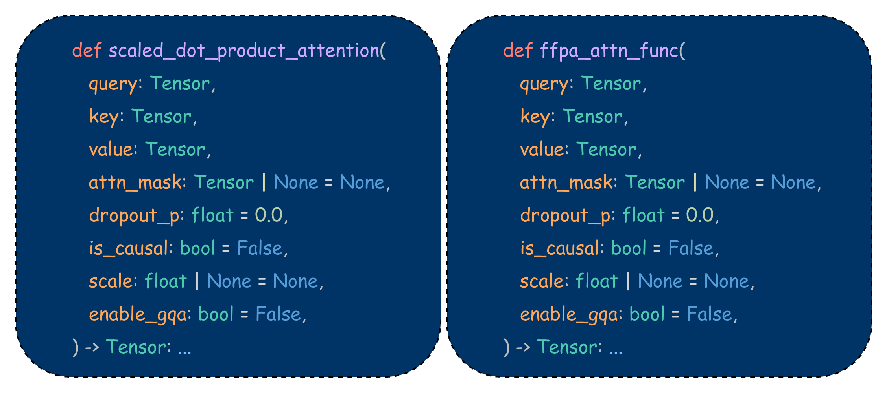
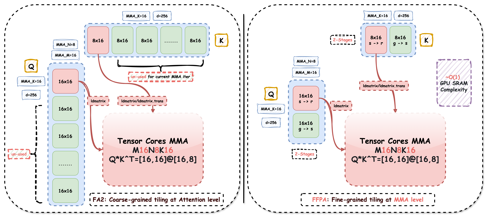

<div align="center">
  <p align="center">
    <h2>🤖FFPA: Yet another Faster Flash Prefill Attention <br>with O(1)⚡️GPU SRAM complexity for large headdim🐑</h2>
    
    <a href="https://pepy.tech/projects/ffpa-attn"></a>
    <a href="https://pypi.org/project/ffpa-attn/"></a>
    
    <br>
    
</div>

**FFPA(Split-D)**: Yet another **Faster Flash Prefill Attention** with **Split-D** strategy, achieve **O(1) SRAM complexity** and **O(d/4) register complexity** for large headdim (**> 256**), **1.5~3x** 🎉 faster than SDPA. 📚👇The Core features:

<div align='center' markdown="1">

|[Self Attn](./bench)| [GQA/MQA](./bench) |[Cross Attn](./bench)|[Causal/Mask](./bench)|[Dropout](./bench)|[Headdim](#ffpa-design)|[Fwd/Bwd](./bench)|
|:---:|:---:|:---:|:---:|:---:|:---:|:---:|
|✔️(`Nq=Nkv`)|✔️(`Hq!=Hkv`)|✔️(`Nq!=Nkv`)|✔️(`attn_mask`)|✔️(`p>0`)|**320~1024** |**1.5~3x↑** |

</div>

## 📖 Quick Start

<div id="install"></div>

First, install the prebuilt package from [PyPI](https://pypi.org/project/ffpa-attn/) or build [ffpa-attn](https://github.com/xlite-dev/ffpa-attn) from source:

```bash
# Fisrt, install the prebuilt package from PyPI
pip3 install -U ffpa-attn # CUDA 13.0+, PyTorch 2.11+
# Or, build ffpa-attn from source, just follow the cmds
git clone https://github.com/xlite-dev/ffpa-attn.git
# Then, build the wheel package (Triton + CuTeDSL backends)
cd ffpa-attn && pip3 install -e . --no-build-isolation
# Optional: install ffpa-attn w/ CUDA backend (forward only)
ENABLE_FFPA_CUDA_IMPL=1 MAX_JOBS=32 pip3 install -e .
```

Then, try to accelerate the attention for large headdim with just <i><b>one-line</b></i> of code:

```python
>>> import torch.nn.functional as F
>>> from ffpa_attn import ffpa_attn_func
>>> # Monkey-patch SDPA to point to FFPA. Every thing that FFPA
>>> # does not support will auto fallback to SDPA: D <= 256, etc.
>>> F.scaled_dot_product_attention = ffpa_attn_func # one-line code
```

For more advanced features, please refer to our online docs at 📘[ffpa-attn.io](https://ffpa-attn.readthedocs.io/en/latest/).

## 📖 Split-D

<a id="ffpa-design"></a>

We extend FlashAttention to support large headdim ($D>256$) via **fine-grained tiling** at the **MMA** level for $QK^\top$ and $PV$ matrix multiplication, referred to as **Split-D**. This design keeps SRAM usage fixed at $B_r \times 16$ (with $B_r=B_c$) for Q, K and V, yielding constant SRAM complexity $O(B_r \times 16) \approx O(1)$ and register complexity $O(d/4)$.

<div align='center'>
  
  </p><i>
    <b>FFPA</b> enables headdim <b> > 256</b>, and outperforms standard SDPA by <b>1.5~3x</b>🎉.
  </i></p>
</div>

> [!NOTE]
> FFPA has been tested on `Ampere`, `Ada`, `Hopper`, and `Blackwell` architectures (e.g., A30, L20, 4090, H200, 5090), achieves `1.5~3×↑🎉` speedup over SDPA. FFPA is mainly design for **prefill** and large headdim, and may not be faster than SDPA for 😈 small sequence length (`N<512`) or small headdim (`D<=256`).

## 🎉 Benchmark

Runnable benchmark are provided under [`bench`](./bench). The performance benchmarks for the NVIDIA L20 (**Ada**), NVIDIA Geforce RTX 5090 (**Blackwell**), NVIDIA H800 PCIE (**Hopper**), NVIDIA H200 SXM (**Hopper**, **CuTeDSL** backend, up to **427** TFLOPS!🎉) with large headdims can be found at [`bench`](./bench).

<div align='center'>
  
  <br>
  
  
</div>

## 🤖 Backends

FFPA supports multiple backends for the forward and backward pass, including: [`SDPA`](./bench/) (baseline), [`CUDA`](./bench/) (forward only), [`Triton`](./bench/), and [`CuTeDSL`](./bench/). The `CuTeDSL` backend is currently in early stage and has some constraints, but it can achieve up to `427🎉` TFLOPS on H200! Stay tuned for future updates.

<div align='center' markdown="1">

|Backend|Arch|Fwd|Bwd|Headdim|Autotune|Speedup|Recommend|
|:---:|:---:|:---:|:---:|:---:|:---:|:---:|:---:|
|SDPA|sm>=75|✔|✔|All|❌|**1.0x**🤗|sm>=75|
|CUDA|sm>=80|✔|❌|320~1024|❌|**1.5x~3x**🎉|sm80~89,120|
|Triton|sm>=80|✔|✔|320~1024|✔|**1.5x~5x**🎉|sm>=80|
|CuTeDSL|sm>=80|✔|✔|320~1024|❌|**1.5x~2x**🎉|sm80~89,120|
|CuTeDSL|sm90|✔|✔|320~512|❌|**3x~6x**🎉|sm90|

<i>Special thanks to [Butterfingrz](https://github.com/Butterfingrz) for contributing to the CuTeDSL backend! Awesome work!🎉</i>

</div>

How to use different backends for your own scenario? Users can simply pass the Backend configs (SDPABackend, CUDABackend, TritonBackend or CuTeDSLBackend) to [ffpa_attn_func](https://ffpa-attn.readthedocs.io/en/latest/api/ffpa_attn/), for example:

```python
>>> from ffpa_attn import ffpa_attn_func, CuTeDSLBackend
>>> # CuTeDSL backend, D=512 scenario, fastest on H200!🎉
>>> o = ffpa_attn_func(q, k, v, backend=CuTeDSLBackend())
```

## Persistent Autotune

Generate device-specific tuned configs for production deployment (currently, [`Triton`](https://ffpa-attn.readthedocs.io/en/latest/user_guide/autotune/) backend only), avoiding per-process autotune cost:

```bash
python -m ffpa_attn.autotune --mode max --full-tasks --overwrite # 1 GPU
export CUDA_VISIBLE_DEVICES=0,1,2,3,4,5,6,7 # Multi-GPU (`pip install ray`)
python -m ffpa_attn.autotune --mode max --full-tasks --num-gpus 8 --overwrite
```

The generated JSON is saved under [configs](https://github.com/xlite-dev/ffpa-attn/tree/main/src/ffpa_attn/triton/configs) directory and automatically loaded when runtime autotune is disabled (the default). See the docs of [Triton Autotune](https://ffpa-attn.readthedocs.io/en/latest/user_guide/autotune/) for details.

## ©️License

<div id="License"></div>

Apache License 2.0

## ©️Citations

```BibTeX
@misc{ffpa-attn@2025,
  title={FFPA: Yet another Faster Flash Prefill Attention for large headdim.},
  url={https://github.com/xlite-dev/ffpa-attn.git},
  note={Open-source software available at https://github.com/xlite-dev/ffpa-attn.git},
  author={DefTruth, Butterfingrz},
  year={2025}
}
```

## 📖 References
<div id="ref"></div>

- [flash-attention](https://github.com/Dao-AILab/flash-attention)
- [LeetCUDA](https://github.com/xlite-dev/LeetCUDA)
- [flashinfer](https://github.com/flashinfer-ai/flashinfer)
- [quack](https://github.com/Dao-AILab/quack)
- [cutlass](https://github.com/NVIDIA/cutlass)
