<div align="center">
  <p align="center">
    <h2>Fast and Memory-Efficient Exact Attention for Large Headdim</h2>
    
    <a href="https://pepy.tech/projects/ffpa-attn"></a>
    <a href="https://pypi.org/project/ffpa-attn/"></a>
    
    <br>
    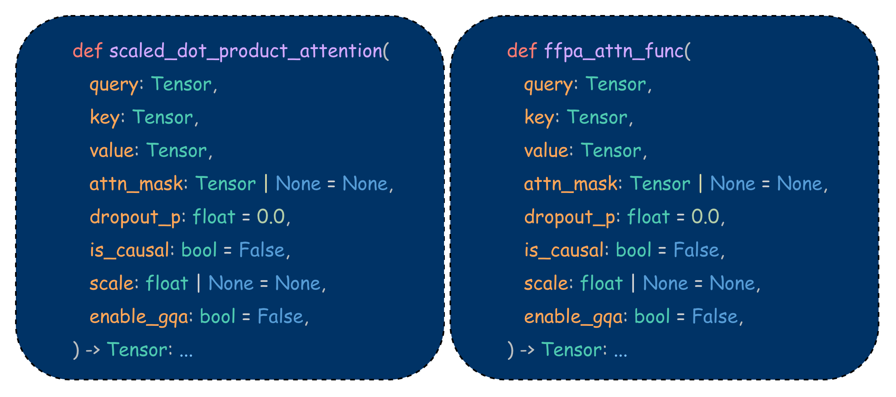
</div>

**FFPA**: Fast and Memory-Efficient Exact Attention for **Large Headdim**, achieving **O(1)** SRAM complexity (w/ [**Split-D**](#ffpa-design)) and **O(d/4)** register complexity, **1.5x~15x** speedup over PyTorch SDPA. FFPA extends the headdim support beyond **D > 256** (up to **1024**) without any precision loss.

<div align='center' markdown="1">

|[Self Attn](./bench)| [GQA/MQA](./bench) |[Cross Attn](./bench)|[Causal/Mask](./bench)|[Dropout](./bench)|[Headdim](#ffpa-design)|[Fwd/Bwd](./bench)|
|:---:|:---:|:---:|:---:|:---:|:---:|:---:|
|✔️(`Nq=Nkv`)|✔️(`Hq!=Hkv`)|✔️(`Nq!=Nkv`)|✔️(`attn_mask`)|✔️(`p>0`)|**320~1024** |**1.5x~15x↑** |

</div>

## Latest News

- [2026-08] 🐍 [**Cache-DiT x FFPA (FP8/FP4)**](#end-to-end-inference) is ready! Feel free to take a try for your Diffusion models. 🎉🎉
- [2026-08] 🚪 FFPA now experimental supports [**FP4 Attention**](./csrc/cuffpa/cute/fp4/) for headdims **[64,1024]** ([sm_120](./csrc/cuffpa/cute/fp4/sm_120/), forward only), achieving **850-980**🎉 TFLOPS (D=128-256) on NVIDIA RTX 5090, **3.8x~4.4x**🎉 speedup over PyTorch SDPA (FlashAttention-2 backend), the performance of large headdims is stay tuned for updates. 🎉🎉
- [2026-08] 🦅 FFPA now supports D=512 for NVIDIA B200 via [**CuTe-DSL**](#benchmark) **tcgen05** 2-CTA, [**1517**](#benchmark) TFLOPS forward and [**763**](#benchmark) TFLOPS backward, achieving **6x~15x**🎉 speedup over standard PyTorch SDPA. 🎉🎉
- [2026-07] 🎯 FFPA now supports [**FP8 Attention**](./csrc/cuffpa/cute/fp8/) for headdims **[64,1024]** ([sm_120](./csrc/cuffpa/cute/fp8/sm_120/), forward only) and achieving **3x~6x**🎉 speedup over PyTorch SDPA for large headdim (**D>256**). 🎉🎉
- [2026-06] FFPA now supports **AMD ROCm/HIP GPUs** via the TritonBackend, check [#268](https://github.com/xlite-dev/ffpa-attn/pull/268) for more details. 🎉
- [2026-06] 🦅 [**NVIDIA-Nemo/AutoModel x FFPA**](https://github.com/NVIDIA-NeMo/Automodel/pull/2436) achieving [**1.4x~1.5x**🎉](https://github.com/NVIDIA-NeMo/Automodel/pull/2436) End2End training throughput speedup for Gemma4-31B (8xH200, FSDP2 + AC) with **FFPA** accelerating the **10/60 (D=512)** full-attention layers. 🎉🎉
- [2026-06] 🐍 FFPA now supports [**TritonBackend**](./src/ffpa_attn/triton/) and [**CuTeDSLBacked**](./src/ffpa_attn/cute/) for both forward and backward pass, achieving **1.5x~5x**🎉 speedup over standard PyTorch SDPA across many devices. 🎉🎉
- [2026-05] 🚪 FFPA now supports GQA, MQA, cross-attn, causal, attn-mask and dropout with [**CUDABackend**](./csrc/cuffpa/native/) for large headdims (**D>256**, forward only), achieving **1.3x~2x**🎉 speedup over PyTorch SDPA. 🎉🎉

## Quick Start

<div id="install"></div>

First, install the prebuilt package from [PyPI](https://pypi.org/project/ffpa-attn/) or build [ffpa-attn](https://github.com/xlite-dev/ffpa-attn) from source:

```bash
# First, install the prebuilt package from PyPI
pip3 install -U ffpa-attn # CUDA 13.0+, PyTorch 2.11+
# Or, build ffpa-attn from source, just follow the cmds
git clone https://github.com/xlite-dev/ffpa-attn.git
# Then, build the wheel package (Triton + CuTe-DSL backends)
cd ffpa-attn && pip3 install -e . --no-build-isolation
# Optional: install ffpa-attn w/ CUDA backend (forward only)
# ext all: build all kernels, include fp8/fp4 attention kernels
bash ./build.sh --arch sm_120f --ext all --headdim all
```

Then, try to accelerate the attention for large headdim with just <i><b>one-line</b></i> of code:

```python
>>> import torch.nn.functional as F
>>> from ffpa_attn import ffpa_attn_func
>>> # Monkey-patch SDPA to point to FFPA. Every thing that FFPA
>>> # does not support will auto fallback to SDPA: N < 512, etc.
>>> F.scaled_dot_product_attention = ffpa_attn_func
```

<a id="example-self"></a>

Or, try the minimal **BF16** usage example — **Self-Attention** (B=1, H=32, N=8192, D=512):

```python
import torch
import torch.nn.functional as F
from ffpa_attn import ffpa_attn_func

# D: 64, 128, ..., 320, ..., 1024 (FA-2 <= 256, FFPA supports up to 1024).
B, H, N, D = 1, 32, 8192, 512 # batch_size, num_heads, seq_len, head_dim
q = torch.randn(B, H, N, D, dtype=torch.bfloat16, device="cuda")
k = torch.randn(B, H, N, D, dtype=torch.bfloat16, device="cuda")
v = torch.randn(B, H, N, D, dtype=torch.bfloat16, device="cuda")

# FFPA self attention; layout follows SDPA: (B, H, N, D).
out = ffpa_attn_func(q, k, v)  # -> torch.Tensor of shape (B, H, N, D)
ref = F.scaled_dot_product_attention(q, k, v)

print(f"FFPA vs SDPA max_abs_err={(out - ref).abs().max().item():.4e}")
```

Or, try the minimal **FP8/FP4** usage example with **CUDABackend** (sm_120, forward only):

```python
import torch
import torch.nn.functional as F
from ffpa_attn import CUDABackend, ffpa_attn_func
from functools import partial

# D: 64, 128, ..., 320, ..., 1024 (FA-2 <= 256, FFPA supports up to 1024).
B, H, N, D = 1, 32, 8192, 128 # batch_size, num_heads, seq_len, head_dim
q = torch.randn(B, H, N, D, dtype=torch.bfloat16, device="cuda")
k = torch.randn(B, H, N, D, dtype=torch.bfloat16, device="cuda")
v = torch.randn(B, H, N, D, dtype=torch.bfloat16, device="cuda")

# Currenly, fp8/fp4 attention are only supported on sm_120, forward only.
fp8_backend = CUDABackend(backward=False, forward=True, enable_fp8=True)
fp4_backend = CUDABackend(backward=False, forward=True, enable_fp4=True)
ffpa_attn_func_fp8 = partial(ffpa_attn_func, forward_backend=fp8_backend)
ffpa_attn_func_fp4 = partial(ffpa_attn_func, forward_backend=fp4_backend)

# FFPA self attention; layout follows SDPA: (B, H, N, D).
out_fp8 = ffpa_attn_func_fp8(q, k, v)  # -> torch.Tensor of shape (B, H, N, D)
out_fp4 = ffpa_attn_func_fp4(q, k, v)  # -> torch.Tensor of shape (B, H, N, D)
ref = F.scaled_dot_product_attention(q, k, v)

print(f"FFPA FP8 vs SDPA max_abs_err={(out_fp8 - ref).abs().max().item():.4e}")
print(f"FFPA FP4 vs SDPA max_abs_err={(out_fp4 - ref).abs().max().item():.4e}")
```

For more advanced features, please refer to our online docs at 📘[ffpa-attn.io](https://ffpa-attn.readthedocs.io/en/latest/).

## Split-D and TiledMMA

<a id="ffpa-design"></a>

We extend FlashAttention to support large headdim ($D>256$) via **fine-grained tiling** at the **MMA** level for $QK^\top$ and $PV$ matrix multiplication. Two orthogonal $O(D)$ bottlenecks — SRAM footprint and register pressure — are broken by **Split-D** and **TiledMMA<4,2,1>** respectively.

[**Split-D**](./csrc/cuffpa/cute/sm_120/split_d.cuh): The tiling of the $D$ axis breaks the SRAM bottleneck. A persist-D layout keeps $Q$ resident in SRAM at $O(D)$ ($D{=}512 \Rightarrow 192\text{KB} > 99\text{KB}$ per-CTA limit on sm_8x/sm_120). Split-D chunks the $D$ axis, keeping SRAM fixed at $B_r \times 16$ (with $B_r=B_c$) for Q, K and V, yielding constant SRAM complexity $O(B_r \times 16) \approx O(1)$.

<div align='center'>
  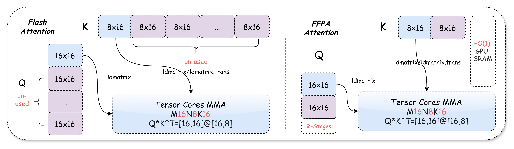
</div>

[**TiledMMA**](./csrc/cuffpa/cute/sm_120/split_d_m4n2.cuh): The **M4N2** layout breaks the register bottleneck. The $QK^\top$ has $N{=}B_c$ (fixed, independent of $D$), so its acc is $O(1)$; the $PV$ GEMM instead has $N{=}D$, so the $O$ acc costs $D/(2{\cdot}N_w)$ regs/thread. **M8N1** (FA-2 style, $N_w{=}1$) $\Rightarrow O(D/2)$: at $D{=}512$ this already reaches 256 regs/thread, over the 255 architectural limit and spilling. Splitting $N$ to **M4N2** (FA-1 style, $N_w{=}2$) halves it to $O(D/4)$, keeping $D{=}1024$ just feasible (256 regs/thread).

<div align='center'>
  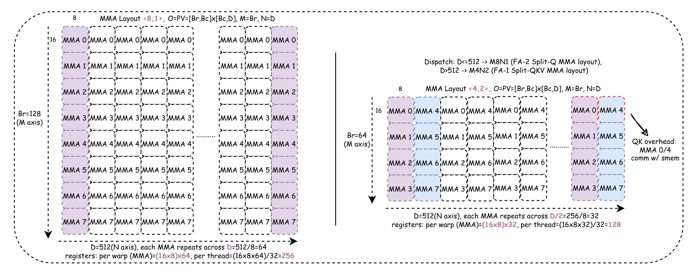
</div>

**Dispatch**: **M8N1** for $D \le 512$, **M4N2** for $D > 512$. On RTX 5090, **M4N2** delivers **1.55×** the throughput of **M8N1** at $D{=}1024$ (154T vs 100T, where **M8N1** collapses from register spilling).

## Benchmark

Runnable benchmark are provided under [`bench`](./bench). The performance benchmarks for the NVIDIA L20 (**Ada**), NVIDIA Geforce RTX 5090 (**Blackwell**), NVIDIA H800 PCIE (**Hopper**), NVIDIA H200 SXM (**Hopper**, **CuTe-DSL** backend, up to **535** TFLOPS!), B200 (**Blackwell**, **CuTe-DSL** `tcgen05` 2-CTA D=512 backend, up to **1517** TFLOPS forward and **763** TFLOPS backward!) with large headdims can be found at [`bench`](./bench).

<div align='center'>
  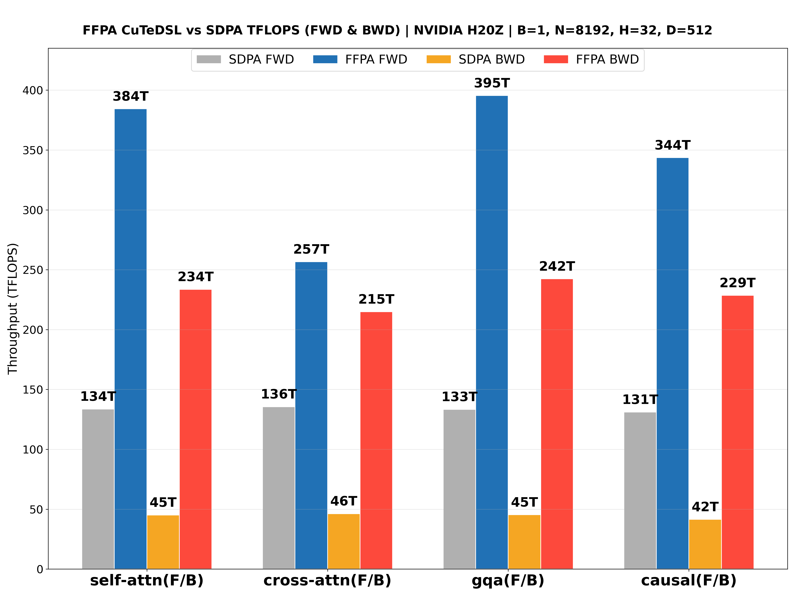
  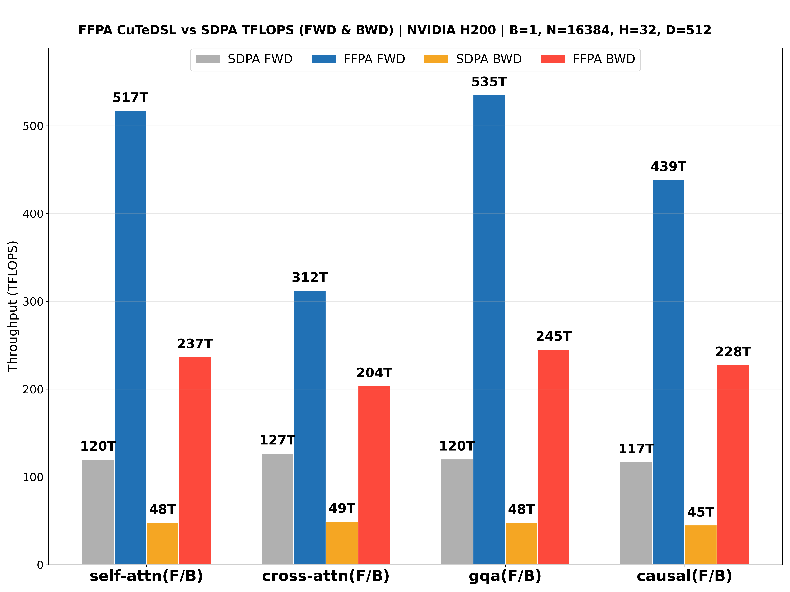
  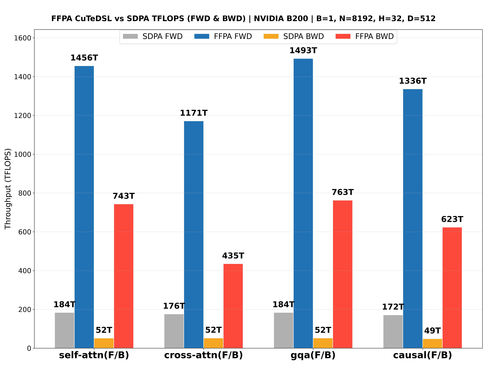
  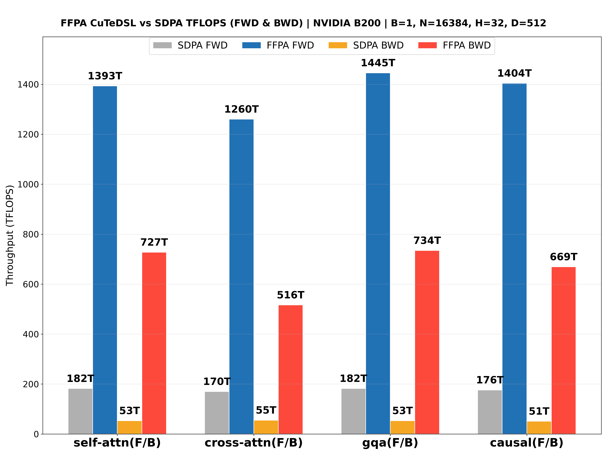<br>
  <p><i><b>BF16 Attention</b> for Large Headdim: FFPA vs SDPA (FWD/BWD) across NVIDIA H200 and B200, 6x-15x↑. </i></p>
</div>
<div align='center'>
  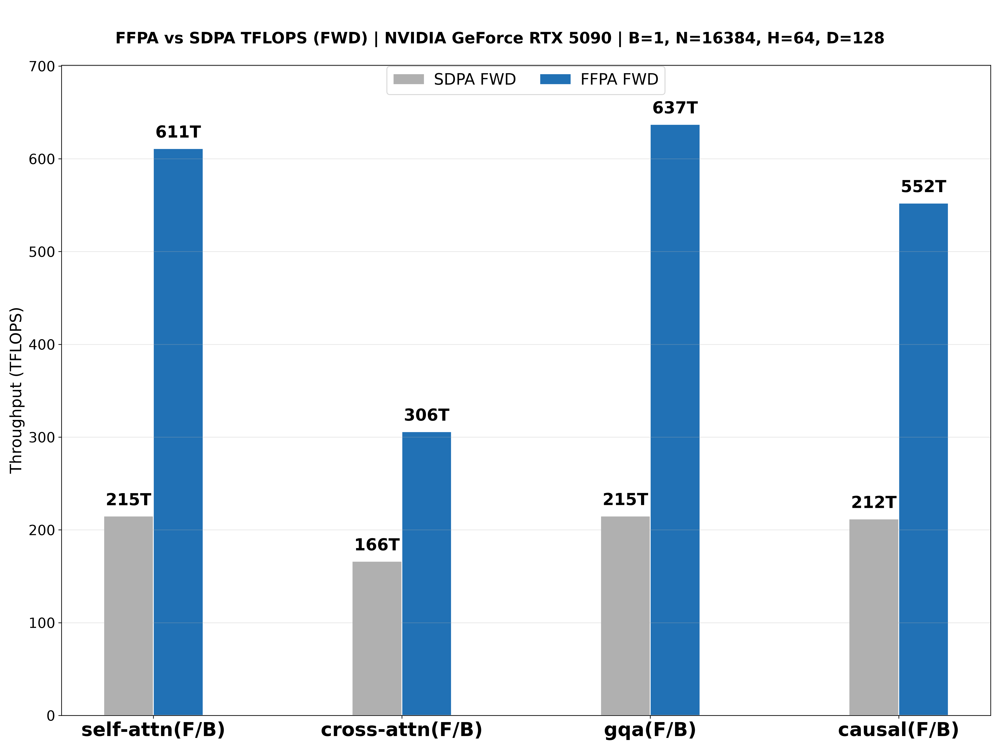
  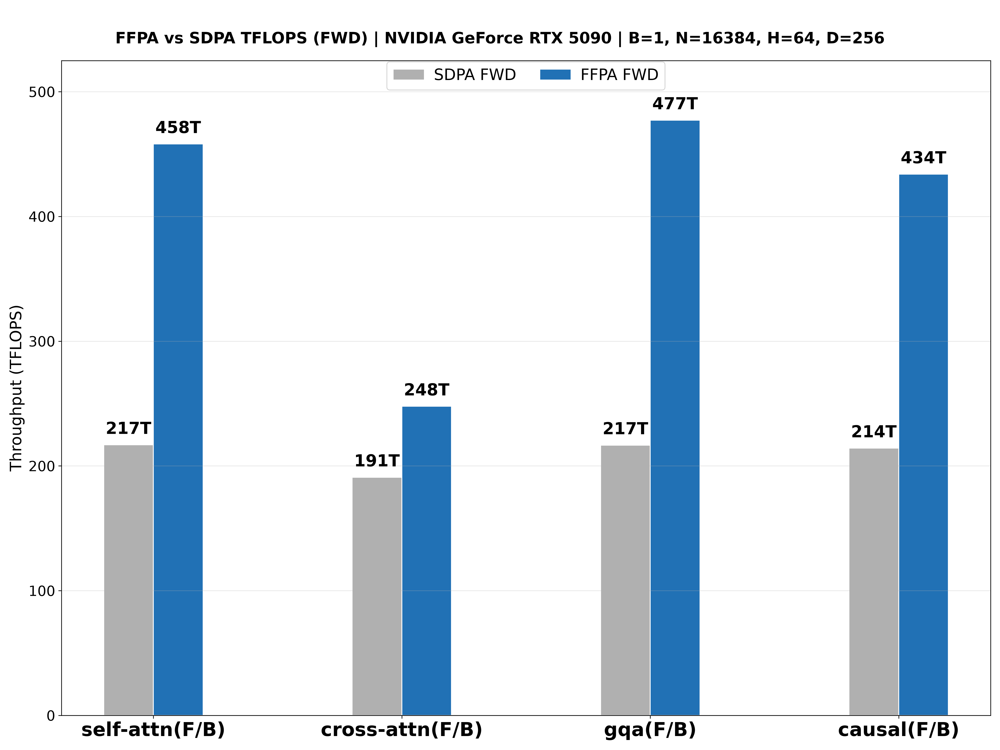
  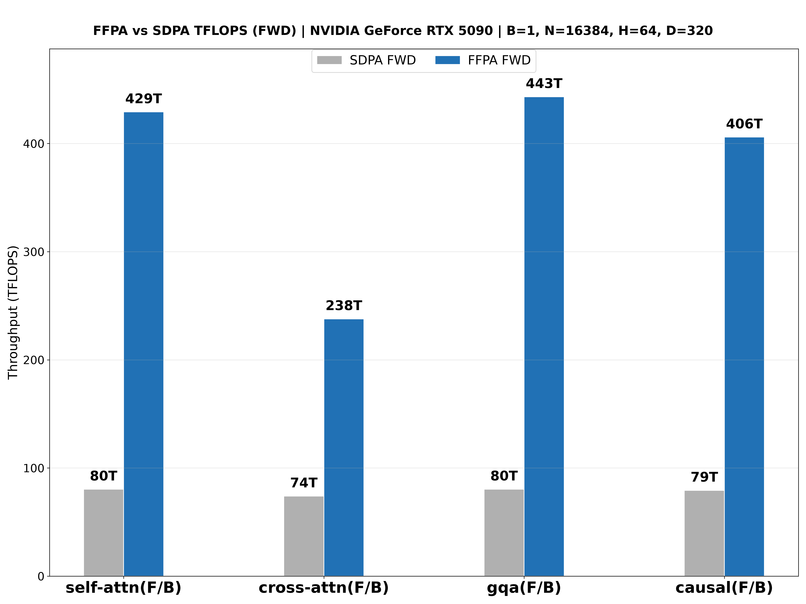
  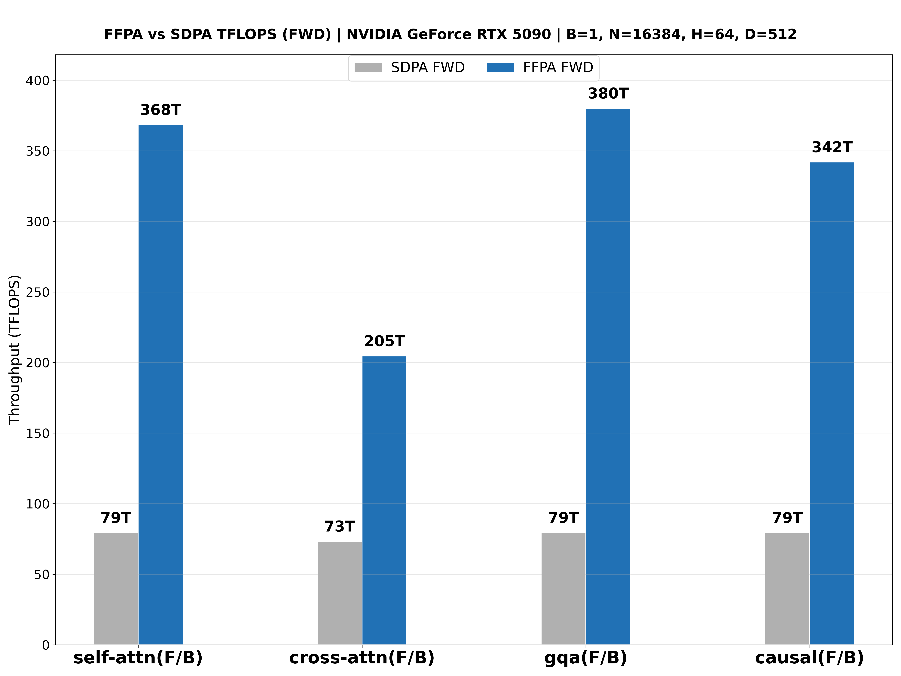<br>
  <p><i><b>FP8 Attention</b> for Large/Small Headdim: FFPA vs SDPA (FWD) on NVIDIA RTX 5090, 3x-6x↑. </i></p>
</div>
<div align='center'>
  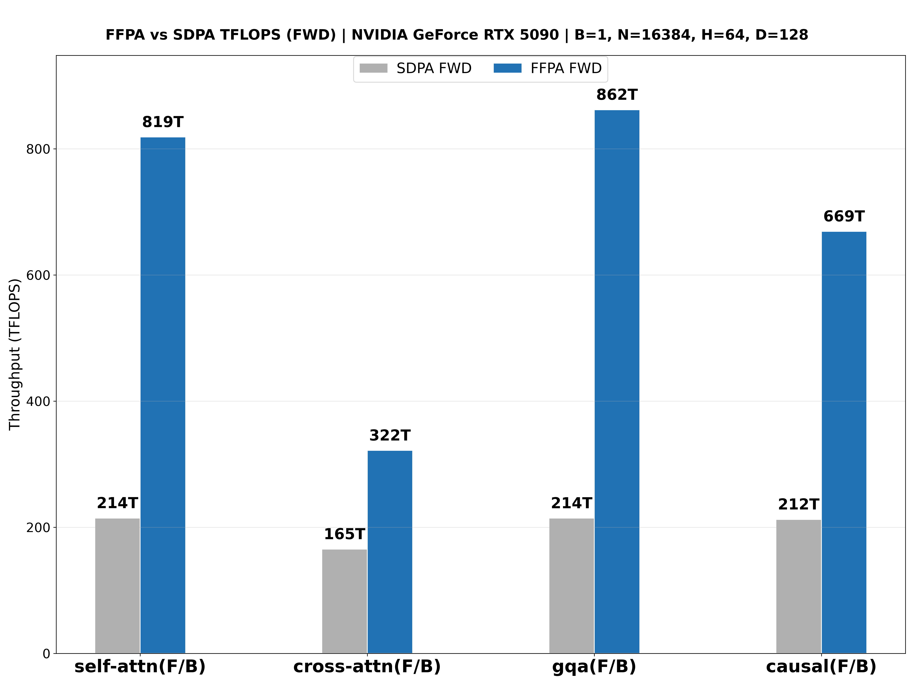
  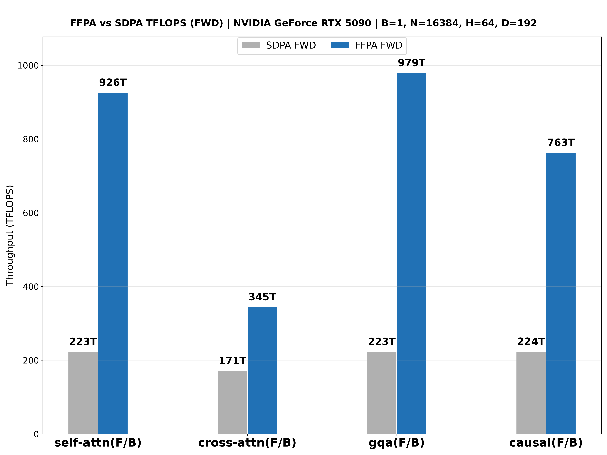
  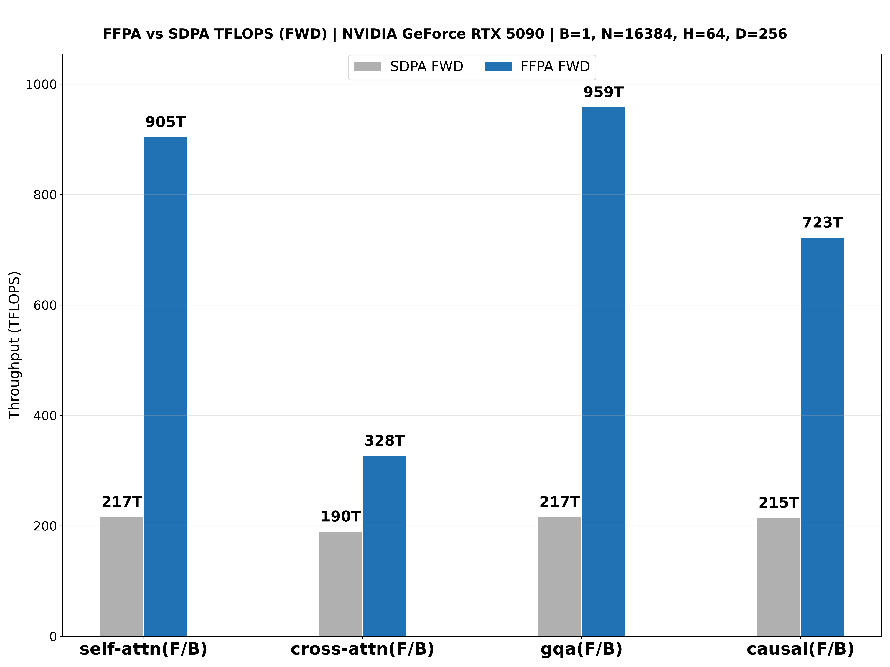
  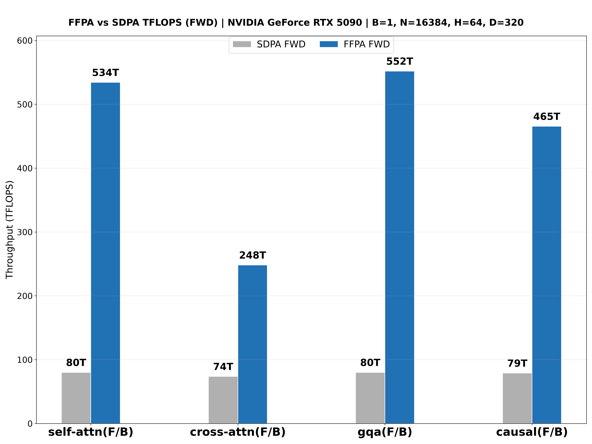<br>
  <p><i><b>FP4 Attention</b> for Large/Small Headdim: FFPA vs SDPA (FWD) on NVIDIA RTX 5090, 4x-7x↑. </i></p>
</div>

## Backends

FFPA supports multiple backends for the forward and backward pass, including: [`SDPA`](./bench/) (baseline), [`CUDA`](./bench/) (forward only), [`Triton`](./bench/), and [`CuTe-DSL`](./bench/). The **CuTe-DSL** backend is currently in early stage, stay tuned for future updates. The **Triton** backend (forward + backward) also runs on AMD GPUs.

<div align='center' markdown="1">

|Backend|Arch|Fwd|Bwd|Headdim|Autotune|Speedup|Recommend|
|:---:|:---:|:---:|:---:|:---:|:---:|:---:|:---:|
|SDPA|sm>=75|✔|✔|All|✖️|**1.0x**|sm>=75|
|CUDA|sm>=80|✔|✖️|320~1024|✖️|**1.5x~3x**|sm_80~89,120{a,f}|
|CUDA FP8|sm_120{a,f}|✔|✖️|64~1024|✖️|**3x~6x**|sm_120{a,f}|
|CUDA FP4|sm_120{a,f}|✔|✖️|64~512|✖️|**4x~7x**|sm_120{a,f}|
|Triton|sm>=80|✔|✔|320~1024|✔|**1.5x~5x**|sm>=80|
|CuTe-DSL|sm>=80|✔|✔|320~1024|✖️|**1.5x~2x**|sm_80~89,120{a,f}|
|CuTe-DSL|sm_90a|✔|✔|320~512|✖️|**3x~6x**|sm_90a|
|CuTe-DSL|sm_100a|✔|✔|512|✖️|**6x~15x**|sm_100a|

</div>

How to use different backends for your own scenario? Users can simply pass the Backend configs (SDPABackend, CUDABackend, TritonBackend or CuTeDSLBackend) to [ffpa_attn_func](https://ffpa-attn.readthedocs.io/en/latest/api/ffpa_attn/), for example:

```python
>>> from ffpa_attn import ffpa_attn_func, CuTeDSLBackend
>>> # CuTe-DSL backend, D=512 scenario, fastest on H200!
>>> o = ffpa_attn_func(q, k, v, backend=CuTeDSLBackend())
```

## Persistent Autotune

Generate device-specific tuned configs for production deployment (currently, [**Triton**](https://ffpa-attn.readthedocs.io/en/latest/user_guide/autotune/) only), avoiding per-process autotune cost. The generated JSON is saved under [configs](https://github.com/xlite-dev/ffpa-attn/tree/main/src/ffpa_attn/triton/configs) dir and automatically loaded when runtime autotune is disabled (the default). See the docs of [Triton Autotune](https://ffpa-attn.readthedocs.io/en/latest/user_guide/autotune/) for details.

```bash
python -m ffpa_attn.autotune --mode max --full-tasks --overwrite # 1 GPU
export CUDA_VISIBLE_DEVICES=0,1,2,3,4,5,6,7 # Multi-GPU (`pip install ray`)
python -m ffpa_attn.autotune --mode max --full-tasks --num-gpus 8 --overwrite
```

## End-to-End Training

NVIDIA-NeMo Automodel PR [#2436](https://github.com/NVIDIA-NeMo/Automodel/pull/2436) shows that on Gemma4-31B training (L=8192, 8xH200, FSDP2 + Activation Checkpointing), accelerating the **10/60 (D=512)** full-attention layers with FFPA delivers about [`1.4x~1.5x`](https://github.com/NVIDIA-NeMo/Automodel/pull/2436) higher throughput (**E2E**) than SDPA at similar memory footprint, with loss aligned within normal bf16 noise.

## End-to-End Inference

The FFPA (FP8/FP4) attention has fully integrated into [Cache-DiT](https://github.com/vipshop/cache-dit). Currently, the FP8/FP4 attention supports most of the attention headdims range from **64** to **1024** (forward only), including any headdims that can be divided by **8**, covering self-attention, cross-attention, causal attention and GQA/MQA attention. Feel free to take a try for your Diffusion models. For examples: (FLUX.1-dev, seed=42, 28 steps)

```bash
python3 -m cache_dit.generate flux --attn native   --seed 42 --height 1024 --width 1024
python3 -m cache_dit.generate flux --attn ffpa_fp8 --seed 42 --height 1024 --width 1024
python3 -m cache_dit.generate flux --attn ffpa_fp4 --seed 42 --height 1024 --width 1024
```

<div align='center' markdown="1">

<i> FLUX.1-dev, seed=42, 28 steps, 1024 x 1024, NVIDIA RTX PRO 5000 </i>

|SDPA-FA2 (17.2s)|FFPA-FP8 (16.6s)|SageAttn-3 (FP4, 16.4s)|FFPA-FP4 (16.4s)|
|:---:|:---:|:---:|:---:|
|||||

<i> FLUX.1-dev, seed=42, 28 steps, 2048 x 2048, NVIDIA RTX PRO 5000 </i>

|SDPA-FA2 (92.3s)|FFPA-FP8 (83.5s)|SageAttn-3 (FP4, 80.4s)|FFPA-FP4 (78.4s)|
|:---:|:---:|:---:|:---:|
|||||

</div>

The performance and precision of FFPA (FP8/FP4) is still under active development, stay tuned for future updates. Please note that the FP8/FP4 attention is **not suitable** for all scenarios (e.g., **small models** or **short seqlen**), and we recommend users to evaluate the precision and performance of FFPA (FP8/FP4) for their own use cases.

## License

<div id="License"></div>

Apache License 2.0

## Citations

```BibTeX
@misc{deftruth2026ffpa,
  author       = {DefTruth and Butterfingrz},
  title        = {FFPA: Fast and Memory-Efficient Exact Attention for Large Headdim},
  year         = {2026},
  publisher    = {Zenodo},
  version      = {v1.0},
  doi          = {10.5281/zenodo.20638547},
  url          = {https://doi.org/10.5281/zenodo.20638547}
}
```

## References

<div id="ref"></div>

- [cache-dit](https://github.com/vipshop/cache-dit)
- [flash-attention](https://github.com/Dao-AILab/flash-attention)
- [SageAttention](https://github.com/thu-ml/sageattention)
- [LeetCUDA](https://github.com/xlite-dev/LeetCUDA)
- [flashinfer](https://github.com/flashinfer-ai/flashinfer)
- [quack](https://github.com/Dao-AILab/quack)
- [cutlass](https://github.com/NVIDIA/cutlass)
