# FFPA Attention Benchmark

## Quick Start

```bash
python3 -m ffpa_attn.bench # default: forward + backward w/o autotuning
python3 -m ffpa_attn.bench --no-bwd # only forward pass
python3 -m ffpa_attn.bench --no-fwd # only backward pass
python3 -m ffpa_attn.bench --fwd-backend triton --bwd-backend triton --tune fast
python3 -m ffpa_attn.bench --fwd-backend triton --bwd-backend triton --tune max
python3 -m ffpa_attn.bench --fwd-backend triton --bwd-backend triton --tune max --fwd-tma --bwd-tma # SM>=90
python3 -m ffpa_attn.bench --fwd-backend cutedsl --bwd-backend cutedsl # SM==90 dense 320<D<=512, SM==100 dense D==512
```

The `ffpa-attn bench CLI (python -m ffpa_attn.bench)` migrated benchmark plotting entrypoint. It preserves the old plot style, can benchmark forward/backward cases on demand, and writes both `ffpa_{device}_speedup.png` and `ffpa_{device}_speedup.md`. The additive-mask example uses a compact `[1, 1, 1, Nkv]` key-position bias by default. Use `[1, 1, Nq, Nkv]` only when per-query bias is required, since it scales as `O(Nq * Nkv)` memory.

## FP8 and FP4

First, install [SageAttention-2/3](https://github.com/thu-ml/SageAttention.git) for benchmark comparison.

```bash
git clone https://github.com/thu-ml/SageAttention.git
cd SageAttention
# SageAttention-2 (FP8)
export EXT_PARALLEL=4 NVCC_APPEND_FLAGS="--threads 8" MAX_JOBS=8 # Optional
python setup.py install
# SageAttention-3 (FP4)
cd sageattention3_blackwell
python setup.py install
```
Then, build FFPA Attention with FP8/FP4 support from source:

```bash
git clone https://github.com/xlite-dev/ffpa-attn.git
cd ffpa-attn && git submodule update --init --recursive --force --progress --jobs 4
# Optional: install ffpa-attn w/ CUDA backend (forward only)
# ext all: build all kernels, include fp8/fp4 attention kernels
bash ./build.sh --arch sm_120f --ext all --headdim 128,192,256
```
Now you can run the benchmark script to compare FFPA Attention with SageAttention-2/3 on NVIDIA RTX PRO 5000/6000/5090. The benchmark results will be saved in the `bench/.tmp` directory.

```bash
python bench/bench_fp8.py --N 16384,32768
python bench/bench_fp4.py --N 16384,32768
```

<div align='center'>
  <p><i><b>FP8 Attention</b> for D=128: FFPA vs SageAttention-2 on NVIDIA RTX PRO 5000/6000/5090. </i></p>
  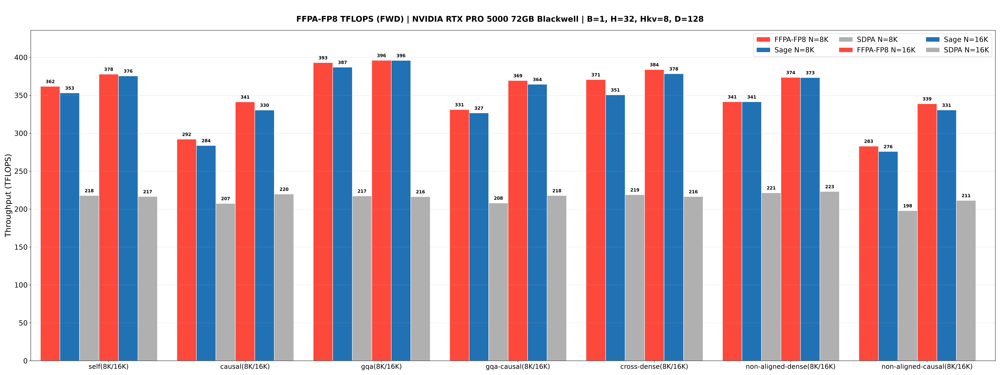<br>
  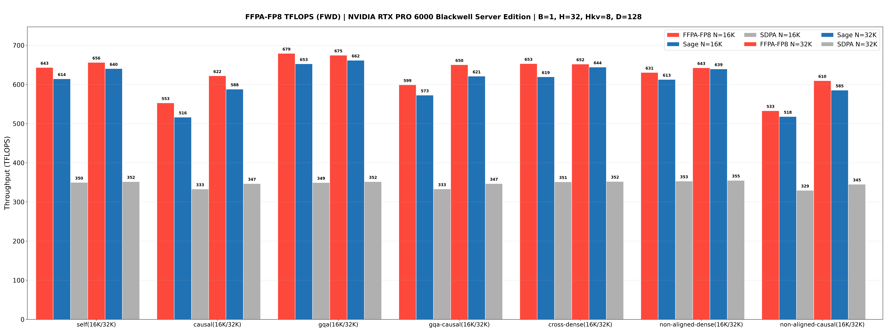<br>
  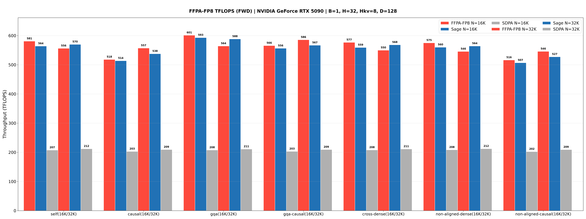<br>
</div>

<div align='center'>
  <p><i><b>FP4 Attention</b> for D=128: FFPA vs SageAttention-3 on NVIDIA RTX PRO 5000/6000/5090. </i></p>
  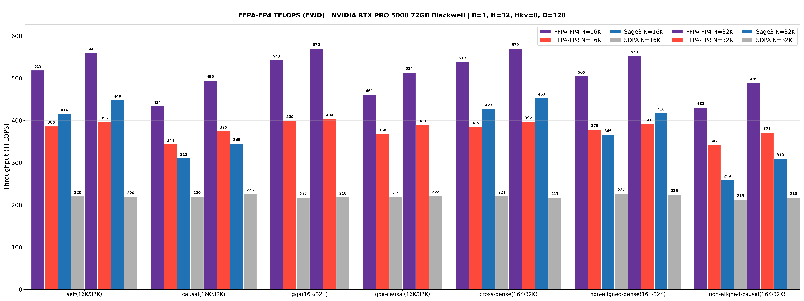<br>
  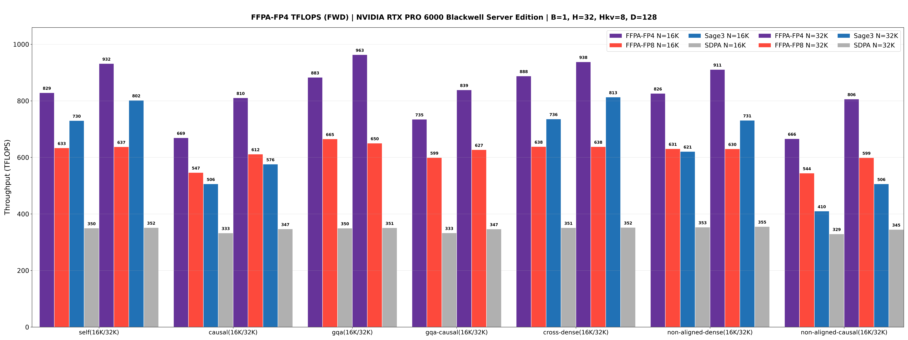<br>
  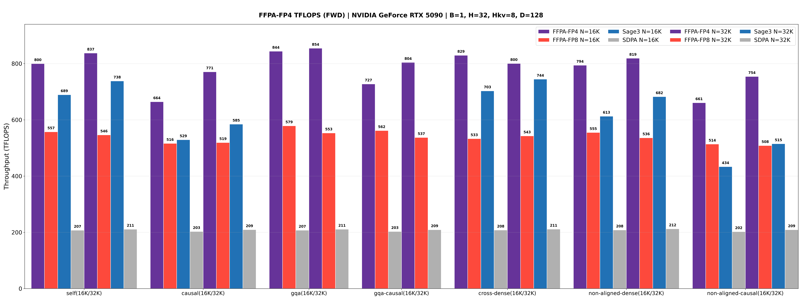<br>
</div>

## More Benchmark

TFLOPS reports the theoretical dominant attention GEMM throughput only; forward and backward are computed separately from the measured latency. Forward counts 2 GEMMs and backward the standard 5, so the backward figure stays comparable across implementations — on SM100 the backward is split into four launches (preprocess, dV, dK, dQ) that execute 8 GEMM passes, and the extra 1.6x is deliberately not counted. Env: NVIDIA L20 (Ada, 119.5 TFLOPS), NVIDIA H200 and NVIDIA B200, PyTorch 2.11, CUDA 13.0, Headdim=512 (FA-2 not supported).

<div align='center' markdown="1">

### Forward Pass (Triton, NVIDIA L20, 8K, D=512)

| Case | dtype | Nq/Nkv | FFPA / SDPA | TFLOPS | speedup |
|:---:|:---:|:---:|:---:|:---:|:---:|
| self-attn | fp16 | 8192/8192 | 45.40 / 74.76 ms | 97T / 59T | 1.65x |
| self-attn | bf16 | 8192/8192 | 45.08 / 74.63 ms | 98T / 59T | 1.66x |
| cross-attn | fp16 | 1024/8192 | 6.31 / 10.05 ms | 87T / 55T | 1.59x |
| cross-attn | bf16 | 1024/8192 | 6.14 / 10.10 ms | 89T / 54T | 1.64x |
| decode-attn | fp16 | 1/8192 | 0.77 / 0.80 ms | 0.69T / 0.67T | 1.03x |
| decode-attn | bf16 | 1/8192 | 0.77 / 0.80 ms | 0.69T / 0.67T | 1.04x |
| gqa | fp16 | 8192/8192 | 45.35 / 74.68 ms | 97T / 59T | 1.65x |
| gqa | bf16 | 8192/8192 | 44.93 / 74.70 ms | 98T / 59T | 1.66x |
| causal | fp16 | 8192/8192 | 25.11 / 37.31 ms | 88T / 59T | 1.49x |
| causal | bf16 | 8192/8192 | 24.71 / 37.48 ms | 89T / 59T | 1.52x |
| attn-mask | fp16 | 8192/8192 | 51.79 / 80.66 ms | 85T / 55T | 1.56x |
| attn-mask | bf16 | 8192/8192 | 48.47 / 80.78 ms | 91T / 54T | 1.67x |
| dropout | fp16 | 8192/8192 | 53.49 / 82.95 ms | 82T / 53T | 1.55x |
| dropout | bf16 | 8192/8192 | 53.00 / 82.83 ms | 83T / 53T | 1.56x |
| non-aligned | fp16 | 8191/8191 | 11.96 / 19.13 ms | 92T / 57T | 1.60x |
| non-aligned | bf16 | 8191/8191 | 11.90 / 19.13 ms | 92T / 57T | 1.61x |

### Backward Pass (Triton, NVIDIA L20, 8K, D=512)

| Case | dtype | Nq/Nkv | FFPA / SDPA | TFLOPS | speedup |
|:---:|:---:|:---:|:---:|:---:|:---:|
| self-attn | fp16 | 8192/8192 | 191.89 / 351.96 ms | 57T / 31T | 1.83x |
| self-attn | bf16 | 8192/8192 | 192.10 / 353.15 ms | 57T / 31T | 1.84x |
| cross-attn | fp16 | 1024/8192 | 26.14 / 42.69 ms | 53T / 32T | 1.63x |
| cross-attn | bf16 | 1024/8192 | 25.91 / 42.56 ms | 53T / 32T | 1.64x |
| decode-attn | fp16 | 1/8192 | 2.65 / 5.81 ms | 0.51T / 0.23T | 2.20x |
| decode-attn | bf16 | 1/8192 | 2.65 / 5.85 ms | 0.51T / 0.23T | 2.21x |
| gqa | fp16 | 8192/8192 | 194.90 / 349.08 ms | 56T / 31T | 1.79x |
| gqa | bf16 | 8192/8192 | 194.04 / 349.12 ms | 57T / 31T | 1.80x |
| causal | fp16 | 8192/8192 | 95.85 / 191.50 ms | 57T / 29T | 2.00x |
| causal | bf16 | 8192/8192 | 96.05 / 190.57 ms | 57T / 29T | 1.98x |
| attn-mask | fp16 | 8192/8192 | 196.93 / 379.14 ms | 56T / 29T | 1.93x |
| attn-mask | bf16 | 8192/8192 | 195.79 / 380.01 ms | 56T / 29T | 1.94x |
| dropout | fp16 | 8192/8192 | 203.18 / 353.68 ms | 54T / 31T | 1.74x |
| dropout | bf16 | 8192/8192 | 201.93 / 354.71 ms | 54T / 31T | 1.76x |
| non-aligned | fp16 | 8191/8191 | 52.38 / 100.03 ms | 52T / 27T | 1.91x |
| non-aligned | bf16 | 8191/8191 | 50.46 / 99.96 ms | 54T / 27T | 1.98x |


### Forward Pass (CuTeDSL, NVIDIA H200, 8K, D=512)

| Case | dtype | Nq/Nkv | FFPA / SDPA | TFLOPS | speedup |
|:---:|:---:|:---:|:---:|:---:|:---:|
| self-attn | fp16 | 8192/8192 | 11.42 / 33.10 ms | 385T / 133T | 2.90x |
| self-attn | bf16 | 8192/8192 | 11.82 / 32.47 ms | 372T / 135T | 2.75x |
| cross-attn | fp16 | 1024/8192 | 2.25 / 4.07 ms | 244T / 135T | 1.81x |
| cross-attn | bf16 | 1024/8192 | 2.22 / 4.03 ms | 247T / 137T | 1.81x |
| gqa | fp16 | 8192/8192 | 11.46 / 33.36 ms | 384T / 132T | 2.91x |
| gqa | bf16 | 8192/8192 | 10.92 / 32.52 ms | 403T / 135T | 2.98x |
| causal | fp16 | 8192/8192 | 6.54 / 16.99 ms | 336T / 129T | 2.60x |
| causal | bf16 | 8192/8192 | 6.34 / 16.76 ms | 347T / 131T | 2.64x |
| non-aligned | fp16 | 8191/8191 | 3.05 / 8.05 ms | 361T / 137T | 2.64x |
| non-aligned | bf16 | 8191/8191 | 3.06 / 7.93 ms | 359T / 139T | 2.59x |

### Backward Pass (CuTeDSL, NVIDIA H200, 8K, D=512)

| Case | dtype | Nq/Nkv | FFPA / SDPA | TFLOPS | speedup |
|:---:|:---:|:---:|:---:|:---:|:---:|
| self-attn | fp16 | 8192/8192 | 48.67 / 239.57 ms | 226T / 46T | 4.92x |
| self-attn | bf16 | 8192/8192 | 48.38 / 239.17 ms | 227T / 46T | 4.94x |
| cross-attn | fp16 | 1024/8192 | 7.13 / 29.59 ms | 193T / 46T | 4.15x |
| cross-attn | bf16 | 1024/8192 | 7.11 / 29.49 ms | 193T / 47T | 4.15x |
| gqa | fp16 | 8192/8192 | 46.38 / 239.77 ms | 237T / 46T | 5.17x |
| gqa | bf16 | 8192/8192 | 46.16 / 239.07 ms | 238T / 46T | 5.18x |
| causal | fp16 | 8192/8192 | 25.84 / 130.43 ms | 213T / 42T | 5.05x |
| causal | bf16 | 8192/8192 | 25.38 / 130.72 ms | 217T / 42T | 5.15x |
| non-aligned | fp16 | 8191/8191 | 11.88 / 71.09 ms | 231T / 39T | 5.98x |
| non-aligned | bf16 | 8191/8191 | 11.81 / 70.83 ms | 233T / 39T | 6.00x |

### Forward Pass (CuTeDSL, NVIDIA H200, 16K, D=512)

| Case | dtype | Nq/Nkv | FFPA / SDPA | TFLOPS | speedup |
|:---:|:---:|:---:|:---:|:---:|:---:|
| self-attn | fp16 | 16384/16384 | 43.11 / 144.70 ms | 408T / 122T | 3.36x |
| self-attn | bf16 | 16384/16384 | 42.28 / 143.35 ms | 416T / 123T | 3.39x |
| cross-attn | fp16 | 1024/16384 | 4.06 / 8.72 ms | 271T / 126T | 2.15x |
| cross-attn | bf16 | 1024/16384 | 4.16 / 8.64 ms | 264T / 127T | 2.08x |
| gqa | fp16 | 16384/16384 | 42.17 / 144.28 ms | 417T / 122T | 3.42x |
| gqa | bf16 | 16384/16384 | 41.31 / 142.98 ms | 426T / 123T | 3.46x |
| causal | fp16 | 16384/16384 | 23.89 / 74.92 ms | 368T / 117T | 3.14x |
| causal | bf16 | 16384/16384 | 23.09 / 74.20 ms | 381T / 119T | 3.21x |
| non-aligned | fp16 | 16383/16383 | 11.16 / 34.46 ms | 394T / 128T | 3.09x |
| non-aligned | bf16 | 16383/16383 | 10.90 / 33.67 ms | 403T / 131T | 3.09x |

### Backward Pass (CuTeDSL, NVIDIA H200, 16K, D=512)

| Case | dtype | Nq/Nkv | FFPA / SDPA | TFLOPS | speedup |
|:---:|:---:|:---:|:---:|:---:|:---:|
| self-attn | fp16 | 16384/16384 | 188.43 / 937.25 ms | 233T / 47T | 4.97x |
| self-attn | bf16 | 16384/16384 | 187.01 / 933.86 ms | 235T / 47T | 4.99x |
| cross-attn | fp16 | 1024/16384 | 13.92 / 56.94 ms | 197T / 48T | 4.09x |
| cross-attn | bf16 | 1024/16384 | 13.87 / 56.95 ms | 198T / 48T | 4.10x |
| gqa | fp16 | 16384/16384 | 184.66 / 933.70 ms | 238T / 47T | 5.06x |
| gqa | bf16 | 16384/16384 | 183.01 / 934.03 ms | 240T / 47T | 5.10x |
| causal | fp16 | 16384/16384 | 98.89 / 496.05 ms | 222T / 44T | 5.02x |
| causal | bf16 | 16384/16384 | 97.10 / 497.01 ms | 226T / 44T | 5.12x |
| non-aligned | fp16 | 16383/16383 | 46.30 / 252.40 ms | 237T / 44T | 5.45x |
| non-aligned | bf16 | 16383/16383 | 45.80 / 253.24 ms | 240T / 43T | 5.53x |

### Forward Pass (CuTeDSL, NVIDIA B200, 8K, D=512)

| Case | dtype | Nq/Nkv | FFPA / SDPA | TFLOPS | speedup |
|:---:|:---:|:---:|:---:|:---:|:---:|
| self-attn | fp16 | 8192/8192 | 3.19 / 23.89 ms | 1379T / 184T | 7.49x |
| self-attn | bf16 | 8192/8192 | 3.02 / 23.93 ms | 1456T / 184T | 7.92x |
| cross-attn | fp16 | 1024/8192 | 0.48 / 3.12 ms | 1136T / 176T | 6.45x |
| cross-attn | bf16 | 1024/8192 | 0.47 / 3.12 ms | 1171T / 176T | 6.65x |
| gqa | fp16 | 8192/8192 | 3.06 / 24.11 ms | 1435T / 182T | 7.87x |
| gqa | bf16 | 8192/8192 | 2.94 / 23.94 ms | 1493T / 184T | 8.13x |
| causal | fp16 | 8192/8192 | 1.74 / 13.05 ms | 1267T / 168T | 7.52x |
| causal | bf16 | 8192/8192 | 1.65 / 12.82 ms | 1336T / 172T | 7.79x |
| non-aligned | fp16 | 8191/8191 | 0.81 / 6.58 ms | 1365T / 167T | 8.17x |
| non-aligned | bf16 | 8191/8191 | 0.77 / 6.16 ms | 1428T / 178T | 8.00x |

### Backward Pass (CuTeDSL, NVIDIA B200, 8K, D=512)

| Case | dtype | Nq/Nkv | FFPA / SDPA | TFLOPS | speedup |
|:---:|:---:|:---:|:---:|:---:|:---:|
| self-attn | fp16 | 8192/8192 | 15.13 / 202.29 ms | 727T / 54T | 13.37x |
| self-attn | bf16 | 8192/8192 | 14.80 / 212.18 ms | 743T / 52T | 14.34x |
| cross-attn | fp16 | 1024/8192 | 3.17 / 25.98 ms | 434T / 53T | 8.21x |
| cross-attn | bf16 | 1024/8192 | 3.16 / 26.24 ms | 435T / 52T | 8.31x |
| gqa | fp16 | 8192/8192 | 14.97 / 202.34 ms | 735T / 54T | 13.52x |
| gqa | bf16 | 8192/8192 | 14.42 / 211.76 ms | 763T / 52T | 14.69x |
| causal | fp16 | 8192/8192 | 8.88 / 104.29 ms | 619T / 53T | 11.75x |
| causal | bf16 | 8192/8192 | 8.82 / 113.14 ms | 623T / 49T | 12.83x |
| non-aligned | fp16 | 8191/8191 | 4.28 / 54.64 ms | 641T / 50T | 12.75x |
| non-aligned | bf16 | 8191/8191 | 4.28 / 59.48 ms | 642T / 46T | 13.90x |

### Forward Pass (CuTeDSL, NVIDIA B200, 16K, D=512)

| Case | dtype | Nq/Nkv | FFPA / SDPA | TFLOPS | speedup |
|:---:|:---:|:---:|:---:|:---:|:---:|
| self-attn | fp16 | 16384/16384 | 12.83 / 98.01 ms | 1371T / 179T | 7.64x |
| self-attn | bf16 | 16384/16384 | 12.63 / 96.73 ms | 1393T / 182T | 7.66x |
| cross-attn | fp16 | 1024/16384 | 0.90 / 6.47 ms | 1219T / 170T | 7.17x |
| cross-attn | bf16 | 1024/16384 | 0.87 / 6.47 ms | 1260T / 170T | 7.42x |
| gqa | fp16 | 16384/16384 | 12.71 / 98.10 ms | 1384T / 179T | 7.72x |
| gqa | bf16 | 16384/16384 | 12.17 / 96.62 ms | 1445T / 182T | 7.94x |
| causal | fp16 | 16384/16384 | 6.47 / 50.82 ms | 1360T / 173T | 7.86x |
| causal | bf16 | 16384/16384 | 6.27 / 49.94 ms | 1404T / 176T | 7.97x |
| non-aligned | fp16 | 16383/16383 | 3.05 / 24.28 ms | 1443T / 181T | 7.97x |
| non-aligned | bf16 | 16383/16383 | 2.90 / 24.37 ms | 1517T / 180T | 8.41x |

### Backward Pass (CuTeDSL, NVIDIA B200, 16K, D=512)

| Case | dtype | Nq/Nkv | FFPA / SDPA | TFLOPS | speedup |
|:---:|:---:|:---:|:---:|:---:|:---:|
| self-attn | fp16 | 16384/16384 | 62.93 / 785.17 ms | 699T / 56T | 12.48x |
| self-attn | bf16 | 16384/16384 | 60.46 / 827.20 ms | 727T / 53T | 13.68x |
| cross-attn | fp16 | 1024/16384 | 5.35 / 50.66 ms | 514T / 54T | 9.48x |
| cross-attn | bf16 | 1024/16384 | 5.32 / 49.76 ms | 516T / 55T | 9.35x |
| gqa | fp16 | 16384/16384 | 62.01 / 787.07 ms | 709T / 56T | 12.69x |
| gqa | bf16 | 16384/16384 | 59.89 / 826.51 ms | 734T / 53T | 13.80x |
| causal | fp16 | 16384/16384 | 34.42 / 401.00 ms | 639T / 55T | 11.65x |
| causal | bf16 | 16384/16384 | 32.87 / 431.60 ms | 669T / 51T | 13.13x |
| non-aligned | fp16 | 16383/16383 | 14.84 / 196.92 ms | 741T / 56T | 13.27x |
| non-aligned | bf16 | 16383/16383 | 14.50 / 213.13 ms | 758T / 52T | 14.69x |

### Forward Pass (Triton w/ autotune (max), NVIDIA H20, 8K, D=512)

| Case | dtype | Nq/Nkv | FFPA / SDPA | TFLOPS | speedup |
|:---:|:---:|:---:|:---:|:---:|:---:|
| self-attn | fp16 | 8192/8192 | 39.26 / 69.13 ms | 112T / 64T | 1.76x |
| self-attn | bf16 | 8192/8192 | 39.13 / 69.13 ms | 112T / 64T | 1.77x |
| cross-attn | fp16 | 1024/8192 | 5.95 / 9.35 ms | 92T / 59T | 1.57x |
| cross-attn | bf16 | 1024/8192 | 5.94 / 9.35 ms | 93T / 59T | 1.57x |
| decode-attn | fp16 | 1/8192 | 0.30 / 1.00 ms | 1.8T / 0.54T | 3.31x |
| decode-attn | bf16 | 1/8192 | 0.29 / 0.99 ms | 1.9T / 0.54T | 3.46x |
| gqa | fp16 | 8192/8192 | 39.78 / 69.13 ms | 111T / 64T | 1.74x |
| gqa | bf16 | 8192/8192 | 39.16 / 69.14 ms | 112T / 64T | 1.77x |
| causal | fp16 | 8192/8192 | 19.62 / 35.56 ms | 112T / 62T | 1.81x |
| causal | bf16 | 8192/8192 | 19.63 / 35.52 ms | 112T / 62T | 1.81x |
| attn-mask | fp16 | 8192/8192 | 43.40 / 70.30 ms | 101T / 63T | 1.62x |
| attn-mask | bf16 | 8192/8192 | 43.92 / 70.30 ms | 100T / 63T | 1.60x |
| dropout | fp16 | 8192/8192 | 46.36 / 73.53 ms | 95T / 60T | 1.59x |
| dropout | bf16 | 8192/8192 | 46.34 / 73.53 ms | 95T / 60T | 1.59x |
| non-aligned | fp16 | 8191/8191 | 10.09 / 17.81 ms | 109T / 62T | 1.76x |
| non-aligned | bf16 | 8191/8191 | 10.08 / 17.83 ms | 109T / 62T | 1.77x |

### Backward Pass (Triton w/ autotune (max), NVIDIA H20, 8K, D=512)

| Case | dtype | Nq/Nkv | FFPA / SDPA | TFLOPS | speedup |
|:---:|:---:|:---:|:---:|:---:|:---:|
| self-attn | fp16 | 8192/8192 | 119.25 / 389.81 ms | 92T / 28T | 3.27x |
| self-attn | bf16 | 8192/8192 | 119.27 / 389.09 ms | 92T / 28T | 3.26x |
| cross-attn | fp16 | 1024/8192 | 14.86 / 49.60 ms | 93T / 28T | 3.34x |
| cross-attn | bf16 | 1024/8192 | 14.88 / 49.71 ms | 92T / 28T | 3.34x |
| decode-attn | fp16 | 1/8192 | 0.98 / 5.91 ms | 1.4T / 0.23T | 6.05x |
| decode-attn | bf16 | 1/8192 | 1.01 / 6.01 ms | 1.3T / 0.22T | 5.93x |
| gqa | fp16 | 8192/8192 | 119.24 / 388.70 ms | 92T / 28T | 3.26x |
| gqa | bf16 | 8192/8192 | 119.25 / 388.83 ms | 92T / 28T | 3.26x |
| causal | fp16 | 8192/8192 | 65.64 / 207.05 ms | 84T / 27T | 3.15x |
| causal | bf16 | 8192/8192 | 65.51 / 207.61 ms | 84T / 26T | 3.17x |
| attn-mask | fp16 | 8192/8192 | 141.89 / 397.86 ms | 77T / 28T | 2.80x |
| attn-mask | bf16 | 8192/8192 | 142.40 / 399.49 ms | 77T / 28T | 2.81x |
| dropout | fp16 | 8192/8192 | 130.43 / 395.33 ms | 84T / 28T | 3.03x |
| dropout | bf16 | 8192/8192 | 131.32 / 398.72 ms | 84T / 28T | 3.04x |
| non-aligned | fp16 | 8191/8191 | 31.87 / 108.35 ms | 86T / 25T | 3.40x |
| non-aligned | bf16 | 8191/8191 | 31.96 / 108.25 ms | 86T / 25T | 3.39x |

### Forward Pass (Triton w/ autotune (max), NVIDIA H20, 8K, D=320)

| Case | dtype | Nq/Nkv | FFPA / SDPA | TFLOPS | speedup |
|:---:|:---:|:---:|:---:|:---:|:---:|
| self-attn | fp16 | 8192/8192 | 21.52 / 48.22 ms | 128T / 57T | 2.24x |
| self-attn | bf16 | 8192/8192 | 21.42 / 48.22 ms | 128T / 57T | 2.25x |
| cross-attn | fp16 | 1024/8192 | 3.30 / 6.54 ms | 104T / 53T | 1.98x |
| cross-attn | bf16 | 1024/8192 | 3.20 / 6.53 ms | 107T / 53T | 2.04x |
| decode-attn | fp16 | 1/8192 | 0.29 / 0.73 ms | 1.2T / 0.46T | 2.55x |
| decode-attn | bf16 | 1/8192 | 0.30 / 0.73 ms | 1.1T / 0.46T | 2.48x |
| gqa | fp16 | 8192/8192 | 21.26 / 48.23 ms | 129T / 57T | 2.27x |
| gqa | bf16 | 8192/8192 | 21.15 / 48.22 ms | 130T / 57T | 2.28x |
| causal | fp16 | 8192/8192 | 11.08 / 24.79 ms | 124T / 55T | 2.24x |
| causal | bf16 | 8192/8192 | 11.08 / 24.77 ms | 124T / 55T | 2.23x |
| attn-mask | fp16 | 8192/8192 | 33.08 / 49.66 ms | 83T / 55T | 1.50x |
| attn-mask | bf16 | 8192/8192 | 33.18 / 49.65 ms | 83T / 55T | 1.50x |
| dropout | fp16 | 8192/8192 | 34.48 / 52.81 ms | 80T / 52T | 1.53x |
| dropout | bf16 | 8192/8192 | 34.44 / 52.80 ms | 80T / 52T | 1.53x |
| non-aligned | fp16 | 8191/8191 | 5.55 / 12.43 ms | 124T / 55T | 2.24x |
| non-aligned | bf16 | 8191/8191 | 5.55 / 12.42 ms | 124T / 55T | 2.24x |

### Backward Pass (Triton w/ autotune (max), NVIDIA H20, 8K, D=320)

| Case | dtype | Nq/Nkv | FFPA / SDPA | TFLOPS | speedup |
|:---:|:---:|:---:|:---:|:---:|:---:|
| self-attn | fp16 | 8192/8192 | 72.95 / 262.78 ms | 94T / 26T | 3.60x |
| self-attn | bf16 | 8192/8192 | 72.90 / 261.45 ms | 94T / 26T | 3.59x |
| cross-attn | fp16 | 1024/8192 | 9.42 / 33.10 ms | 91T / 26T | 3.51x |
| cross-attn | bf16 | 1024/8192 | 9.42 / 33.06 ms | 91T / 26T | 3.51x |
| decode-attn | fp16 | 1/8192 | 0.75 / 3.97 ms | 1.1T / 0.21T | 5.29x |
| decode-attn | bf16 | 1/8192 | 0.74 / 4.04 ms | 1.1T / 0.21T | 5.45x |
| gqa | fp16 | 8192/8192 | 73.29 / 262.47 ms | 94T / 26T | 3.58x |
| gqa | bf16 | 8192/8192 | 73.11 / 260.93 ms | 94T / 26T | 3.57x |
| causal | fp16 | 8192/8192 | 38.66 / 138.88 ms | 89T / 25T | 3.59x |
| causal | bf16 | 8192/8192 | 38.75 / 138.64 ms | 89T / 25T | 3.58x |
| attn-mask | fp16 | 8192/8192 | 81.71 / 269.02 ms | 84T / 26T | 3.29x |
| attn-mask | bf16 | 8192/8192 | 82.85 / 269.36 ms | 83T / 26T | 3.25x |
| dropout | fp16 | 8192/8192 | 80.60 / 268.33 ms | 85T / 26T | 3.33x |
| dropout | bf16 | 8192/8192 | 81.08 / 270.67 ms | 85T / 25T | 3.34x |
| non-aligned | fp16 | 8191/8191 | 19.70 / 72.14 ms | 87T / 24T | 3.66x |
| non-aligned | bf16 | 8191/8191 | 19.72 / 72.10 ms | 87T / 24T | 3.66x |

</div>

The performance benchmarks for the NVIDIA L20 (**Ada**), NVIDIA Geforce RTX 5090 (**Blackwell**), NVIDIA H800 PCIE (**Hopper**), NVIDIA H200 SXM (**Hopper**, **CuTeDSL** backend, up to **427** TFLOPS!🎉), NVIDIA B200 (**Blackwell**, **CuTeDSL** `tcgen05` 2-CTA D=512 path, up to **1517** TFLOPS forward and **763** TFLOPS backward!🎉) with large headdim are shown below:

<div align='center'>
  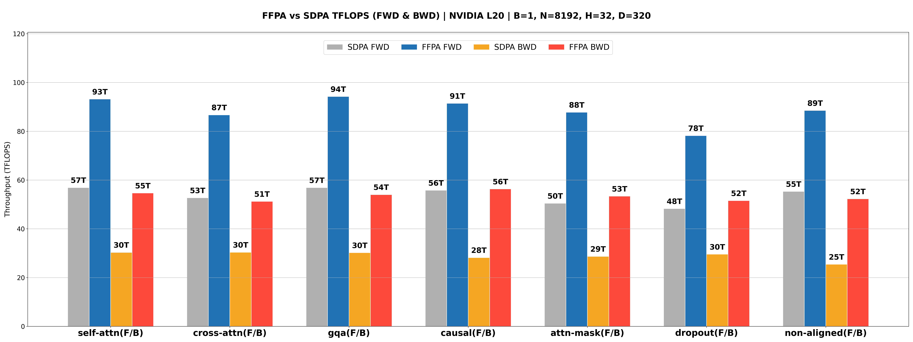
  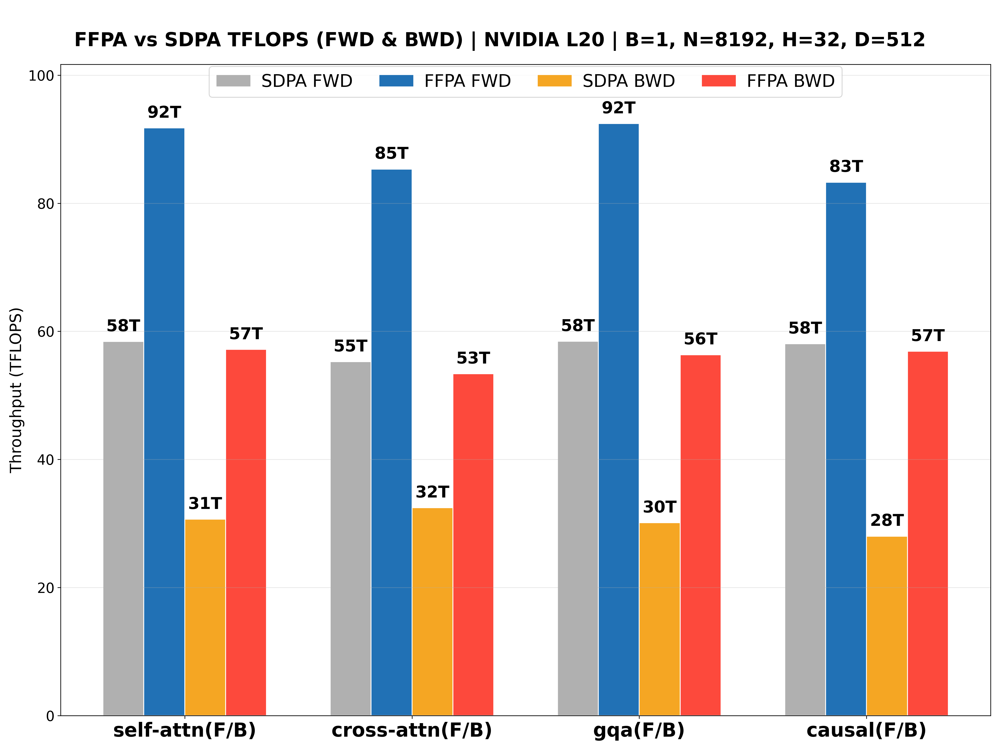<br>
  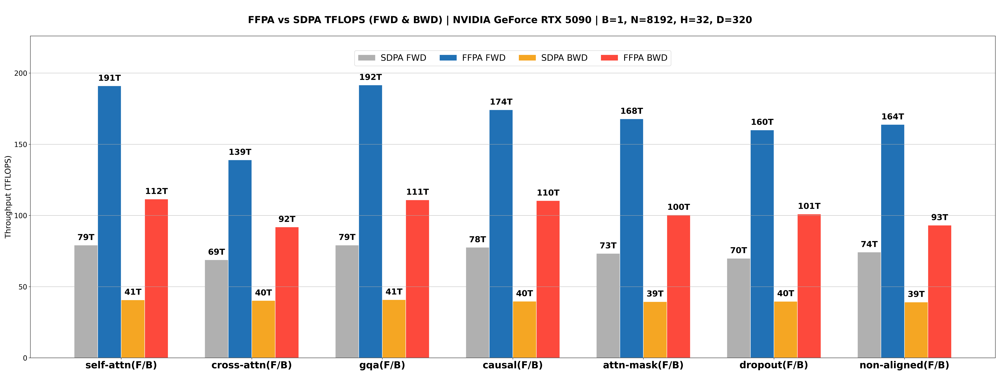
  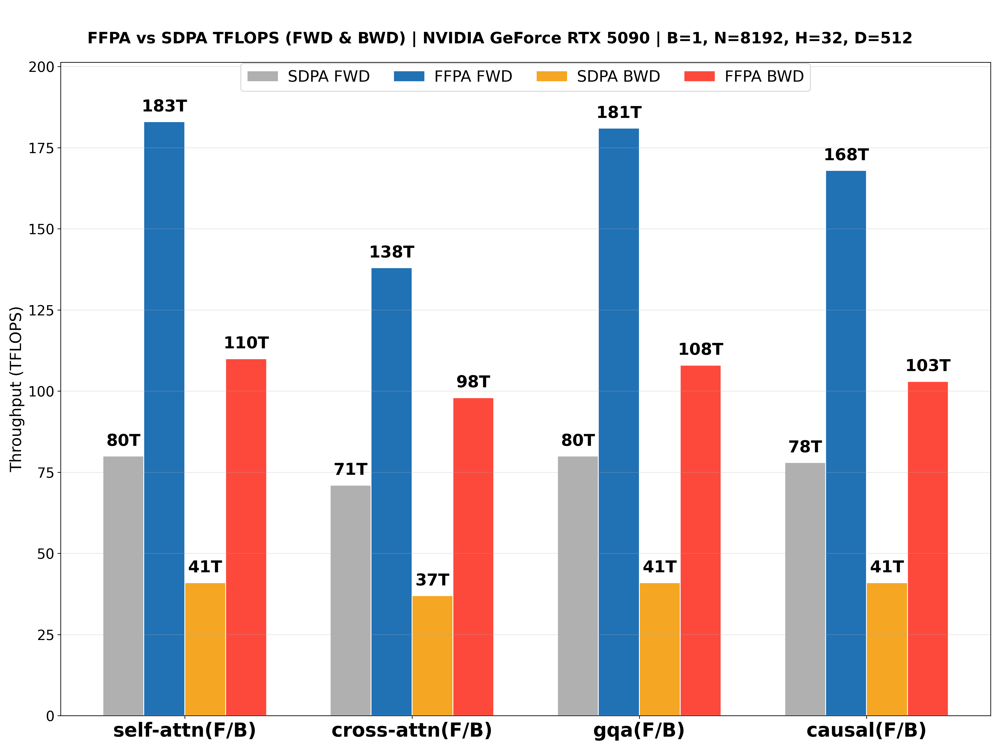<br>
  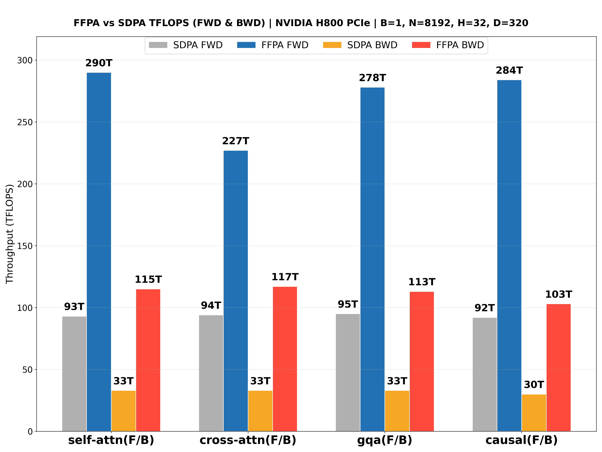
  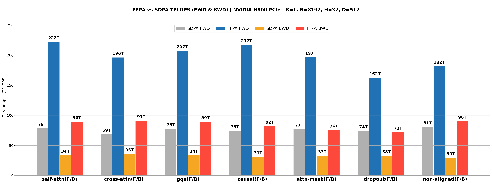<br>
  
  <br>
  
  
</div>
