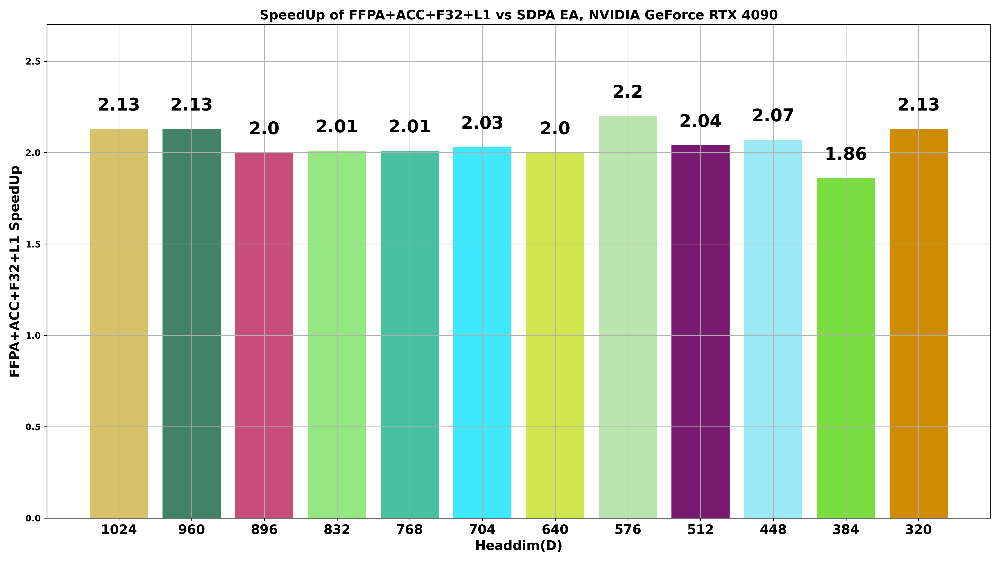

<div align="center">
  <p align="center">
    <h2>🤖FFPA: Yet another Faster Flash Prefill Attention <br>with O(1)⚡️GPU SRAM complexity for large headdim🐑</h2>
    <a href="./benchmark/README.md"> 📈L20 ~1.9x↑🎉 </a> | <a href="./benchmark/README.md"> 📈A30 ~1.8x↑🎉 </a> | <a href="./benchmark/README.md"> 📈3080 ~2.9x↑🎉 </a> | <a href="./benchmark/README.md"> 📈4090 ~2.1x↑🎉 </a><br>
  </p>
  
</div>

**FFPA(Split-D)**: Yet another **Faster Flash Prefill Attention** with **Split-D** strategy, achieve **O(1) SRAM complexity** and **O(d/4) register complexity** for large headdim (**> 256**), **1.8x~3x** 🎉 faster than SDPA. Currently, FFPA supports self-attention, cross-attention, grouped/multi-query attention, causal attention with large headdim (D=320~1024). While the standard FlashAttention-2 only support headdim <= 256.

<div align="center" markdown="1">

|[Self Attention](#example-self)| [Cross/Decode Attention](#example-cross)|[GQA/MQA Attention](#example-gqa)|[Causal Attention](#example-causal)|[Headdim](#ffpa-design)|
|:---:|:---:|:---:|:---:|:---:|
|✔️(`Nq = Nkv`)|✔️(`Nq != Nkv`)|✔️(`Nh_q % Nh_kv == 0`)|✔️(`causal mask`)|**32~1024** |

</div>

> [!NOTE]
> FFPA has been tested on `Ampere, Ada, Hopper, Blackwell` architectures (e.g. `A30, RTX 3080, L20, RTX 4090, H200, RTX 5090`), the performance may not be optimal (but still get `1.5x~2.3x↑🎉` speedup compared to SDPA for large headdim `> 256`) for Hopper and Blackwell architectures since it does not yet leverage TMA and other architecture-specific optimizations for further optimization.

## 📖 Quick Start

<a id="install"></a>

First, install the prebuilt package from [PyPI](https://pypi.org/project/ffpa-attn/) (required: PyTorch>=2.11.0, CUDA>=13.0):

```bash
pip3 install -U ffpa-attn # (support: sm_80, sm_89, sm_90, sm_100, sm_120)
```

Or, you can build [ffpa-attn](https://github.com/xlite-dev/ffpa-attn) from source (recommended: PyTorch>=2.11.0, CUDA>=13.0):
```bash
git clone https://github.com/xlite-dev/ffpa-attn.git
cd ffpa-attn && MAX_JOBS=32 && python3 setup.py bdist_wheel
# Optional: build with ccache for faster rebuilds
apt install ccache && bash tools/build_fast.sh bdist_wheel
# Optional: for editable install, use `pip install -e .` instead.
pip3 install dist/ffpa_attn-*.whl # pip uninstall ffpa-attn -y
```

> [!NOTE]
> FFPA supports **cross-attention** where the query seqlen ``Nq`` may differ from the key/value seqlen ``Nkv``, **GQA / MQA** attention where Q has ``Nh_q`` heads and K/V have ``Nh_kv`` heads (requires ``Nh_q % Nh_kv == 0``; group size = ``Nh_q / Nh_kv``), and **causal attention** (pass ``causal=True``; queries are aligned to the KV tail, i.e. Q row ``r`` attends to ``k <= r + (Nkv - Nq)``, which requires ``Nkv >= Nq``). K/V must share the same ``Nh_kv`` and ``Nkv``.

<a id="example-self"></a>

Minimal usage example — **Self-Attention** (B=1, H=32, N=8192, D=512):
```python
import torch
import torch.nn.functional as F
from ffpa_attn import ffpa_attn_func

# D: 32, 64, ..., 320, ..., 1024 (FA-2 <= 256, FFPA supports up to 1024).
B, H, N, D = 1, 32, 8192, 512 # batch_size, num_heads, seq_len, head_dim
q = torch.randn(B, H, N, D, dtype=torch.bfloat16, device="cuda")
k = torch.randn(B, H, N, D, dtype=torch.bfloat16, device="cuda")
v = torch.randn(B, H, N, D, dtype=torch.bfloat16, device="cuda")

# FFPA self attention; layout follows SDPA: (B, H, N, D).
out = ffpa_attn_func(q, k, v)  # -> torch.Tensor of shape (B, H, N, D)
print(out.shape, out.dtype)

ref = F.scaled_dot_product_attention(q, k, v)
print(f"vs SDPA max_abs_err={(out - ref).abs().max().item():.4e}")
```

<a id="example-cross"></a>

**Cross-Attention** or **Decoding-Attention** example (short query, long KV cache; `Nq != Nkv`):
```python
import torch
import torch.nn.functional as F
from ffpa_attn import ffpa_attn_func

# Short-query / long-KV, e.g. incremental decoding or cross-attention:
# Q: [B, H, Nq, D], K/V: [B, H, Nkv, D]; Nq can differ from Nkv but Nk==Nv required.
B, H, D = 1, 8, 512
Nq, Nkv = 128, 8192
q = torch.randn(B, H, Nq,  D, dtype=torch.bfloat16, device="cuda")
k = torch.randn(B, H, Nkv, D, dtype=torch.bfloat16, device="cuda")
v = torch.randn(B, H, Nkv, D, dtype=torch.bfloat16, device="cuda")

out = ffpa_attn_func(q, k, v)  # -> (B, H, Nq, D) = (1, 8, 128, 512)
print(out.shape, out.dtype)

ref = F.scaled_dot_product_attention(q, k, v)
print(f"vs SDPA max_abs_err={(out - ref).abs().max().item():.4e}")
```

<a id="example-gqa"></a>

**Grouped-Query / Multi-Query Attention** example (Q has more heads than K/V):
```python
import torch
import torch.nn.functional as F
from ffpa_attn import ffpa_attn_func

# GQA: Q has Nh_q heads, K/V share Nh_kv heads; group_size = Nh_q / Nh_kv.
# Typical Llama-3-style 32/8 ratio; MQA is the Nh_kv==1 special case.
# FFPA targets large headdim so we use D=512 here (FA-2 tops out at D=256).
B, D, Nq, Nkv = 1, 512, 1024, 4096
Nh_q, Nh_kv = 32, 8  # group_size = 4
q = torch.randn(B, Nh_q,  Nq,  D, dtype=torch.bfloat16, device="cuda")
k = torch.randn(B, Nh_kv, Nkv, D, dtype=torch.bfloat16, device="cuda")
v = torch.randn(B, Nh_kv, Nkv, D, dtype=torch.bfloat16, device="cuda")

out = ffpa_attn_func(q, k, v)  # -> (B, Nh_q, Nq, D) = (1, 32, 1024, 512)
print(out.shape, out.dtype)

# Reference: replicate K/V along head dim to match Q's head count.
group_size = Nh_q // Nh_kv
k_ref = k.repeat_interleave(group_size, dim=1)
v_ref = v.repeat_interleave(group_size, dim=1)
ref = F.scaled_dot_product_attention(q, k_ref, v_ref)
print(f"vs SDPA max_abs_err={(out - ref).abs().max().item():.4e}")
```

<a id="example-causal"></a>

**Causal Attention** example (self-attention causal; also supports chunked / decoding prefill with `Nkv > Nq`):
```python
import torch
import torch.nn.functional as F
from ffpa_attn import ffpa_attn_func

# Causal self-attention: Q row r attends to k <= r (standard triangular mask).
# FFPA is tuned for large headdim, so we keep D=512 as in the self-attn example.
B, H, N, D = 1, 8, 4096, 512
q = torch.randn(B, H, N, D, dtype=torch.bfloat16, device="cuda")
k = torch.randn(B, H, N, D, dtype=torch.bfloat16, device="cuda")
v = torch.randn(B, H, N, D, dtype=torch.bfloat16, device="cuda")

out = ffpa_attn_func(q, k, v, causal=True)
print(out.shape, out.dtype)

ref = F.scaled_dot_product_attention(q, k, v, is_causal=True)
print(f"vs SDPA max_abs_err={(out - ref).abs().max().item():.4e}")

# Chunked / decoding prefill: Nq < Nkv, queries aligned to the KV tail
# so Q row r attends to k <= r + (Nkv - Nq). Requires Nkv >= Nq.
Nq, Nkv = 128, 8192
q = torch.randn(B, H, Nq,  D, dtype=torch.bfloat16, device="cuda")
k = torch.randn(B, H, Nkv, D, dtype=torch.bfloat16, device="cuda")
v = torch.randn(B, H, Nkv, D, dtype=torch.bfloat16, device="cuda")
out = ffpa_attn_func(q, k, v, causal=True)
print(out.shape, out.dtype)  # (1, 8, 128, 512)
```

A runnable end-to-end example (witt self-attn, cross-attn, GQA and causal-attn) is provided under [`examples`](https://github.com/xlite-dev/ffpa-attn/blob/main/examples/run_ffpa_attn.py):

```bash
CUDA_VISIBLE_DEVICES=0 python3 examples/run_ffpa_attn.py
```

Env: NVIDIA L20 (Ada), PyTorch 2.11, CUDA 13.0, Headdim=512 (FA-2 not supported).

<div align="center" markdown="1">

| Case | dtype | Nq/Nkv | allclose | FFPA / SDPA | speedup |
|:---:|:---:|:---:|:---:|:---:|:---:|
| self-attn | fp16 | 8192/8192 | ✅ | 46.7 / 74.7 ms | 1.60x |
| cross-attn | fp16 | 1024/8192 | ✅ | 6.32 / 9.94 ms | 1.57x |
| gqa | fp16 | 8192/8192 | ✅ | 46.4 / 74.8 ms | 1.61x |
| causal | fp16 | 8192/8192 | ✅ | 24.3 / 37.4 ms | 1.54x |
| non-aligned | fp16 | 8191/8191 | ✅ | 12.3 / 19.0 ms | 1.55x |
| self-attn | bf16 | 8192/8192 | ✅ | 46.5 / 74.7 ms | 1.61x |
| cross-attn | bf16 | 1024/8192 | ✅ | 6.29 / 9.95 ms | 1.58x |
| gqa | bf16 | 8192/8192 | ✅ | 46.2 / 74.7 ms | 1.62x |
| causal | bf16 | 8192/8192 | ✅ | 24.2 / 37.5 ms | 1.55x |
| non-aligned | bf16 | 8191/8191 | ✅ | 12.3 / 19.0 ms | 1.55x |

</div>

## 📖 Fine-grained Tiling at MMA level

<a id="ffpa-design"></a>

We have extended FlashAttention for large headdim (D > 256) by implementing **Fine-grained Tiling** at the **MMA level (GEMM style)** for the Q@K^T and P@V matmul. This approach results in a constant SRAM usage of Br * 16 or Bc * 16 (Br = Bc) for Q, K, and V, leading to an overall SRAM complexity of O(2 * Br * 16) ≈ O(1) and a register complexity of O(d/4). Consequently, this method allows us to extend headdim beyond 256 and achieve faster performance compared to SDPA with or without MMA Accumulation F32 (**1.8x~3x** 🎉 faster than SDPA EA).


We have named this new attention tiling technique **FFPA: Faster Flash Prefill Attention**. FFPA does not introduce any additional VRAM requirement, so the HBM memory complexity remains the same as FlashAttention.

By leveraging this approach, we can achieve better performance than SDPA EA for very large headdim (D > 256, `FA-2 not supported`). Approximate SRAM and register complexity analysis for FFPA is as follows: (`d`=headdim, `C,Br,Bc`=Constant, `Br=Bc`, let O(C)≈O(1)) 👇

<div align="center" markdown="1">

|📚Complexity Analysis| 📚FFPA Attention (Split-D)| 📚FlashAttention-2 |
|:---:|:---:|:---:|
|SRAM | O(2xBrx16)≈O(1) | ≈O(3xBrxd), d↑ |
|Register | ≈O(d/4), d↑ | ≈O(d/2), d↑ |
|HBM| ≈FA2≈O(Nd), O | ≈O(Nd), O |
|Extra HBM| ≈FA2≈O(N), m,l | ≈O(N), m,l |

</div>

**📚Implementation**: FFPA is implemented using pure MMA PTX instructions, which supports many features such as Split-Q, SMEM Swizzle/Padding, QKV Multi-Stages(1~4), Tile MMAs/Warps, Mixed MMA F32/F16 Acc (Q@K^T MMA Acc F32 + P@V MMA Acc F16), Fully Shared QKV SMEM, Prefetch QKV g2s, Persist Q s2r/g2s, **Fully QKV Fine-grained Tiling(GEMM style)**, Collective Store, etc.

<div align="center" markdown="1">

|✔️Tensor Cores |✔️**MMA(m16n8k16)** |✔️Tile Block(Br, Bc) |✔️Tile MMA/Warp |
|:---:|:---:|:---:|:---:|
|✔️**Split Q**(FA-2)|✔️Pack LDST(128 bits)|✔️SMEM **Swizzle/Pad** |✔️Copy Async |
|✔️**Reg Double Buffers** |✔️QKV **Multi-Stages(1~4)** |✔️Collective Store(**Shfl**)|✔️**Prefetch QKV** g2s |
|✔️**QKV Fine-grained Tiling**|✔️**Shared QKV** SMEM|✔️Mixed MMA Acc|✔️**Persist Q** s2r/g2s|

</div>

## ©️License

<a id="License"></a>

Apache License 2.0

## 🎉Contribute

<a id="Contribute"></a>

How to contribute? Wecome to star⭐️ this repo to support me👆🏻 ~

<div align="center">
<a href="https://star-history.com/#xlite-dev/ffpa-attn&Date">
 <picture>
   <source media="(prefers-color-scheme: dark)" srcset="https://api.star-history.com/svg?repos=xlite-dev/ffpa-attn&type=Date&theme=dark" />
   <source media="(prefers-color-scheme: light)" srcset="https://api.star-history.com/svg?repos=xlite-dev/ffpa-attn&type=Date" />
   
 </picture>
</a>
</div>

## ©️Citations

```BibTeX
@misc{ffpa-attn@2025,
  title={FFPA: Yet another Faster Flash Prefill Attention for large headdim.},
  url={https://github.com/xlite-dev/ffpa-attn.git},
  note={Open-source software available at https://github.com/xlite-dev/ffpa-attn.git},
  author={DefTruth},
  year={2025}
}
```

## 📖 References
<a id="ref"></a>

- [flash-attention](https://github.com/Dao-AILab/flash-attention)
- [LeetCUDA](https://github.com/xlite-dev/LeetCUDA)
- [flashinfer](https://github.com/flashinfer-ai/flashinfer)
