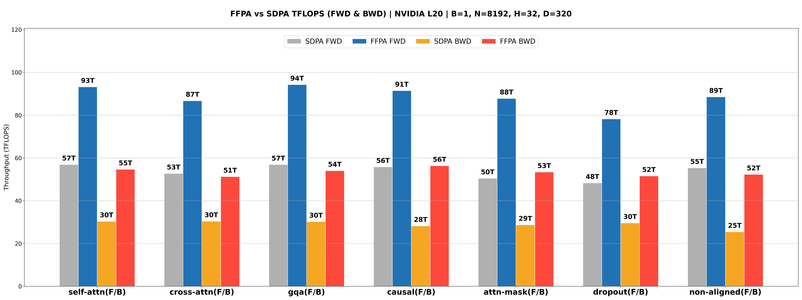
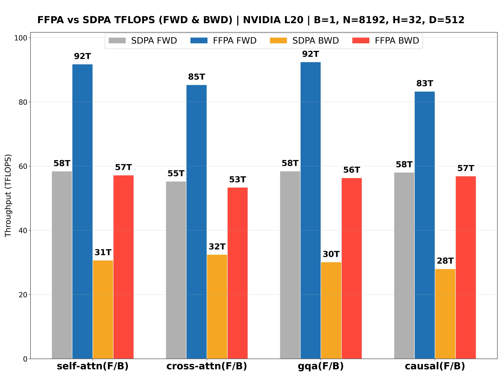
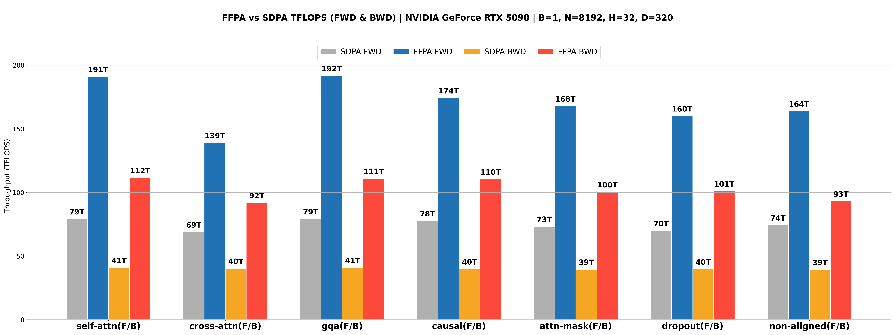
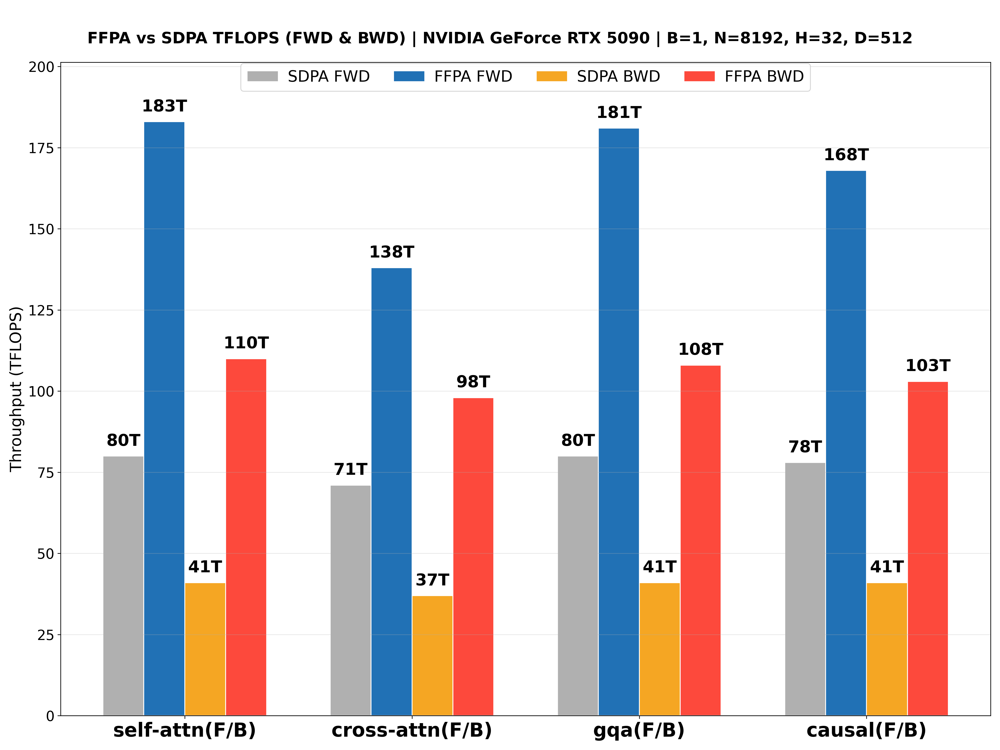
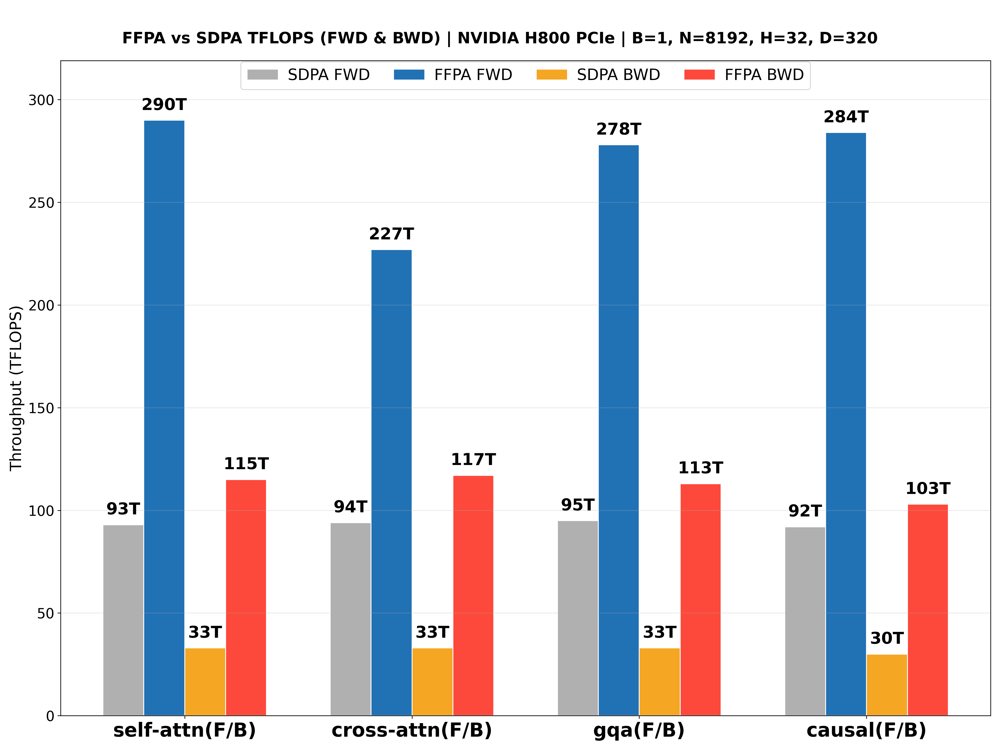
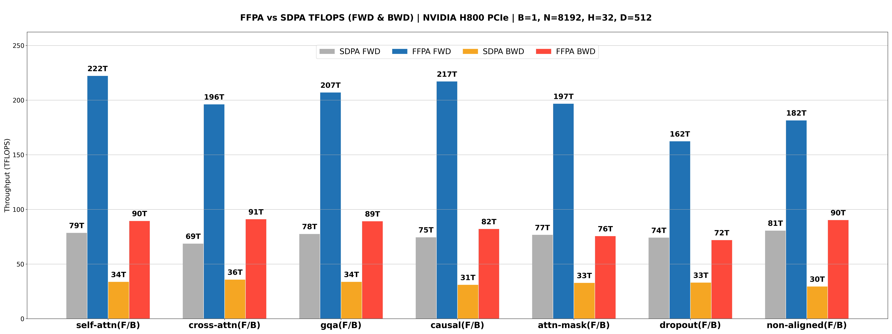
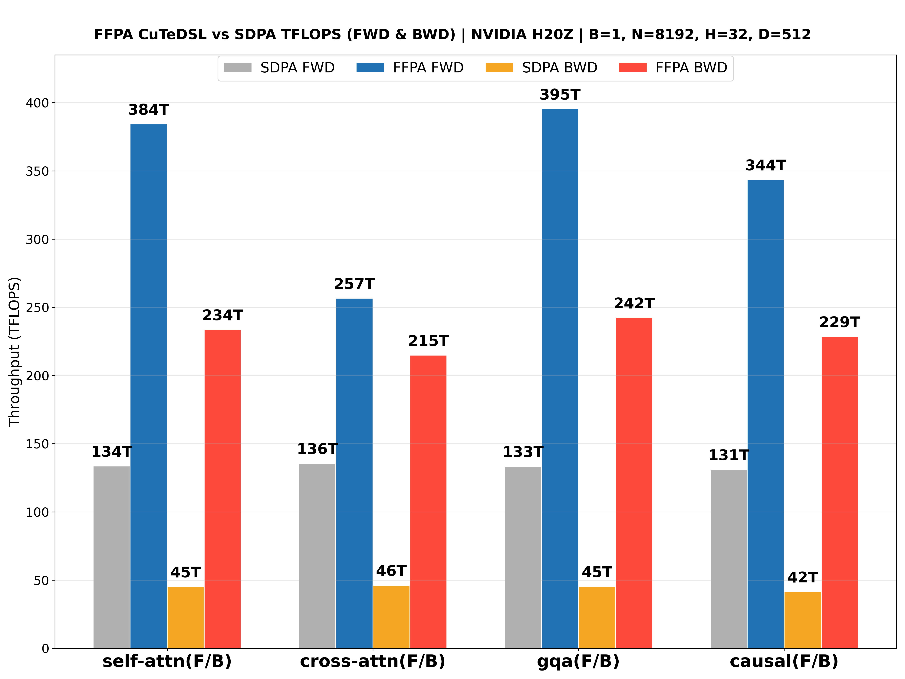
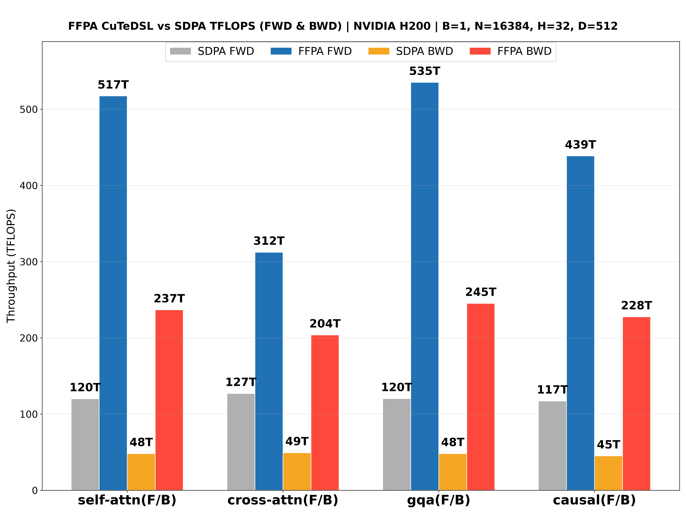

# FFPA Attention Examples

## Quick Start

```bash
python3 examples/perf.py # default: forward + backward w/o autotuning
python3 examples/perf.py --no-bwd # only forward pass
python3 examples/perf.py --no-fwd # only backward pass
python3 examples/perf.py --fwd-backend triton --bwd-backend triton --tune fast
python3 examples/perf.py --fwd-backend triton --bwd-backend triton --tune max
python3 examples/perf.py --fwd-backend triton --bwd-backend triton --tune max --fwd-tma --bwd-tma # SM>=90
python3 examples/perf.py --fwd-backend cutedsl --bwd-backend cutedsl # SM==90 + dense 320<D<=512
```

The `examples/perf.py` migrated benchmark plotting entrypoint. It preserves the old plot style, can benchmark forward/backward cases on demand, and writes both `ffpa_{device}_speedup.png` and `ffpa_{device}_speedup.md`. The additive-mask example uses a compact `[1, 1, 1, Nkv]` key-position bias by default. Use `[1, 1, Nq, Nkv]` only when per-query bias is required, since it scales as `O(Nq * Nkv)` memory.

## Benchmark

TFLOPS reports the theoretical dominant attention GEMM throughput only; forward and backward are computed separately from the measured latency. Env: NVIDIA L20 (Ada, 119.5 TFLOPS) and NVIDIA H200, PyTorch 2.11, CUDA 13.0, Headdim=512 (FA-2 not supported).

<div align='center' markdown="1">

### Forward Pass (Triton, NVIDIA L20, 8K)

| Case | dtype | Nq/Nkv | FFPA / SDPA | TFLOPS | speedup |
|:---:|:---:|:---:|:---:|:---:|:---:|
| self-attn | fp16 | 8192/8192 | 50.33 / 75.32 ms | 87T / 58T | 1.50x |
| self-attn | bf16 | 8192/8192 | 47.90 / 75.98 ms | 92T / 58T | 1.59x |
| cross-attn | fp16 | 1024/8192 | 6.42 / 10.05 ms | 86T / 55T | 1.57x |
| cross-attn | bf16 | 1024/8192 | 6.71 / 9.93 ms | 82T / 55T | 1.48x |
| decode-attn | fp16 | 1/8192 | 0.77 / 1.00 ms | 0.70T / 0.54T | 1.30x |
| decode-attn | bf16 | 1/8192 | 0.77 / 0.80 ms | 0.70T / 0.67T | 1.04x |
| gqa | fp16 | 8192/8192 | 50.72 / 75.27 ms | 87T / 58T | 1.48x |
| gqa | bf16 | 8192/8192 | 47.21 / 75.41 ms | 93T / 58T | 1.60x |
| causal | fp16 | 8192/8192 | 26.69 / 38.17 ms | 82T / 58T | 1.43x |
| causal | bf16 | 8192/8192 | 26.40 / 37.53 ms | 83T / 59T | 1.42x |
| attn-mask | fp16 | 8192/8192 | 55.57 / 82.04 ms | 79T / 54T | 1.48x |
| attn-mask | bf16 | 8192/8192 | 52.98 / 81.68 ms | 83T / 54T | 1.54x |
| dropout | fp16 | 8192/8192 | 55.77 / 83.61 ms | 79T / 53T | 1.50x |
| dropout | bf16 | 8192/8192 | 52.60 / 84.28 ms | 84T / 52T | 1.60x |
| non-aligned | fp16 | 8191/8191 | 14.19 / 19.01 ms | 77T / 58T | 1.34x |
| non-aligned | bf16 | 8191/8191 | 12.36 / 19.12 ms | 89T / 58T | 1.55x |

### Backward Pass (Triton, NVIDIA L20, 8K)

| Case | dtype | Nq/Nkv | FFPA / SDPA | TFLOPS | speedup |
|:---:|:---:|:---:|:---:|:---:|:---:|
| self-attn | fp16 | 8192/8192 | 192.15 / 353.61 ms | 57T / 31T | 1.84x |
| self-attn | bf16 | 8192/8192 | 196.53 / 353.47 ms | 56T / 31T | 1.80x |
| cross-attn | fp16 | 1024/8192 | 25.98 / 42.82 ms | 53T / 32T | 1.65x |
| cross-attn | bf16 | 1024/8192 | 26.24 / 43.49 ms | 52T / 32T | 1.66x |
| decode-attn | fp16 | 1/8192 | 2.65 / 6.05 ms | 0.51T / 0.22T | 2.28x |
| decode-attn | bf16 | 1/8192 | 2.65 / 6.01 ms | 0.51T / 0.22T | 2.27x |
| gqa | fp16 | 8192/8192 | 193.69 / 352.02 ms | 57T / 31T | 1.82x |
| gqa | bf16 | 8192/8192 | 198.45 / 352.54 ms | 55T / 31T | 1.78x |
| causal | fp16 | 8192/8192 | 96.86 / 199.46 ms | 57T / 28T | 2.06x |
| causal | bf16 | 8192/8192 | 96.95 / 199.67 ms | 57T / 28T | 2.06x |
| attn-mask | fp16 | 8192/8192 | 195.14 / 375.20 ms | 56T / 29T | 1.92x |
| attn-mask | bf16 | 8192/8192 | 197.66 / 377.68 ms | 56T / 29T | 1.91x |
| dropout | fp16 | 8192/8192 | 200.19 / 367.95 ms | 55T / 30T | 1.84x |
| dropout | bf16 | 8192/8192 | 204.05 / 364.58 ms | 54T / 30T | 1.79x |
| non-aligned | fp16 | 8191/8191 | 52.67 / 101.27 ms | 52T / 27T | 1.92x |
| non-aligned | bf16 | 8191/8191 | 52.90 / 101.69 ms | 52T / 27T | 1.92x |

### Forward Pass (CuTeDSL, NVIDIA H200, 8K)

| Case | dtype | Nq/Nkv | FFPA / SDPA | TFLOPS | speedup |
|:---:|:---:|:---:|:---:|:---:|:---:|
| self-attn | fp16 | 8192/8192 | 11.42 / 33.10 ms | 385T / 133T | 2.90x |
| self-attn | bf16 | 8192/8192 | 11.82 / 32.47 ms | 372T / 135T | 2.75x |
| cross-attn | fp16 | 1024/8192 | 2.25 / 4.07 ms | 244T / 135T | 1.81x |
| cross-attn | bf16 | 1024/8192 | 2.22 / 4.03 ms | 247T / 137T | 1.81x |
| gqa | fp16 | 8192/8192 | 11.46 / 33.36 ms | 384T / 132T | 2.91x |
| gqa | bf16 | 8192/8192 | 10.92 / 32.52 ms | 403T / 135T | 2.98x |
| causal | fp16 | 8192/8192 | 6.54 / 16.99 ms | 336T / 129T | 2.60x |
| causal | bf16 | 8192/8192 | 6.34 / 16.76 ms | 347T / 131T | 2.64x |
| non-aligned | fp16 | 8191/8191 | 3.05 / 8.05 ms | 361T / 137T | 2.64x |
| non-aligned | bf16 | 8191/8191 | 3.06 / 7.93 ms | 359T / 139T | 2.59x |

### Backward Pass (CuTeDSL, NVIDIA H200, 8K)

| Case | dtype | Nq/Nkv | FFPA / SDPA | TFLOPS | speedup |
|:---:|:---:|:---:|:---:|:---:|:---:|
| self-attn | fp16 | 8192/8192 | 48.67 / 239.57 ms | 226T / 46T | 4.92x |
| self-attn | bf16 | 8192/8192 | 48.38 / 239.17 ms | 227T / 46T | 4.94x |
| cross-attn | fp16 | 1024/8192 | 7.13 / 29.59 ms | 193T / 46T | 4.15x |
| cross-attn | bf16 | 1024/8192 | 7.11 / 29.49 ms | 193T / 47T | 4.15x |
| gqa | fp16 | 8192/8192 | 46.38 / 239.77 ms | 237T / 46T | 5.17x |
| gqa | bf16 | 8192/8192 | 46.16 / 239.07 ms | 238T / 46T | 5.18x |
| causal | fp16 | 8192/8192 | 25.84 / 130.43 ms | 213T / 42T | 5.05x |
| causal | bf16 | 8192/8192 | 25.38 / 130.72 ms | 217T / 42T | 5.15x |
| non-aligned | fp16 | 8191/8191 | 11.88 / 71.09 ms | 231T / 39T | 5.98x |
| non-aligned | bf16 | 8191/8191 | 11.81 / 70.83 ms | 233T / 39T | 6.00x |

### Forward Pass (CuTeDSL, NVIDIA H200, 16K)

| Case | dtype | Nq/Nkv | FFPA / SDPA | TFLOPS | speedup |
|:---:|:---:|:---:|:---:|:---:|:---:|
| self-attn | fp16 | 16384/16384 | 43.11 / 144.70 ms | 408T / 122T | 3.36x |
| self-attn | bf16 | 16384/16384 | 42.28 / 143.35 ms | 416T / 123T | 3.39x |
| cross-attn | fp16 | 1024/16384 | 4.06 / 8.72 ms | 271T / 126T | 2.15x |
| cross-attn | bf16 | 1024/16384 | 4.16 / 8.64 ms | 264T / 127T | 2.08x |
| gqa | fp16 | 16384/16384 | 42.17 / 144.28 ms | 417T / 122T | 3.42x |
| gqa | bf16 | 16384/16384 | 41.31 / 142.98 ms | 426T / 123T | 3.46x |
| causal | fp16 | 16384/16384 | 23.89 / 74.92 ms | 368T / 117T | 3.14x |
| causal | bf16 | 16384/16384 | 23.09 / 74.20 ms | 381T / 119T | 3.21x |
| non-aligned | fp16 | 16383/16383 | 11.16 / 34.46 ms | 394T / 128T | 3.09x |
| non-aligned | bf16 | 16383/16383 | 10.90 / 33.67 ms | 403T / 131T | 3.09x |

### Backward Pass (CuTeDSL, NVIDIA H200, 16K)

| Case | dtype | Nq/Nkv | FFPA / SDPA | TFLOPS | speedup |
|:---:|:---:|:---:|:---:|:---:|:---:|
| self-attn | fp16 | 16384/16384 | 188.43 / 937.25 ms | 233T / 47T | 4.97x |
| self-attn | bf16 | 16384/16384 | 187.01 / 933.86 ms | 235T / 47T | 4.99x |
| cross-attn | fp16 | 1024/16384 | 13.92 / 56.94 ms | 197T / 48T | 4.09x |
| cross-attn | bf16 | 1024/16384 | 13.87 / 56.95 ms | 198T / 48T | 4.10x |
| gqa | fp16 | 16384/16384 | 184.66 / 933.70 ms | 238T / 47T | 5.06x |
| gqa | bf16 | 16384/16384 | 183.01 / 934.03 ms | 240T / 47T | 5.10x |
| causal | fp16 | 16384/16384 | 98.89 / 496.05 ms | 222T / 44T | 5.02x |
| causal | bf16 | 16384/16384 | 97.10 / 497.01 ms | 226T / 44T | 5.12x |
| non-aligned | fp16 | 16383/16383 | 46.30 / 252.40 ms | 237T / 44T | 5.45x |
| non-aligned | bf16 | 16383/16383 | 45.80 / 253.24 ms | 240T / 43T | 5.53x |

</div>

The performance benchmarks for the NVIDIA L20 (**Ada**), NVIDIA Geforce RTX 5090 (**Blackwell**), NVIDIA H800 PCIE (**Hopper**), NVIDIA H200 SXM (**Hopper**, **CuTeDSL** backend, up to **427** TFLOPS!🎉) with large headdim are shown below:

<div align='center'>
  
  <br>
  
  <br>
  
  <br>
  
  
</div>
